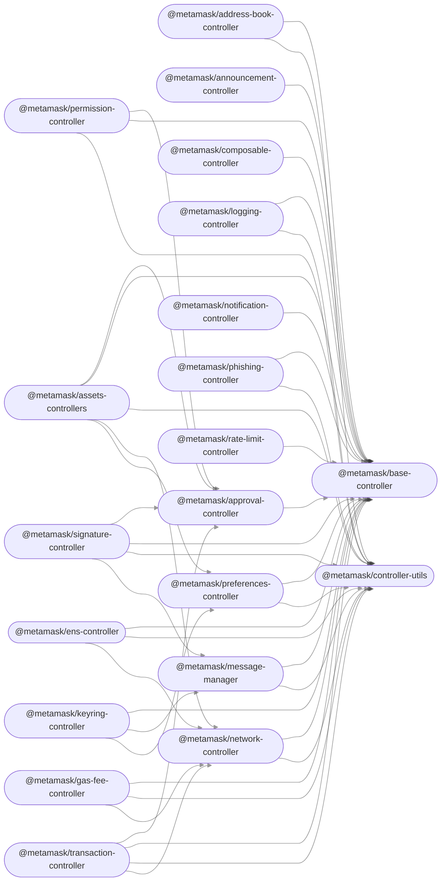

# Core Monorepo

This monorepo is a collection of packages used across multiple MetaMask clients (e.g. [`metamask-extension`](https://github.com/MetaMask/metamask-extension/), [`metamask-mobile`](https://github.com/MetaMask/metamask-mobile/)).

## Modules

This repository houses the following packages:

- [`@metamask/address-book-controller`](packages/address-book-controller)
- [`@metamask/announcement-controller`](packages/announcement-controller)
- [`@metamask/approval-controller`](packages/approval-controller)
- [`@metamask/assets-controllers`](packages/assets-controllers)
- [`@metamask/base-controller`](packages/base-controller)
- [`@metamask/composable-controller`](packages/composable-controller)
- [`@metamask/controller-utils`](packages/controller-utils)
- [`@metamask/ens-controller`](packages/ens-controller)
- [`@metamask/gas-fee-controller`](packages/gas-fee-controller)
- [`@metamask/keyring-controller`](packages/keyring-controller)
- [`@metamask/message-manager`](packages/message-manager)
- [`@metamask/network-controller`](packages/network-controller)
- [`@metamask/notification-controller`](packages/notification-controller)
- [`@metamask/permission-controller`](packages/permission-controller)
- [`@metamask/phishing-controller`](packages/phishing-controller)
- [`@metamask/preferences-controller`](packages/preferences-controller)
- [`@metamask/rate-limit-controller`](packages/rate-limit-controller)
- [`@metamask/signature-controller`](packages/signature-controller)
- [`@metamask/transaction-controller`](packages/transaction-controller)

Or, in graph form [^fn1]:

<!-- start dependency graph -->

<!-- end dependency graph -->

Refer to individual packages for usage instructions.

## Learn more

For instructions on performing common development-related tasks, see [contributing to the monorepo](./docs/contributing.md).

[^fn1]: This graph can be auto-generated! To update it based on the current set of packages, run `yarn generate-dependency-graph`.

Test
