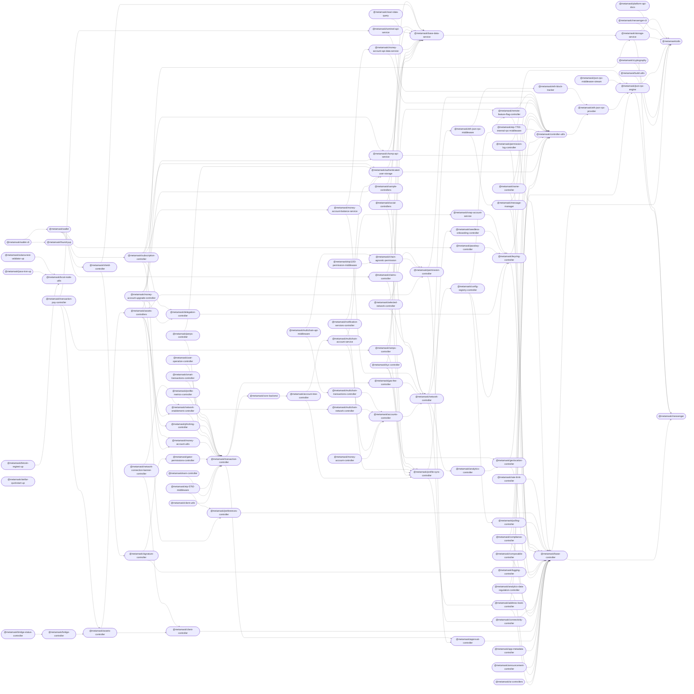

# Core Monorepo

This monorepo is a collection of packages used across multiple MetaMask clients (e.g. [`metamask-extension`](https://github.com/MetaMask/metamask-extension/), [`metamask-mobile`](https://github.com/MetaMask/metamask-mobile/)).

## Contributing

See the [Contributor Documentation](./docs) for help on:

- Setting up your development environment
- Working with the monorepo
- Testing changes in clients
- Issuing new releases
- Creating a new package

## Installation/Usage

Each package in this repository has its own README where you can find installation and usage instructions. See `packages/` for more.

## Agent skills

This repo can install MetaMask agent skills for Claude, Cursor, and Codex/OpenAI.
`yarn setup` keeps the public [`MetaMask/skills`](https://github.com/MetaMask/skills)
cache available through the shared `@metamask/skills` CLI. Run `yarn skills` any
time to install or refresh the gitignored generated skills under `.claude/skills/`,
`.cursor/rules/`, and `.agents/skills/`.

By default, all stable skills that support Core are installed when you run `yarn skills`.
Set `SKILLS_AUTO_UPDATE=1` to opt into best-effort regeneration during setup. The shared package keeps sync/cache behavior uniform with Mobile and Extension.
To persist a local selection, copy `.skills.local.example` to `.skills.local` and
set values such as `SKILLS_DOMAINS=perps`.

```bash
yarn skills                         # refresh default stable Core skills
yarn skills --domain perps          # install only the perps domain
yarn skills --select                # interactively choose domains
yarn skills --reset                 # clear saved local selection
```

## Packages

<!-- start package list -->

- [`@metamask/account-tree-controller`](packages/account-tree-controller)
- [`@metamask/accounts-controller`](packages/accounts-controller)
- [`@metamask/address-book-controller`](packages/address-book-controller)
- [`@metamask/ai-controllers`](packages/ai-controllers)
- [`@metamask/analytics-controller`](packages/analytics-controller)
- [`@metamask/analytics-data-regulation-controller`](packages/analytics-data-regulation-controller)
- [`@metamask/announcement-controller`](packages/announcement-controller)
- [`@metamask/app-metadata-controller`](packages/app-metadata-controller)
- [`@metamask/approval-controller`](packages/approval-controller)
- [`@metamask/assets-controller`](packages/assets-controller)
- [`@metamask/assets-controllers`](packages/assets-controllers)
- [`@metamask/authenticated-user-storage`](packages/authenticated-user-storage)
- [`@metamask/base-controller`](packages/base-controller)
- [`@metamask/base-data-service`](packages/base-data-service)
- [`@metamask/bitcoin-regtest-up`](packages/bitcoin-regtest-up)
- [`@metamask/bridge-controller`](packages/bridge-controller)
- [`@metamask/bridge-status-controller`](packages/bridge-status-controller)
- [`@metamask/build-utils`](packages/build-utils)
- [`@metamask/chain-agnostic-permission`](packages/chain-agnostic-permission)
- [`@metamask/chomp-api-service`](packages/chomp-api-service)
- [`@metamask/claims-controller`](packages/claims-controller)
- [`@metamask/client-controller`](packages/client-controller)
- [`@metamask/client-utils`](packages/client-utils)
- [`@metamask/compliance-controller`](packages/compliance-controller)
- [`@metamask/composable-controller`](packages/composable-controller)
- [`@metamask/config-registry-controller`](packages/config-registry-controller)
- [`@metamask/connectivity-controller`](packages/connectivity-controller)
- [`@metamask/controller-utils`](packages/controller-utils)
- [`@metamask/core-backend`](packages/core-backend)
- [`@metamask/cryptography`](packages/cryptography)
- [`@metamask/delegation-controller`](packages/delegation-controller)
- [`@metamask/earn-controller`](packages/earn-controller)
- [`@metamask/eip-5792-middleware`](packages/eip-5792-middleware)
- [`@metamask/eip-7702-internal-rpc-middleware`](packages/eip-7702-internal-rpc-middleware)
- [`@metamask/eip1193-permission-middleware`](packages/eip1193-permission-middleware)
- [`@metamask/eth-block-tracker`](packages/eth-block-tracker)
- [`@metamask/eth-json-rpc-middleware`](packages/eth-json-rpc-middleware)
- [`@metamask/eth-json-rpc-provider`](packages/eth-json-rpc-provider)
- [`@metamask/foundryup`](packages/foundryup)
- [`@metamask/gas-fee-controller`](packages/gas-fee-controller)
- [`@metamask/gator-permissions-controller`](packages/gator-permissions-controller)
- [`@metamask/geolocation-controller`](packages/geolocation-controller)
- [`@metamask/java-tron-up`](packages/java-tron-up)
- [`@metamask/json-rpc-engine`](packages/json-rpc-engine)
- [`@metamask/json-rpc-middleware-stream`](packages/json-rpc-middleware-stream)
- [`@metamask/keyring-controller`](packages/keyring-controller)
- [`@metamask/kyc-controller`](packages/kyc-controller)
- [`@metamask/local-node-utils`](packages/local-node-utils)
- [`@metamask/logging-controller`](packages/logging-controller)
- [`@metamask/message-manager`](packages/message-manager)
- [`@metamask/messenger`](packages/messenger)
- [`@metamask/messenger-cli`](packages/messenger-cli)
- [`@metamask/money-account-api-data-service`](packages/money-account-api-data-service)
- [`@metamask/money-account-balance-service`](packages/money-account-balance-service)
- [`@metamask/money-account-controller`](packages/money-account-controller)
- [`@metamask/money-account-upgrade-controller`](packages/money-account-upgrade-controller)
- [`@metamask/money-account-utils`](packages/money-account-utils)
- [`@metamask/multichain-account-service`](packages/multichain-account-service)
- [`@metamask/multichain-api-middleware`](packages/multichain-api-middleware)
- [`@metamask/multichain-network-controller`](packages/multichain-network-controller)
- [`@metamask/multichain-transactions-controller`](packages/multichain-transactions-controller)
- [`@metamask/name-controller`](packages/name-controller)
- [`@metamask/network-connection-banner-controller`](packages/network-connection-banner-controller)
- [`@metamask/network-controller`](packages/network-controller)
- [`@metamask/network-enablement-controller`](packages/network-enablement-controller)
- [`@metamask/notification-services-controller`](packages/notification-services-controller)
- [`@metamask/passkey-controller`](packages/passkey-controller)
- [`@metamask/permission-controller`](packages/permission-controller)
- [`@metamask/permission-log-controller`](packages/permission-log-controller)
- [`@metamask/perps-controller`](packages/perps-controller)
- [`@metamask/phishing-controller`](packages/phishing-controller)
- [`@metamask/platform-api-docs`](packages/platform-api-docs)
- [`@metamask/polling-controller`](packages/polling-controller)
- [`@metamask/preferences-controller`](packages/preferences-controller)
- [`@metamask/profile-metrics-controller`](packages/profile-metrics-controller)
- [`@metamask/profile-sync-controller`](packages/profile-sync-controller)
- [`@metamask/ramps-controller`](packages/ramps-controller)
- [`@metamask/rate-limit-controller`](packages/rate-limit-controller)
- [`@metamask/react-data-query`](packages/react-data-query)
- [`@metamask/remote-feature-flag-controller`](packages/remote-feature-flag-controller)
- [`@metamask/sample-controllers`](packages/sample-controllers)
- [`@metamask/seedless-onboarding-controller`](packages/seedless-onboarding-controller)
- [`@metamask/selected-network-controller`](packages/selected-network-controller)
- [`@metamask/sentinel-api-service`](packages/sentinel-api-service)
- [`@metamask/shield-controller`](packages/shield-controller)
- [`@metamask/signature-controller`](packages/signature-controller)
- [`@metamask/smart-transactions-controller`](packages/smart-transactions-controller)
- [`@metamask/snap-account-service`](packages/snap-account-service)
- [`@metamask/social-controllers`](packages/social-controllers)
- [`@metamask/solana-test-validator-up`](packages/solana-test-validator-up)
- [`@metamask/stellar-quickstart-up`](packages/stellar-quickstart-up)
- [`@metamask/storage-service`](packages/storage-service)
- [`@metamask/subscription-controller`](packages/subscription-controller)
- [`@metamask/transaction-controller`](packages/transaction-controller)
- [`@metamask/transaction-pay-controller`](packages/transaction-pay-controller)
- [`@metamask/user-operation-controller`](packages/user-operation-controller)
- [`@metamask/utils`](packages/utils)
- [`@metamask/wallet`](packages/wallet)
- [`@metamask/wallet-cli`](packages/wallet-cli)

<!-- end package list -->

<!-- start dependency graph -->


```mermaid
%%{ init: { 'flowchart': { 'curve': 'bumpX' } } }%%
graph LR;
linkStyle default opacity:0.5
  account_tree_controller(["@metamask/account-tree-controller"]);
  accounts_controller(["@metamask/accounts-controller"]);
  address_book_controller(["@metamask/address-book-controller"]);
  ai_controllers(["@metamask/ai-controllers"]);
  analytics_controller(["@metamask/analytics-controller"]);
  analytics_data_regulation_controller(["@metamask/analytics-data-regulation-controller"]);
  announcement_controller(["@metamask/announcement-controller"]);
  app_metadata_controller(["@metamask/app-metadata-controller"]);
  approval_controller(["@metamask/approval-controller"]);
  assets_controller(["@metamask/assets-controller"]);
  assets_controllers(["@metamask/assets-controllers"]);
  authenticated_user_storage(["@metamask/authenticated-user-storage"]);
  base_controller(["@metamask/base-controller"]);
  base_data_service(["@metamask/base-data-service"]);
  bitcoin_regtest_up(["@metamask/bitcoin-regtest-up"]);
  bridge_controller(["@metamask/bridge-controller"]);
  bridge_status_controller(["@metamask/bridge-status-controller"]);
  build_utils(["@metamask/build-utils"]);
  chain_agnostic_permission(["@metamask/chain-agnostic-permission"]);
  chomp_api_service(["@metamask/chomp-api-service"]);
  claims_controller(["@metamask/claims-controller"]);
  client_controller(["@metamask/client-controller"]);
  client_utils(["@metamask/client-utils"]);
  compliance_controller(["@metamask/compliance-controller"]);
  composable_controller(["@metamask/composable-controller"]);
  config_registry_controller(["@metamask/config-registry-controller"]);
  connectivity_controller(["@metamask/connectivity-controller"]);
  controller_utils(["@metamask/controller-utils"]);
  core_backend(["@metamask/core-backend"]);
  cryptography(["@metamask/cryptography"]);
  delegation_controller(["@metamask/delegation-controller"]);
  earn_controller(["@metamask/earn-controller"]);
  eip_5792_middleware(["@metamask/eip-5792-middleware"]);
  eip_7702_internal_rpc_middleware(["@metamask/eip-7702-internal-rpc-middleware"]);
  eip1193_permission_middleware(["@metamask/eip1193-permission-middleware"]);
  eth_block_tracker(["@metamask/eth-block-tracker"]);
  eth_json_rpc_middleware(["@metamask/eth-json-rpc-middleware"]);
  eth_json_rpc_provider(["@metamask/eth-json-rpc-provider"]);
  foundryup(["@metamask/foundryup"]);
  gas_fee_controller(["@metamask/gas-fee-controller"]);
  gator_permissions_controller(["@metamask/gator-permissions-controller"]);
  geolocation_controller(["@metamask/geolocation-controller"]);
  java_tron_up(["@metamask/java-tron-up"]);
  json_rpc_engine(["@metamask/json-rpc-engine"]);
  json_rpc_middleware_stream(["@metamask/json-rpc-middleware-stream"]);
  keyring_controller(["@metamask/keyring-controller"]);
  kyc_controller(["@metamask/kyc-controller"]);
  local_node_utils(["@metamask/local-node-utils"]);
  logging_controller(["@metamask/logging-controller"]);
  message_manager(["@metamask/message-manager"]);
  messenger(["@metamask/messenger"]);
  messenger_cli(["@metamask/messenger-cli"]);
  money_account_api_data_service(["@metamask/money-account-api-data-service"]);
  money_account_balance_service(["@metamask/money-account-balance-service"]);
  money_account_controller(["@metamask/money-account-controller"]);
  money_account_upgrade_controller(["@metamask/money-account-upgrade-controller"]);
  money_account_utils(["@metamask/money-account-utils"]);
  multichain_account_service(["@metamask/multichain-account-service"]);
  multichain_api_middleware(["@metamask/multichain-api-middleware"]);
  multichain_network_controller(["@metamask/multichain-network-controller"]);
  multichain_transactions_controller(["@metamask/multichain-transactions-controller"]);
  name_controller(["@metamask/name-controller"]);
  network_connection_banner_controller(["@metamask/network-connection-banner-controller"]);
  network_controller(["@metamask/network-controller"]);
  network_enablement_controller(["@metamask/network-enablement-controller"]);
  notification_services_controller(["@metamask/notification-services-controller"]);
  passkey_controller(["@metamask/passkey-controller"]);
  permission_controller(["@metamask/permission-controller"]);
  permission_log_controller(["@metamask/permission-log-controller"]);
  perps_controller(["@metamask/perps-controller"]);
  phishing_controller(["@metamask/phishing-controller"]);
  platform_api_docs(["@metamask/platform-api-docs"]);
  polling_controller(["@metamask/polling-controller"]);
  preferences_controller(["@metamask/preferences-controller"]);
  profile_metrics_controller(["@metamask/profile-metrics-controller"]);
  profile_sync_controller(["@metamask/profile-sync-controller"]);
  ramps_controller(["@metamask/ramps-controller"]);
  rate_limit_controller(["@metamask/rate-limit-controller"]);
  react_data_query(["@metamask/react-data-query"]);
  remote_feature_flag_controller(["@metamask/remote-feature-flag-controller"]);
  sample_controllers(["@metamask/sample-controllers"]);
  seedless_onboarding_controller(["@metamask/seedless-onboarding-controller"]);
  selected_network_controller(["@metamask/selected-network-controller"]);
  sentinel_api_service(["@metamask/sentinel-api-service"]);
  shield_controller(["@metamask/shield-controller"]);
  signature_controller(["@metamask/signature-controller"]);
  smart_transactions_controller(["@metamask/smart-transactions-controller"]);
  snap_account_service(["@metamask/snap-account-service"]);
  social_controllers(["@metamask/social-controllers"]);
  solana_test_validator_up(["@metamask/solana-test-validator-up"]);
  stellar_quickstart_up(["@metamask/stellar-quickstart-up"]);
  storage_service(["@metamask/storage-service"]);
  subscription_controller(["@metamask/subscription-controller"]);
  transaction_controller(["@metamask/transaction-controller"]);
  transaction_pay_controller(["@metamask/transaction-pay-controller"]);
  user_operation_controller(["@metamask/user-operation-controller"]);
  utils(["@metamask/utils"]);
  wallet(["@metamask/wallet"]);
  wallet_cli(["@metamask/wallet-cli"]);
  account_tree_controller --> multichain_account_service;
  account_tree_controller --> profile_sync_controller;
  accounts_controller --> network_controller;
  address_book_controller --> base_controller;
  address_book_controller --> controller_utils;
  ai_controllers --> base_controller;
  analytics_controller --> geolocation_controller;
  analytics_data_regulation_controller --> base_controller;
  analytics_data_regulation_controller --> controller_utils;
  announcement_controller --> base_controller;
  app_metadata_controller --> base_controller;
  approval_controller --> base_controller;
  assets_controller --> assets_controllers;
  assets_controller --> client_controller;
  assets_controllers --> network_enablement_controller;
  assets_controllers --> permission_controller;
  assets_controllers --> phishing_controller;
  assets_controllers --> preferences_controller;
  assets_controllers --> storage_service;
  authenticated_user_storage --> base_data_service;
  authenticated_user_storage --> controller_utils;
  base_controller --> messenger;
  base_controller --> utils;
  base_data_service --> storage_service;
  bitcoin_regtest_up --> local_node_utils;
  bridge_controller --> assets_controller;
  bridge_status_controller --> bridge_controller;
  build_utils --> utils;
  chain_agnostic_permission --> permission_controller;
  chomp_api_service --> base_data_service;
  chomp_api_service --> controller_utils;
  claims_controller --> base_data_service;
  claims_controller --> profile_sync_controller;
  client_controller --> base_controller;
  client_utils --> transaction_controller;
  compliance_controller --> base_controller;
  compliance_controller --> controller_utils;
  composable_controller --> base_controller;
  composable_controller --> json_rpc_engine;
  config_registry_controller --> keyring_controller;
  config_registry_controller --> polling_controller;
  config_registry_controller --> remote_feature_flag_controller;
  connectivity_controller --> base_controller;
  controller_utils --> eth_json_rpc_provider;
  core_backend --> account_tree_controller;
  cryptography --> utils;
  delegation_controller --> keyring_controller;
  earn_controller --> transaction_controller;
  eip_5792_middleware --> preferences_controller;
  eip_5792_middleware --> transaction_controller;
  eip_7702_internal_rpc_middleware --> controller_utils;
  eip1193_permission_middleware --> chain_agnostic_permission;
  eth_block_tracker --> eth_json_rpc_provider;
  eth_json_rpc_middleware --> eth_block_tracker;
  eth_json_rpc_middleware --> message_manager;
  eth_json_rpc_provider --> json_rpc_engine;
  gas_fee_controller --> network_controller;
  gator_permissions_controller --> transaction_controller;
  geolocation_controller --> base_controller;
  geolocation_controller --> controller_utils;
  java_tron_up --> local_node_utils;
  json_rpc_engine --> messenger;
  json_rpc_engine --> utils;
  json_rpc_middleware_stream --> json_rpc_engine;
  keyring_controller --> base_controller;
  keyring_controller --> controller_utils;
  kyc_controller --> base_data_service;
  kyc_controller --> geolocation_controller;
  kyc_controller --> profile_sync_controller;
  logging_controller --> base_controller;
  message_manager --> base_controller;
  message_manager --> controller_utils;
  messenger_cli --> utils;
  money_account_api_data_service --> base_data_service;
  money_account_api_data_service --> controller_utils;
  money_account_balance_service --> money_account_api_data_service;
  money_account_balance_service --> network_controller;
  money_account_controller --> accounts_controller;
  money_account_upgrade_controller --> authenticated_user_storage;
  money_account_upgrade_controller --> chomp_api_service;
  money_account_upgrade_controller --> delegation_controller;
  money_account_upgrade_controller --> money_account_utils;
  money_account_utils --> transaction_controller;
  multichain_account_service --> accounts_controller;
  multichain_account_service --> snap_account_service;
  multichain_api_middleware --> chain_agnostic_permission;
  multichain_api_middleware --> multichain_transactions_controller;
  multichain_network_controller --> accounts_controller;
  multichain_transactions_controller --> accounts_controller;
  name_controller --> base_controller;
  name_controller --> controller_utils;
  network_connection_banner_controller --> client_controller;
  network_connection_banner_controller --> network_enablement_controller;
  network_controller --> analytics_controller;
  network_controller --> config_registry_controller;
  network_controller --> connectivity_controller;
  network_controller --> eth_json_rpc_middleware;
  network_enablement_controller --> multichain_network_controller;
  network_enablement_controller --> transaction_controller;
  notification_services_controller --> authenticated_user_storage;
  notification_services_controller --> profile_sync_controller;
  passkey_controller --> keyring_controller;
  permission_controller --> approval_controller;
  permission_controller --> controller_utils;
  permission_log_controller --> base_controller;
  permission_log_controller --> json_rpc_engine;
  perps_controller --> authenticated_user_storage;
  perps_controller --> transaction_controller;
  phishing_controller --> transaction_controller;
  platform_api_docs --> utils;
  polling_controller --> base_controller;
  preferences_controller --> base_controller;
  profile_metrics_controller --> transaction_controller;
  profile_sync_controller --> address_book_controller;
  profile_sync_controller --> seedless_onboarding_controller;
  ramps_controller --> profile_sync_controller;
  ramps_controller --> remote_feature_flag_controller;
  rate_limit_controller --> base_controller;
  react_data_query --> base_data_service;
  remote_feature_flag_controller --> base_controller;
  remote_feature_flag_controller --> controller_utils;
  sample_controllers --> base_data_service;
  sample_controllers --> network_controller;
  seedless_onboarding_controller --> keyring_controller;
  selected_network_controller --> network_controller;
  selected_network_controller --> permission_controller;
  sentinel_api_service --> base_data_service;
  sentinel_api_service --> controller_utils;
  shield_controller --> base_data_service;
  shield_controller --> signature_controller;
  signature_controller --> gator_permissions_controller;
  signature_controller --> logging_controller;
  smart_transactions_controller --> transaction_controller;
  snap_account_service --> keyring_controller;
  social_controllers --> base_data_service;
  social_controllers --> profile_sync_controller;
  solana_test_validator_up --> local_node_utils;
  storage_service --> messenger;
  storage_service --> utils;
  subscription_controller --> authenticated_user_storage;
  subscription_controller --> chomp_api_service;
  subscription_controller --> delegation_controller;
  subscription_controller --> money_account_balance_service;
  subscription_controller --> money_account_utils;
  transaction_controller --> approval_controller;
  transaction_controller --> core_backend;
  transaction_controller --> gas_fee_controller;
  transaction_pay_controller --> assets_controller;
  transaction_pay_controller --> ramps_controller;
  transaction_pay_controller --> sentinel_api_service;
  user_operation_controller --> transaction_controller;
  wallet --> claims_controller;
  wallet --> passkey_controller;
  wallet --> shield_controller;
  wallet --> subscription_controller;
  wallet_cli --> wallet;
  wallet_cli --> foundryup;
```

<!-- end dependency graph -->

(This section may be regenerated at any time by running `yarn update-readme-content`.)
