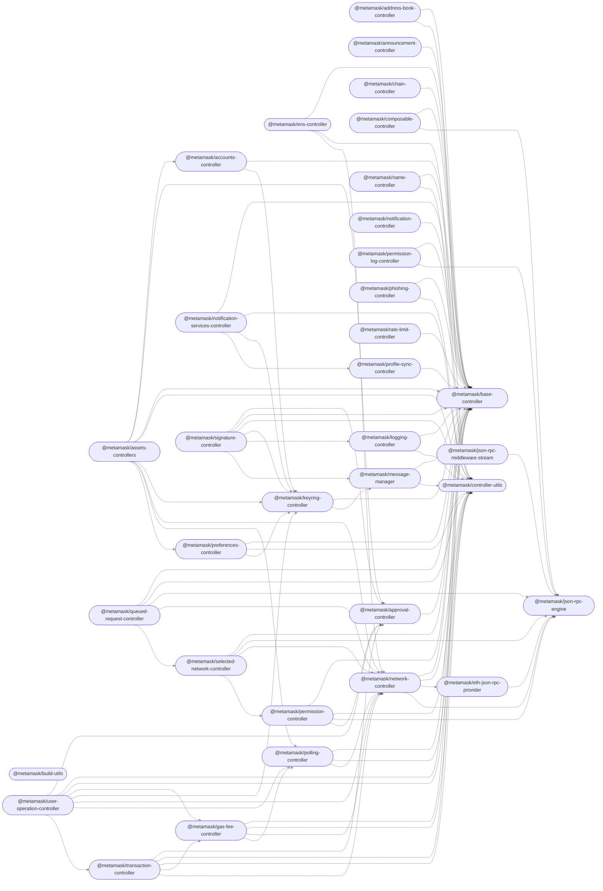

# Core Monorepo

This monorepo is a collection of packages used across multiple MetaMask clients (e.g. [`metamask-extension`](https://github.com/MetaMask/metamask-extension/), [`metamask-mobile`](https://github.com/MetaMask/metamask-mobile/)).

## Modules

This repository contains the following packages [^fn1]:

<!-- start package list -->

- [`@metamask/accounts-controller`](packages/accounts-controller)
- [`@metamask/address-book-controller`](packages/address-book-controller)
- [`@metamask/announcement-controller`](packages/announcement-controller)
- [`@metamask/approval-controller`](packages/approval-controller)
- [`@metamask/assets-controllers`](packages/assets-controllers)
- [`@metamask/base-controller`](packages/base-controller)
- [`@metamask/build-utils`](packages/build-utils)
- [`@metamask/chain-controller`](packages/chain-controller)
- [`@metamask/composable-controller`](packages/composable-controller)
- [`@metamask/controller-utils`](packages/controller-utils)
- [`@metamask/ens-controller`](packages/ens-controller)
- [`@metamask/eth-json-rpc-provider`](packages/eth-json-rpc-provider)
- [`@metamask/gas-fee-controller`](packages/gas-fee-controller)
- [`@metamask/json-rpc-engine`](packages/json-rpc-engine)
- [`@metamask/json-rpc-middleware-stream`](packages/json-rpc-middleware-stream)
- [`@metamask/keyring-controller`](packages/keyring-controller)
- [`@metamask/logging-controller`](packages/logging-controller)
- [`@metamask/message-manager`](packages/message-manager)
- [`@metamask/name-controller`](packages/name-controller)
- [`@metamask/network-controller`](packages/network-controller)
- [`@metamask/notification-controller`](packages/notification-controller)
- [`@metamask/notification-services-controller`](packages/notification-services-controller)
- [`@metamask/permission-controller`](packages/permission-controller)
- [`@metamask/permission-log-controller`](packages/permission-log-controller)
- [`@metamask/phishing-controller`](packages/phishing-controller)
- [`@metamask/polling-controller`](packages/polling-controller)
- [`@metamask/preferences-controller`](packages/preferences-controller)
- [`@metamask/profile-sync-controller`](packages/profile-sync-controller)
- [`@metamask/queued-request-controller`](packages/queued-request-controller)
- [`@metamask/rate-limit-controller`](packages/rate-limit-controller)
- [`@metamask/selected-network-controller`](packages/selected-network-controller)
- [`@metamask/signature-controller`](packages/signature-controller)
- [`@metamask/transaction-controller`](packages/transaction-controller)
- [`@metamask/user-operation-controller`](packages/user-operation-controller)

<!-- end package list -->

Or, in graph form [^fn1]:

<!-- start dependency graph -->

<!-- end dependency graph -->

Refer to individual packages for usage instructions.

## Learn more

For instructions on performing common development-related tasks, see [contributing to the monorepo](./docs/contributing.md).

[^fn1]: The package list and dependency graph should be programmatically generated by running `yarn update-readme-content`.
