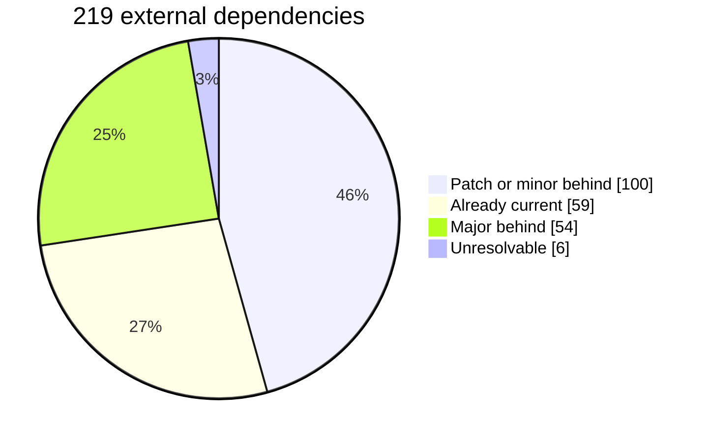

# Dependency upgrade survey

A survey of all 219 external dependencies in core, ahead of deciding whether to open the `@metamask/*` allowlist in `dependabot.yml`.

> [!IMPORTANT]
> Two thirds of the backlog is mechanical and the repair workflow already handles it. The real question is the 53 majors, and only ten of those look genuinely awkward.

Patch and minor bumps are exactly what `repair-dependabot-pull-requests.yml` was built for: it aligns ranges, resolves and deduplicates the lockfile, and writes changelog entries without anyone reading the diff. A hundred of those arriving over a few weeks is volume, not risk.

The majors are the human work, and they are not evenly hard: **10 hard, 26 moderate, 17 easy**.

## How difficulty was scored

Four signals, all derived from the repo and the registry rather than guessed. They are the ones that actually cost time on the `uuid` upgrade.

| Signal | Why it matters | Count |
| --- | --- | ---: |
| **Published surface** | `dependencies` or `peerDependencies` reach consumers; a devDependency does not | 36 of 54 |
| **ESM only at target** | Jest cannot `requireActual` it without `transformIgnorePatterns` work. This is what stopped `uuid` at 11 rather than 14 | 8 |
| **Blast radius** | Manifests declaring it. Ten or more means a mistake is a wide revert | 9 |
| **Client precedent** | extension or mobile already resolves that major, so the ecosystem risk is largely proven | 14 |

> [!WARNING]
> **The score is blind to nested copies.** `@metamask/snaps-sdk` scores in the middle, but #10025 is stuck precisely because `@metamask/eth-snap-keyring` pins its own nested copy and the two `SnapId` branded types refuse to unify. Treat the ranking as triage, not a verdict.

> [!NOTE]
> `typescript` is excluded. Its ranges are a peer `>=5.0.0` and an alias, `npm:@typescript/typescript6@^6.0.2`, so the apparent jump to 7.0.2 is an artefact rather than an upgrade anyone would make.

## The ten hard ones

| Package | Current → latest | Majors | Manifests | Signals | Difficulty |
| --- | --- | ---: | ---: | --- | --- |
| `uuid` | `^11.1.1` → `14.0.2` | +3 | 25 | ESM only, published, client has it | 🔴 Hard |
| `nanoid` | `^3.3.8` → `6.0.1` | +3 | 4 | ESM only, published | 🔴 Hard |
| `execa` | `^5.0.0` → `10.0.1` | +5 | 3 | ESM only, published | 🔴 Hard |
| `multiformats` | `^9.9.0` → `14.0.5` | +5 | 1 | ESM only, published | 🔴 Hard |
| `typedoc-plugin-missing-exports` | `^2.0.0` → `4.1.4` | +2 | 94 | ESM only | 🔴 Hard |
| `immer` | `^9.0.6` → `11.1.18` | +2 | 16 | published | 🔴 Hard |
| `@metamask/snaps-controllers` | `^19.0.0` → `21.1.0` | +2 | 11 | published | 🔴 Hard |
| `bignumber.js` | `^9.1.2` → `11.1.5` | +2 | 10 | published | 🔴 Hard |
| `@ethereumjs/tx` | `^5.4.0` → `10.1.3` | +5 | 3 | published | 🔴 Hard |
| `p-limit` | `^3.1.0` → `7.3.2` | +4 | 1 | ESM only, published, client has it | 🔴 Hard |

`uuid`, `nanoid`, `execa` and `multiformats` are all ESM only at their target and all published, so each needs the Jest transform question answered before it can land. `immer`, `bignumber.js` and `@metamask/snaps-controllers` are published and wide, ten to sixteen manifests each. `@ethereumjs/tx` is a five major jump.

<b>All 53 majors, hardest first</b>

| Package | Current → latest | Majors | Manifests | Signals | Difficulty |
| --- | --- | ---: | ---: | --- | --- |
| `uuid` | `^11.1.1` → `14.0.2` | +3 | 25 | ESM only, published, client has it | 🔴 Hard |
| `nanoid` | `^3.3.8` → `6.0.1` | +3 | 4 | ESM only, published | 🔴 Hard |
| `execa` | `^5.0.0` → `10.0.1` | +5 | 3 | ESM only, published | 🔴 Hard |
| `multiformats` | `^9.9.0` → `14.0.5` | +5 | 1 | ESM only, published | 🔴 Hard |
| `typedoc-plugin-missing-exports` | `^2.0.0` → `4.1.4` | +2 | 94 | ESM only | 🔴 Hard |
| `immer` | `^9.0.6` → `11.1.18` | +2 | 16 | published | 🔴 Hard |
| `@metamask/snaps-controllers` | `^19.0.0` → `21.1.0` | +2 | 11 | published | 🔴 Hard |
| `bignumber.js` | `^9.1.2` → `11.1.5` | +2 | 10 | published | 🔴 Hard |
| `@ethereumjs/tx` | `^5.4.0` → `10.1.3` | +5 | 3 | published | 🔴 Hard |
| `p-limit` | `^3.1.0` → `7.3.2` | +4 | 1 | ESM only, published, client has it | 🔴 Hard |
| `@ethereumjs/common` | `^4.4.0` → `10.1.3` | +6 | 2 | published | 🟡 Moderate |
| `@ethereumjs/rlp` | `^5.0.2` → `10.1.3` | +5 | 1 | published | 🟡 Moderate |
| `@solana/addresses` | `^2.0.0` → `8.3.0` | +6 | 1 | published | 🟡 Moderate |
| `eslint-plugin-jsdoc` | `^50.2.4` → `64.5.2` | +14 | 1 | ESM only | 🟡 Moderate |
| `@lavamoat/allow-scripts` | `^3.0.4` → `5.1.0` | +2 | 10 |   | 🟡 Moderate |
| `@metamask/snaps-sdk` | `^11.0.0` → `12.0.1` | +1 | 7 | published | 🟡 Moderate |
| `@babel/runtime` | `^7.0.0` → `8.0.5` | +1 | 6 | published | 🟡 Moderate |
| `@ethereumjs/util` | `^9.1.0` → `10.1.3` | +1 | 6 | published | 🟡 Moderate |
| `@noble/hashes` | `^1.8.0` → `2.4.0` | +1 | 6 | published | 🟡 Moderate |
| `cockatiel` | `^3.1.2` → `4.0.0` | +1 | 5 | published | 🟡 Moderate |
| `@noble/ciphers` | `^1.3.0` → `2.4.0` | +1 | 4 | published | 🟡 Moderate |
| `@noble/curves` | `^1.9.2` → `2.4.0` | +1 | 4 | published | 🟡 Moderate |
| `@metamask/abi-utils` | `^2.0.3` → `3.0.0` | +1 | 3 | published | 🟡 Moderate |
| `yargs` | `^17.7.2` → `18.1.0` | +1 | 4 | published, client has it | 🟡 Moderate |
| `@types/readable-stream` | `^2.3.0` → `4.0.24` | +2 | 3 |   | 🟡 Moderate |
| `ethereum-cryptography` | `^2.1.2` → `3.2.0` | +1 | 3 | published, client has it | 🟡 Moderate |
| `@metamask/delegation-core` | `^2.2.1` → `3.0.0` | +1 | 2 | published | 🟡 Moderate |
| `@metamask/delegation-deployments` | `^1.4.0` → `2.0.0` | +1 | 2 | published | 🟡 Moderate |
| `@scure/base` | `^1.2.6` → `2.4.0` | +1 | 2 | published | 🟡 Moderate |
| `@contentful/rich-text-html-renderer` | `^16.5.2` → `17.2.3` | +1 | 1 | published | 🟡 Moderate |
| `@metamask/7715-permission-types` | `^1.0.0` → `2.0.0` | +1 | 1 | published | 🟡 Moderate |
| `@oclif/core` | `^4.10.5` → `5.0.0` | +1 | 1 | published | 🟡 Moderate |
| `@types/eslint` | `^8.44.7` → `9.6.1` | +1 | 1 | published | 🟡 Moderate |
| `better-sqlite3` | `^12.9.0` → `13.0.3` | +1 | 1 | published | 🟡 Moderate |
| `firebase` | `^11.2.0` → `12.19.0` | +1 | 1 | published | 🟡 Moderate |
| `ulid` | `^2.3.0` → `3.0.2` | +1 | 1 | published | 🟡 Moderate |
| `rimraf` | `^5.0.5` → `6.1.3` | +1 | 101 | client has it | 🟢 Easy |
| `nock` | `^13.3.1` → `14.0.17` | +1 | 34 | client has it | 🟢 Easy |
| `@lavamoat/preinstall-always-fail` | `^2.1.0` → `3.0.0` | +1 | 8 |   | 🟢 Easy |
| `jest-when` | `^3.7.0` → `4.0.3` | +1 | 3 |   | 🟢 Easy |
| `@types/better-sqlite3` | `^7.6.13` → `9.6.0` | +2 | 1 |   | 🟢 Easy |
| `bitcoin-address-validation` | `^2.2.3` → `3.0.1` | +1 | 1 | published, client has it | 🟢 Easy |
| `readable-stream` | `^3.6.2` → `4.7.0` | +1 | 1 | published, client has it | 🟢 Easy |
| `yargs-parser` | `^21.1.1` → `22.0.0` | +1 | 1 | published, client has it | 🟢 Easy |
| `comment-json` | `^4.5.1` → `5.0.0` | +1 | 1 |   | 🟢 Easy |
| `eslint` | `^9.39.1` → `10.10.0` | +1 | 1 |   | 🟢 Easy |
| `eslint-import-resolver-typescript` | `^3.6.3` → `4.4.5` | +1 | 1 |   | 🟢 Easy |
| `eslint-plugin-n` | `^17.10.3` → `18.3.0` | +1 | 1 |   | 🟢 Easy |
| `extension-port-stream` | `^3.0.0` → `5.0.3` | +2 | 1 | client has it | 🟢 Easy |
| `contentful` | `^10.15.0` → `11.12.10` | +1 | 1 | client has it | 🟢 Easy |
| `eslint-config-prettier` | `^9.1.0` → `10.1.8` | +1 | 1 | client has it | 🟢 Easy |
| `eslint-plugin-jest` | `^28.8.3` → `29.16.6` | +1 | 1 | client has it | 🟢 Easy |
| `node-fetch` | `^2.7.0` → `3.3.2` | +1 | 1 | client has it | 🟢 Easy |

## What this says about the rollout

> [!TIP]
> **Drop the allowlist, but split the work by kind rather than letting it arrive as one stream.** Group patch and minor updates so they land as a handful of batched pull requests the workflow repairs unattended. Configure majors into their own group, or ignore `version-update:semver-major` entirely at first, so the 53 arrive deliberately.

That turns the scary number into two manageable ones: a steady trickle of mechanical batches, and a backlog of 53 majors to work through at whatever pace suits, starting from the bottom of the table where seventeen are close to free.

Four of the ten hard ones were already sitting in the Dependabot backlog as stuck pull requests, so opening the allowlist does not create the problem. It just makes the rest of it visible.

---

Gathered 2026-09-16 against `MetaMask/core@main`, with client lockfiles from metamask-extension and metamask-mobile. Versions compared against the npm registry; module format read from each target's published manifest. Ranges are the lowest declared where a dependency carries more than one.
