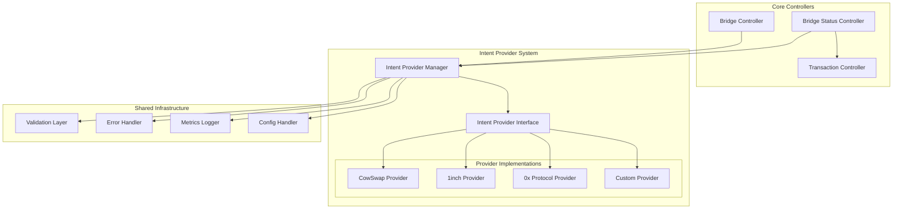
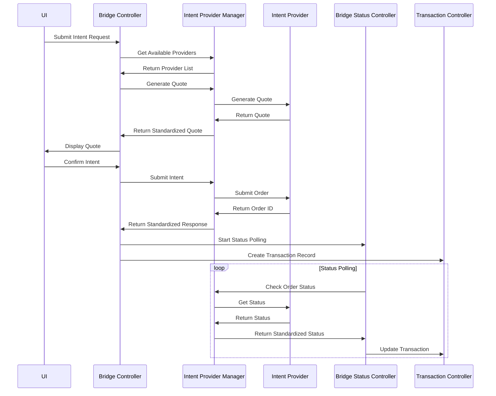

## 1. Current State Analysis

### 1.1 Module Overview

Based on the codebase analysis, the current architecture consists of three main modules:

**Bridge Controller** (`@metamask/bridge-controller`):

- Manages quote fetching and transaction submission
- Handles both traditional bridge transactions and intent-based swaps
- Contains hardcoded CowSwap integration logic

**Bridge Status Controller** (`@metamask/bridge-status-controller`):

- Polls transaction status for both bridge and intent transactions
- Contains CowSwap-specific API polling logic
- Manages transaction history and status updates

**Transaction Controller** (`@metamask/transaction-controller`):

- Manages transaction lifecycle and metadata
- Stores transaction data and provides updates to UI

### 1.2 Current Intent Integration

The current CowSwap integration is tightly coupled and hardcoded:

```tsx
// CoW intent: API base and network path mapping (adjust as needed)
const COW_API_BASE = '<https://api.cow.fi>';
const COW_NETWORK_PATHS: Record<number, string> = {
  // Ethereum Mainnet
  1: 'mainnet',
  // Arbitrum One
  42161: 'arbitrum_one',
  // Base
  8453: 'base',
  // Avalanche C-Chain
  43114: 'avalanche',
  // Polygon PoS
  137: 'polygon',
};

```

### 1.3 Current Data Flow

```
User Request → Bridge Controller → Quote Generation → Intent Submission → Bridge Status Controller → Status Polling → Transaction Controller Updates

```

## 2. Proposed Modular Architecture

### 2.1 Architecture Diagram



### 2.2 Data Flow Diagram



## 3. Base Intent Interface Design

```tsx
import type { Hex } from '@metamask/utils';

export interface IntentQuoteRequest {
  srcChainId: number;
  destChainId: number;
  srcTokenAddress: string;
  destTokenAddress: string;
  amount: string;
  userAddress: string;
  slippage?: number;
}

export interface IntentQuote {
  id: string;
  provider: string;
  srcAmount: string;
  destAmount: string;
  estimatedGas: string;
  estimatedTime: number; // seconds
  priceImpact: number;
  fees: IntentFee[];
  validUntil: number; // timestamp
  metadata: Record<string, unknown>;
}

export interface IntentFee {
  type: 'network' | 'protocol' | 'bridge';
  amount: string;
  token: string;
}

export interface IntentOrder {
  id: string;
  status: IntentOrderStatus;
  txHash?: string;
  createdAt: number;
  updatedAt: number;
  metadata: Record<string, unknown>;
}

export enum IntentOrderStatus {
  PENDING = 'pending',
  SUBMITTED = 'submitted',
  CONFIRMED = 'confirmed',
  COMPLETED = 'completed',
  FAILED = 'failed',
  CANCELLED = 'cancelled',
  EXPIRED = 'expired',
}

export interface IntentSubmissionParams {
  quote: IntentQuote;
  signature: string;
  userAddress: string;
}

export interface IntentProviderConfig {
  name: string;
  version: string;
  supportedChains: number[];
  apiBaseUrl: string;
  features: string[];
  rateLimit?: {
    requestsPerMinute: number;
    burstLimit: number;
  };
}

export abstract class BaseIntentProvider {
  protected config: IntentProviderConfig;

  constructor(config: IntentProviderConfig) {
    this.config = config;
  }

  abstract getName(): string;
  abstract getVersion(): string;
  abstract getSupportedChains(): number[];

  abstract generateQuote(request: IntentQuoteRequest): Promise<IntentQuote>;
  abstract submitOrder(params: IntentSubmissionParams): Promise<IntentOrder>;
  abstract getOrderStatus(orderId: string, chainId: number): Promise<IntentOrder>;
  abstract cancelOrder(orderId: string, chainId: number): Promise<boolean>;

  abstract validateQuoteRequest(request: IntentQuoteRequest): Promise<boolean>;
  abstract estimateGas(quote: IntentQuote): Promise<string>;

  // Lifecycle hooks for provider-specific logic
  protected onQuoteGenerated?(quote: IntentQuote): Promise<void>;
  protected onOrderSubmitted?(order: IntentOrder): Promise<void>;
  protected onOrderStatusChanged?(order: IntentOrder, previousStatus: IntentOrderStatus): Promise<void>;

  // Error handling
  protected handleError(error: Error, context: string): Error {
    return new Error(`${this.getName()}: ${context} - ${error.message}`);
  }
}

```

## 4. Intent Provider Manager

```tsx
import type { BaseIntentProvider, IntentQuote, IntentQuoteRequest, IntentOrder, IntentSubmissionParams } from './base-intent-provider';

export interface ProviderRegistry {
  [providerName: string]: BaseIntentProvider;
}

export interface ProviderSelectionCriteria {
  chainId: number;
  tokenPair: [string, string];
  amount: string;
  preferredProviders?: string[];
  excludedProviders?: string[];
}

export class IntentProviderManager {
  private providers: ProviderRegistry = {};
  private defaultProvider?: string;

  registerProvider(provider: BaseIntentProvider): void {
    const name = provider.getName();
    this.providers[name] = provider;

    // Set first registered provider as default
    if (!this.defaultProvider) {
      this.defaultProvider = name;
    }
  }

  unregisterProvider(providerName: string): boolean {
    if (this.providers[providerName]) {
      delete this.providers[providerName];

      // Update default if needed
      if (this.defaultProvider === providerName) {
        this.defaultProvider = Object.keys(this.providers)[0];
      }
      return true;
    }
    return false;
  }

  getAvailableProviders(criteria?: ProviderSelectionCriteria): BaseIntentProvider[] {
    let availableProviders = Object.values(this.providers);

    if (criteria) {
      availableProviders = availableProviders.filter(provider => {
        // Filter by supported chains
        if (criteria.chainId && !provider.getSupportedChains().includes(criteria.chainId)) {
          return false;
        }

        // Filter by excluded providers
        if (criteria.excludedProviders?.includes(provider.getName())) {
          return false;
        }

        return true;
      });

      // Prioritize preferred providers
      if (criteria.preferredProviders) {
        availableProviders.sort((a, b) => {
          const aIndex = criteria.preferredProviders!.indexOf(a.getName());
          const bIndex = criteria.preferredProviders!.indexOf(b.getName());

          if (aIndex === -1 && bIndex === -1) return 0;
          if (aIndex === -1) return 1;
          if (bIndex === -1) return -1;

          return aIndex - bIndex;
        });
      }
    }

    return availableProviders;
  }

  async generateQuotes(request: IntentQuoteRequest, criteria?: ProviderSelectionCriteria): Promise<IntentQuote[]> {
    const providers = this.getAvailableProviders(criteria);
    const quotes: IntentQuote[] = [];

    await Promise.allSettled(
      providers.map(async (provider) => {
        try {
          const isValid = await provider.validateQuoteRequest(request);
          if (isValid) {
            const quote = await provider.generateQuote(request);
            quotes.push(quote);
          }
        } catch (error) {
          console.warn(`Failed to get quote from ${provider.getName()}:`, error);
        }
      })
    );

    return quotes.sort((a, b) => parseFloat(b.destAmount) - parseFloat(a.destAmount));
  }

  async submitOrder(params: IntentSubmissionParams): Promise<IntentOrder> {
    const provider = this.providers[params.quote.provider];
    if (!provider) {
      throw new Error(`Provider ${params.quote.provider} not found`);
    }

    return provider.submitOrder(params);
  }

  async getOrderStatus(orderId: string, providerName: string, chainId: number): Promise<IntentOrder> {
    const provider = this.providers[providerName];
    if (!provider) {
      throw new Error(`Provider ${providerName} not found`);
    }

    return provider.getOrderStatus(orderId, chainId);
  }

  getProvider(name: string): BaseIntentProvider | undefined {
    return this.providers[name];
  }

  getDefaultProvider(): BaseIntentProvider | undefined {
    return this.defaultProvider ? this.providers[this.defaultProvider] : undefined;
  }
}

```

## 5. CowSwap Provider Implementation

```tsx
import { BaseIntentProvider, type IntentQuote, type IntentQuoteRequest, type IntentOrder, type IntentSubmissionParams, IntentOrderStatus } from './base-intent-provider';

const COW_NETWORK_PATHS: Record<number, string> = {
  1: 'mainnet',
  42161: 'arbitrum_one',
  8453: 'base',
  43114: 'avalanche',
  137: 'polygon',
};

export class CowSwapProvider extends BaseIntentProvider {
  private readonly apiBaseUrl = '<https://api.cow.fi>';

  getName(): string {
    return 'cowswap';
  }

  getVersion(): string {
    return '1.0.0';
  }

  getSupportedChains(): number[] {
    return Object.keys(COW_NETWORK_PATHS).map(Number);
  }

  async generateQuote(request: IntentQuoteRequest): Promise<IntentQuote> {
    const networkPath = COW_NETWORK_PATHS[request.srcChainId];
    if (!networkPath) {
      throw new Error(`Unsupported chain: ${request.srcChainId}`);
    }

    // Implementation for CowSwap quote generation
    // This would call the actual CowSwap API
    const response = await this.fetchQuote(request, networkPath);

    return {
      id: response.id,
      provider: this.getName(),
      srcAmount: request.amount,
      destAmount: response.buyAmount,
      estimatedGas: response.estimatedGas || '21000',
      estimatedTime: 300, // 5 minutes typical for CowSwap
      priceImpact: response.priceImpact || 0,
      fees: [{
        type: 'protocol',
        amount: response.feeAmount,
        token: request.srcTokenAddress,
      }],
      validUntil: response.validTo,
      metadata: {
        order: response.order,
        settlementContract: response.settlementContract,
      },
    };
  }

  async submitOrder(params: IntentSubmissionParams): Promise<IntentOrder> {
    const chainId = params.quote.metadata.chainId as number;
    const networkPath = COW_NETWORK_PATHS[chainId];

    const orderBody = {
      ...params.quote.metadata.order,
      from: params.userAddress,
      signature: params.signature,
      signingScheme: 'eip712',
    };

    const url = `${this.apiBaseUrl}/${networkPath}/api/v1/orders`;
    const response = await fetch(url, {
      method: 'POST',
      headers: { 'Content-Type': 'application/json' },
      body: JSON.stringify(orderBody),
    });

    if (!response.ok) {
      throw new Error(`Failed to submit order: ${response.statusText}`);
    }

    const orderUid = await response.text();

    return {
      id: orderUid,
      status: IntentOrderStatus.SUBMITTED,
      createdAt: Date.now(),
      updatedAt: Date.now(),
      metadata: { chainId, networkPath },
    };
  }

  async getOrderStatus(orderId: string, chainId: number): Promise<IntentOrder> {
    const networkPath = COW_NETWORK_PATHS[chainId];
    const url = `${this.apiBaseUrl}/${networkPath}/api/v1/orders/${orderId}`;

    const response = await fetch(url);
    if (!response.ok) {
      throw new Error(`Failed to get order status: ${response.statusText}`);
    }

    const data = await response.json();

    return {
      id: orderId,
      status: this.mapCowSwapStatus(data.status),
      txHash: data.executedSellAmount ? data.txHash : undefined,
      createdAt: new Date(data.creationDate).getTime(),
      updatedAt: Date.now(),
      metadata: data,
    };
  }

  async cancelOrder(orderId: string, chainId: number): Promise<boolean> {
    // CowSwap doesn't support order cancellation via API
    // Orders expire naturally
    return false;
  }

  async validateQuoteRequest(request: IntentQuoteRequest): Promise<boolean> {
    return this.getSupportedChains().includes(request.srcChainId);
  }

  async estimateGas(quote: IntentQuote): Promise<string> {
    // CowSwap uses meta-transactions, so gas estimation is minimal
    return '21000';
  }

  private mapCowSwapStatus(cowStatus: string): IntentOrderStatus {
    switch (cowStatus) {
      case 'presignaturePending':
      case 'open':
        return IntentOrderStatus.PENDING;
      case 'fulfilled':
        return IntentOrderStatus.COMPLETED;
      case 'cancelled':
        return IntentOrderStatus.CANCELLED;
      case 'expired':
        return IntentOrderStatus.EXPIRED;
      default:
        return IntentOrderStatus.FAILED;
    }
  }

  private async fetchQuote(request: IntentQuoteRequest, networkPath: string): Promise<any> {
    // Implement actual CowSwap quote API call
    // This is a placeholder for the actual implementation
    throw new Error('Not implemented');
  }
}

```

## 6. Bridge Controller Integration

```tsx
import { IntentProviderManager } from './intent-providers/intent-provider-manager';
import { CowSwapProvider } from './intent-providers/cowswap-provider';

export class BridgeController extends StaticIntervalPollingController<
  typeof BRIDGE_CONTROLLER_NAME,
  BridgeControllerState,
  BridgeControllerMessenger
> {
  private intentProviderManager: IntentProviderManager;

  constructor({
    messenger,
    state,
    fetchFunction = globalThis.fetch,
  }: {
    messenger: BridgeControllerMessenger;
    state?: Partial<BridgeControllerState>;
    fetchFunction?: typeof fetch;
  }) {
    super({
      name: BRIDGE_CONTROLLER_NAME,
      metadata: {
        // ... existing metadata
      },
      messenger,
      state: { ...DEFAULT_BRIDGE_CONTROLLER_STATE, ...state },
    });

    this.intentProviderManager = new IntentProviderManager();
    this.#initializeIntentProviders();
  }

  #initializeIntentProviders(): void {
    // Register CowSwap provider
    const cowSwapProvider = new CowSwapProvider({
      name: 'cowswap',
      version: '1.0.0',
      supportedChains: [1, 42161, 8453, 43114, 137],
      apiBaseUrl: '<https://api.cow.fi>',
      features: ['eip712-signing', 'meta-transactions'],
    });

    this.intentProviderManager.registerProvider(cowSwapProvider);
  }

  async submitIntent(params: {
    quoteResponse: QuoteResponse<TxData | string> & QuoteMetadata;
    signature: string;
    accountAddress: string;
  }): Promise<Pick<TransactionMeta, 'id' | 'chainId' | 'type' | 'status'>> {
    const { quoteResponse, signature, accountAddress } = params;

    try {
      const intentQuote = this.#convertToIntentQuote(quoteResponse);

      const order = await this.intentProviderManager.submitOrder({
        quote: intentQuote,
        signature,
        userAddress: accountAddress,
      });

      // Create transaction record and bridge history entry
      return this.#createIntentTransaction(order, quoteResponse, accountAddress);
    } catch (error) {
      // Handle error and emit metrics
      throw error;
    }
  }

  getIntentProviderManager(): IntentProviderManager {
    return this.intentProviderManager;
  }

  #convertToIntentQuote(quoteResponse: QuoteResponse & QuoteMetadata): any {
    // Convert bridge quote format to intent quote format
    // Implementation details...
  }

  #createIntentTransaction(order: any, quoteResponse: any, accountAddress: string): any {
    // Create transaction record for intent
    // Implementation details...
  }
}

```

## 7. Bridge Status Controller Integration

```tsx
import type { IntentProviderManager } from '@metamask/bridge-controller';

export class BridgeStatusController extends StaticIntervalPollingController<
  typeof BRIDGE_STATUS_CONTROLLER_NAME,
  BridgeStatusControllerState,
  BridgeStatusControllerMessenger
> {
  #intentProviderManager?: IntentProviderManager;

  setIntentProviderManager(manager: IntentProviderManager): void {
    this.#intentProviderManager = manager;
  }

  readonly #fetchBridgeTxStatus = async ({
    bridgeTxMetaId,
  }: FetchBridgeTxStatusArgs) => {
    const { txHistory } = this.state;

    // Intent-based items: use provider manager instead of hardcoded logic
    if (bridgeTxMetaId.startsWith('intent:')) {
      await this.#fetchIntentOrderStatus({ bridgeTxMetaId });
      return;
    }

    // ... existing bridge status logic
  };

  readonly #fetchIntentOrderStatus = async ({
    bridgeTxMetaId,
  }: FetchBridgeTxStatusArgs) => {
    if (!this.#intentProviderManager) {
      console.warn('Intent provider manager not available');
      return;
    }

    const { txHistory } = this.state;
    const historyItem = txHistory[bridgeTxMetaId];
    if (!historyItem) {
      return;
    }

    if (shouldSkipFetchDueToFetchFailures(historyItem.attempts)) {
      return;
    }

    try {
      const orderId = bridgeTxMetaId.replace(/^intent:/u, '');
      const [providerName, actualOrderId] = orderId.split(':');
      const { srcChainId } = historyItem.quote;

      const order = await this.#intentProviderManager.getOrderStatus(
        actualOrderId,
        providerName,
        srcChainId
      );

      // Update transaction status based on intent order status
      this.#updateTransactionFromIntentOrder(bridgeTxMetaId, order);
    } catch (error) {
      console.error('Failed to fetch intent order status:', error);
      this.#handleIntentStatusError(bridgeTxMetaId, error);
    }
  };

  #updateTransactionFromIntentOrder(bridgeTxMetaId: string, order: any): void {
    // Convert intent order status to transaction status
    // Update transaction controller
    // Implementation details...
  }

  #handleIntentStatusError(bridgeTxMetaId: string, error: Error): void {
    // Handle status polling errors
    // Implementation details...
  }
}

```
