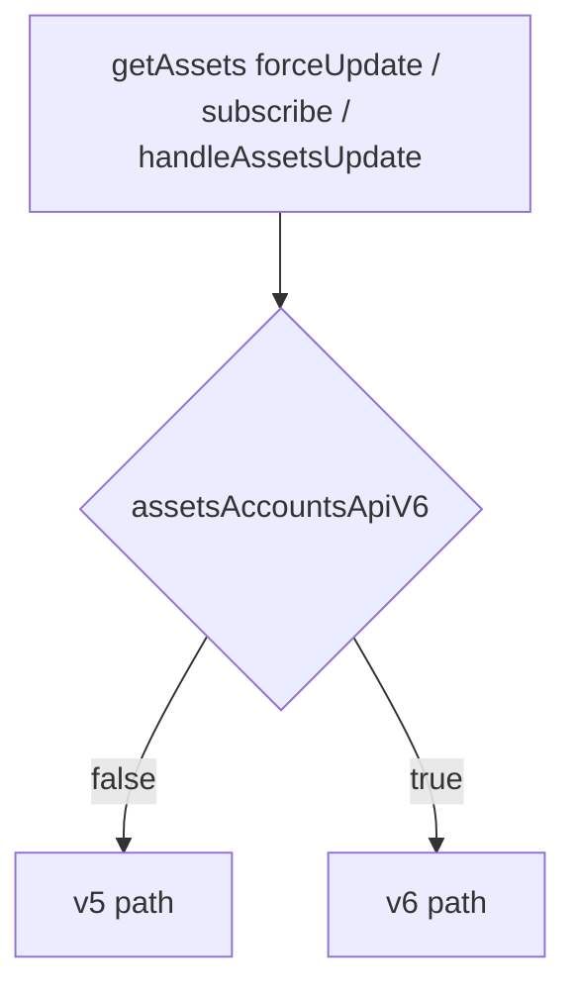
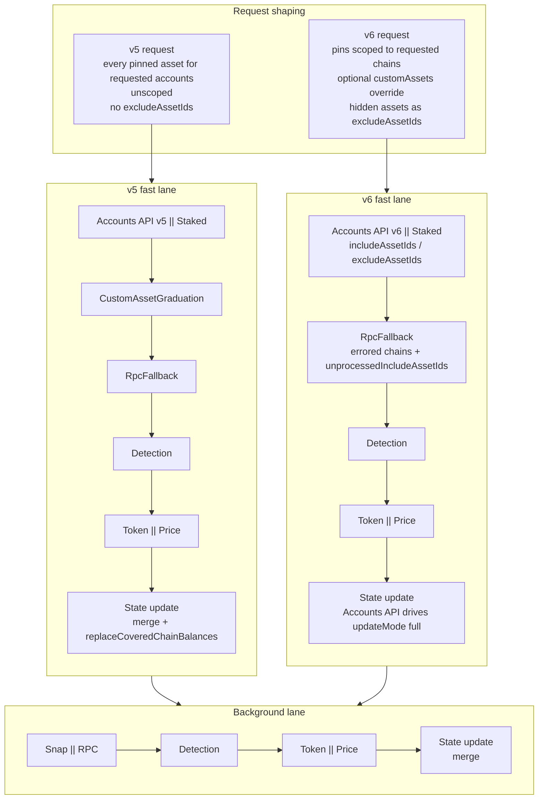
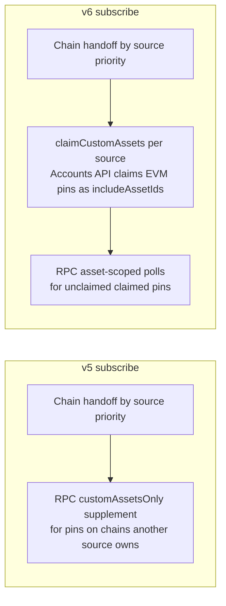
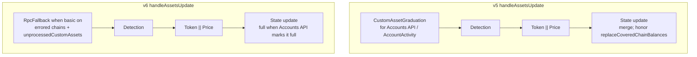

# AssetsController 15.0.0 - architecture change and AccountsAPI v5/v6 paths

This branch keeps the previous balance behavior and the new Accounts API v6
behavior side by side behind the `assetsAccountsApiV6` remote feature flag.

- Flag off, missing, or unreadable: use the legacy **v5** path.
- `assetsAccountsApiV6: { value: true }`: use the new **v6** path.

The flag is read only in `AssetsController.#isBalanceV6Enabled()` and injected
into `AccountsApiDataSource`, `RpcFallbackMiddleware`, and `RpcDataSource`.

## Architectural change

The controller now has two explicit orchestration paths instead of one mixed
flow with many conditional branches:

- **v5 path** preserves the old behavior so rollout-off matches existing
  production semantics.
- **v6 path** isolates the new behavior so rollout-on can be evaluated and the
  old path can be deleted cleanly later.

This split exists in three main places:

1. Force-update orchestration from `getAssets(..., { forceUpdate: true })`
2. Balance subscription setup
3. Balance update enrichment and merge

## Path overview

## Force-update path

Both paths share the same broad shape: run a fast lane, commit state, then run
the slower background fetch.

When basic functionality is off, both fast lanes reduce to `Staked -> Detection`
and the background lane is RPC only.

## Subscribe path

`AccountsApiDataSource.claimCustomAssets()` returns `[]` on v5.

## Update enrichment path

v5 does not run `RpcFallbackMiddleware` on this subscribe/update path. v6 does
not run `CustomAssetGraduationMiddleware`.

## Behavioral intent

| Concern                   | v5                                         | v6                                                |
| ------------------------- | ------------------------------------------ | ------------------------------------------------- |
| Accounts API endpoint     | `fetchV5MultiAccountBalances`              | `fetchV6MultiAccountBalances`                     |
| Accounts API update mode  | `merge`                                    | `full`                                            |
| Covered-chain merge       | Preserve old behavior                      | Replace covered chain slice                       |
| Custom asset preservation | Keep custom + staked pins in v5 merge path | Keep `unprocessedCustomAssets` until RPC resolves |
| Hidden assets             | Not sent to v5 endpoint                    | Sent as `excludeAssetIds`                         |
| RPC token fetch           | Flat `request.customAssets` on the chain   | Only pins owned by that account                   |

## Code map

| Concern                  | v5 implementation                         | v6 implementation                         |
| ------------------------ | ----------------------------------------- | ----------------------------------------- |
| Force-update request     | `#buildForceUpdateRequestV5`              | `#buildForceUpdateRequestV6`              |
| Force-update pipeline    | `#forceUpdateAssetsV5`, `#runFastFetchV5` | `#forceUpdateAssetsV6`, `#runFastFetchV6` |
| Subscribe                | `#subscribeAssetsBalanceV5`               | `#subscribeAssetsBalanceV6`               |
| Update enrichment        | `#handleAssetsUpdateV5`                   | `#handleAssetsUpdateV6`                   |
| Balance merge            | `mergeAccountBalancesV5`                  | `mergeAccountBalancesV6`                  |
| Accounts API fetch       | `#fetchV5Balances`                        | `#fetchV6Balances`                        |
| RPC fallback             | `#recoverV5`                              | `#recoverV6`                              |
| RPC custom ERC-20 append | `#appendRequestCustomErc20sV5`            | `#appendRequestCustomErc20sV6`            |

## Deletion plan after rollout

Once v6 is accepted as the only behavior:

1. Remove the v5 methods and `!this.#isBalanceV6Enabled()` branches.
2. Keep the v6 methods as the only orchestration path.
3. Remove transitional docs/tables that compare v5 and v6.
