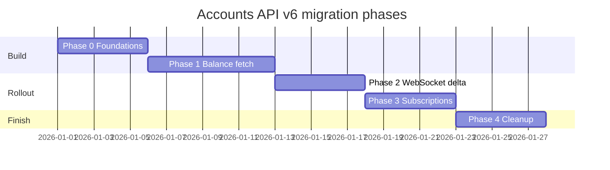

# Accounts API v6 — Migration & Implementation Plan

This document is the actionable follow-up to
[accounts-api-v6-simplification.md](./accounts-api-v6-simplification.md). It
describes **how** to migrate `AssetsController` to Accounts API v6 while keeping
all new logic behind feature flags and preserving the existing v5 path until
rollout is complete.

**Audience:** engineers implementing the migration in `@metamask/assets-controller`
and wiring flags in extension / mobile.

---

## Table of contents

- [Goals & non-goals](#goals--non-goals)
- [Prerequisites](#prerequisites)
- [Architecture summary](#architecture-summary)
- [Feature flags](#feature-flags)
- [New modules & file layout](#new-modules--file-layout)
- [Routing boundary](#routing-boundary)
- [Phased migration](#phased-migration)
- [Phase 0 — Foundations](#phase-0--foundations)
- [Phase 1 — Balance fetch path](#phase-1--balance-fetch-path)
- [Phase 2 — WebSocket delta path](#phase-2--websocket-delta-path)
- [Phase 3 — Subscriptions](#phase-3--subscriptions)
- [Phase 4 — Cleanup](#phase-4--cleanup)
- [Fallback & enrichment details](#fallback--enrichment-details)
- [Testing strategy](#testing-strategy)
- [Rollout & rollback](#rollout--rollback)
- [PR sequence](#pr-sequence)
- [Acceptance criteria](#acceptance-criteria)
- [Checklist](#checklist)

---

## Goals & non-goals

### Goals

1. **Collapse the v6 hot path** — one `/v6/multiaccount/balances` call replaces
   the v5 balance fetch + `DetectionMiddleware` + `TokenDataSource` +
   `PriceDataSource` onion for v6-supported chains.
2. **Zero public API breakage** — `AssetsController` state shape, messenger
   actions, and events stay unchanged.
3. **Feature-flagged rollout** — every new code path is gated; v5 remains the
   default until flags are enabled remotely.
4. **Safe rollback** — flag off (or v6 error) falls back to the legacy pipeline
   without a client release.
5. **Incremental delivery** — ship in small PRs, each independently testable.

### Non-goals (for initial phases)

- Removing legacy middleware / data sources (Phase 4 only).
- Changing extension / mobile UI.
- Migrating other controllers (`TokenBalancesController`, etc.) — out of scope
  unless explicitly required.

---

## Prerequisites

Resolve these **before Phase 4 cleanup**. They can be deferred during Phases
0–3 via sub-flags.

| # | Topic | Decision needed | Default during rollout |
|---|-------|-----------------|------------------------|
| 1 | **Images & rich market metadata** | Does the UI require `iconUrl`, `aggregators`, `occurrences`, `honeypotStatus`, etc. from v6 alone? v6 returns `name`/`symbol`/`decimals`/`labels` but no image. | `lazySecondaryEnrichment: false` — enable when Token API lazy fetch is ready |
| 2 | **Dual currency (`usdPrice`)** | v6 accepts one `vsCurrency`. Preserve `usdPrice` via second v6 call or scoped Price API fetch? | `dualCurrencyUsd: false` initially; use selected currency only from v6 |
| 3 | **Chain coverage map** | Source of truth for which chains Tokens API / Price API / v6 each cover | Hardcode initial map in `api-chain-coverage.ts`; migrate to backend config later |
| 4 | **Remote flag name** | Confirm with platform team | `accountsApiV6` under `remoteFeatureFlags` |
| 5 | **DeFi indexing latency** | `processingDefiPositions` may require re-poll | Handle in `AccountsApiV6DataSource`; short retry when flag is true |

---

## Architecture summary

When the master flag is **on** and `isBasicFunctionality()` is **true**:

```
getAssets(forceUpdate)
  └─ #fetchAssetsV6()
       ├─ AccountsApiV6DataSource.fetch()
       ├─ mapV6ResponseToState()
       ├─ #updateState()
       ├─ fallback for unprocessedNetworks → RpcDataSource / SnapDataSource
       ├─ FallbackEnrichment.enrich() (Token/Price APIs, fallback assets only)
       └─ optional lazy enrichment (images, usdPrice)

When flag is off OR isBasicFunctionality() is false:
  └─ #fetchAssetsLegacy()  ← today's fast/slow pipeline, unchanged
```

See [accounts-api-v6-simplification.md](./accounts-api-v6-simplification.md)
for the full before/after diagrams.

---

## Feature flags

### Flag source

Use `RemoteFeatureFlagController` (same pattern as
`SmartTransactionsController`). Inject a getter into `AssetsController` for
tests:

```typescript
// packages/assets-controller/src/feature-flags/accounts-api-v6.ts

export type AccountsApiV6FeatureFlags = {
  /** Master kill switch. When false, entire v6 path is disabled. */
  enabled: boolean;
  /** Use v6 in getAssets({ forceUpdate: true }). */
  balanceFetch: boolean;
  /** WS / AccountActivity deltas trigger targeted v6 re-fetch. */
  websocketDelta: boolean;
  /** Pass includeDeFiBalances to v6 (replaces StakedBalanceDataSource). */
  includeDeFiBalances: boolean;
  /** Lazy Token/Price fetch for images & rich metadata on v6 assets. */
  lazySecondaryEnrichment: boolean;
  /** Fetch usdPrice via second v6 call or Price API. */
  dualCurrencyUsd: boolean;
  /** Optional per-chain canary (CAIP-2). Empty/undefined = all chains. */
  allowedChainIds?: string[];
};

export const DEFAULT_ACCOUNTS_API_V6_FLAGS: AccountsApiV6FeatureFlags = {
  enabled: false,
  balanceFetch: false,
  websocketDelta: false,
  includeDeFiBalances: false,
  lazySecondaryEnrichment: false,
  dualCurrencyUsd: false,
};

export function getAccountsApiV6FeatureFlags(
  messenger: RestrictedMessenger<..., RemoteFeatureFlagControllerGetStateAction, ...>,
): AccountsApiV6FeatureFlags;
```

### `AssetsControllerOptions` addition

```typescript
/** Defaults to reading RemoteFeatureFlagController when omitted. */
getAccountsApiV6FeatureFlags?: () => AccountsApiV6FeatureFlags;

/** Called when v6 flags change; controller refreshes subscriptions. */
subscribeToAccountsApiV6FlagChange?: (
  onChange: (flags: AccountsApiV6FeatureFlags) => void,
) => void | (() => void);
```

### Flag gating rules

All of the following must be true for a given surface:

| Surface | Conditions |
|---------|------------|
| Any v6 path | `isBasicFunctionality() === true` |
| `getAssets` v6 | `flags.enabled && flags.balanceFetch` |
| WS delta v6 | `flags.enabled && flags.websocketDelta` |
| DeFi in v6 | above + `flags.includeDeFiBalances` |
| Lazy enrichment | above + `flags.lazySecondaryEnrichment` |
| USD price | above + `flags.dualCurrencyUsd` |
| Per-chain canary | chain ∈ `flags.allowedChainIds` (if set) |

### Extension / mobile wiring (outside this package)

1. Define `accountsApiV6` in remote config (LaunchDarkly / equivalent).
2. Subscribe `AssetsController` to `RemoteFeatureFlagController:stateChange`.
3. No local `PreferencesController` flag needed unless you want a dev override.

---

## New modules & file layout

```
packages/assets-controller/src/
├── data-sources/
│   └── AccountsApiV6DataSource.ts          # NEW — v6 HTTP + poll subscription
│   └── AccountsApiV6DataSource.test.ts
├── mappers/
│   └── mapV6ResponseToState.ts             # NEW — pure V6BalancesResponse → DataResponse
│   └── mapV6ResponseToState.test.ts
├── enrichment/
│   └── FallbackEnrichment.ts                 # NEW — scoped Token/Price enrich()
│   └── FallbackEnrichment.test.ts
├── utils/
│   └── api-chain-coverage.ts                 # NEW — Tokens/Price API chain gates
│   └── api-chain-coverage.test.ts
├── fetch/
│   └── fetchAssetsV6.ts                      # NEW — linear v6 fetch orchestration
│   └── fetchAssetsV6.test.ts
├── feature-flags/
│   └── accounts-api-v6.ts                    # NEW — flag types + messenger reader
│   └── accounts-api-v6.test.ts
└── AssetsController.ts                       # MODIFY — routing only (thin changes)
```

Export new public types from `src/index.ts` only if extension/mobile need them
(flag helpers are usually internal).

---

## Routing boundary

**Rule:** `AssetsController` is the only place that branches v5 vs v6. No
`if (v6)` inside existing middleware.

### Methods to branch

| Method | Branch |
|--------|--------|
| `getAssets` (`forceUpdate: true`) | `#fetchAssetsV6` vs legacy fast/slow |
| `handleAssetsUpdate` | v6 delta re-fetch vs legacy enrichment chain |
| `#subscribeAssetsBalance` | subscribe `AccountsApiV6DataSource` instead of v5 (+ adjust source list) |
| `subscribeAssetsPrice` | shrink scope to fallback-only assets when v6 on |
| `#subscribeStakedBalance` | skip when `includeDeFiBalances` flag on |
| `handleBasicFunctionalityChange` | already refreshes subscriptions — extend for v6 flags |

### Pseudocode — `getAssets`

```typescript
async getAssets(accounts, options) {
  // ... existing early returns ...

  if (options?.forceUpdate) {
    const v6Flags = this.#getAccountsApiV6FeatureFlags();
    if (
      this.#isBasicFunctionality() &&
      v6Flags.enabled &&
      v6Flags.balanceFetch &&
      this.#chainsAllowedForV6(options.chainIds ?? [...this.#enabledChains], v6Flags)
    ) {
      try {
        await this.#fetchAssetsV6(accounts, options);
        return this.#getAssetsFromState(accounts, chainIds, assetTypes);
      } catch (error) {
        this.#captureException?.(error);
        log('v6 fetch failed, falling back to legacy pipeline', { error });
        // fall through to legacy
      }
    }

    // LEGACY — unchanged
    return this.#fetchAssetsLegacy(accounts, options);
  }

  // ... existing non-forceUpdate path ...
}
```

Extract today's `forceUpdate` block (lines ~1654–1725 in `AssetsController.ts`)
into `#fetchAssetsLegacy` as part of Phase 1.

---

## Phased migration



| Phase | Delivers | Flag(s) enabled | Legacy code touched |
|-------|----------|-----------------|---------------------|
| 0 | Mapper, data source, flags (no controller wiring) | none | none |
| 1 | `getAssets` v6 path + fallback | `enabled`, `balanceFetch` | extract `#fetchAssetsLegacy` |
| 2 | WS / AccountActivity delta | `websocketDelta` | `handleAssetsUpdate` branch |
| 3 | v6 poll subscription; shrink price poll | same master flags | `#subscribeAssetsBalance`, `subscribeAssetsPrice` |
| 4 | Delete v5 hot-path code | 100% rollout | remove legacy pipeline |

---

## Phase 0 — Foundations

**Goal:** build and test new modules in isolation. No runtime behavior change.

### Tasks

- [ ] **0.1** Create `feature-flags/accounts-api-v6.ts`
  - Types, defaults, `getAccountsApiV6FeatureFlags(messenger)` helper.
  - Unit tests with mock messenger.

- [ ] **0.2** Create `utils/api-chain-coverage.ts`
  - `tokensApiCoversChain(chainId): boolean`
  - `priceApiCoversChain(chainId): boolean`
  - `v6SupportsChain(chainId): boolean` (can mirror Accounts API supported
    networks initially).
  - Tests per chain.

- [ ] **0.3** Create `mappers/mapV6ResponseToState.ts`
  - Input: `V6BalancesResponse`, `DataRequest`, `selectedCurrency`.
  - Output: `DataResponse` (`assetsInfo`, `assetsBalance`, `assetsPrice`).
  - Map `category: 'token'` and `category: 'defi'` rows.
  - Map `canonicalHead` into custom-asset graduation hints (or a dedicated
    field consumed by controller).
  - Map `unprocessedNetworks` → list of `ChainId` for fallback handoff.
  - Map `unprocessedIncludeAssetIds` for RPC custom-asset supplement.
  - Fixture-based tests using shapes from
    `packages/core-backend/src/api/accounts/client.test.ts`.

- [ ] **0.4** Create `data-sources/AccountsApiV6DataSource.ts`
  - Extend `AbstractDataSource` (mirror `AccountsApiDataSource` structure).
  - Use `queryApiClient.accounts.fetchV6MultiAccountBalances` /
    `getV6MultiAccountBalancesQueryOptions`.
  - Default query options for full fetch:
    ```typescript
    {
      filterSupportedTokens: true,
      includeLabels: true,
      includeCanonicalHead: true,
      includePrices: true,
      vsCurrency: selectedCurrency,
      includeAssetIds: customAssets,  // from request
      includeDeFiBalances: flags.includeDeFiBalances,
    }
    ```
  - `assetsMiddleware` is **not** needed on the v6 path — expose `fetch(request)`
    and `subscribe()` directly.
  - Handle `processingDefiPositions`: schedule a short re-fetch (e.g. 2s) when
    any account has `processingDefiPositions: true`.
  - Unit tests: happy path, timeout → mark chains errored, empty accounts.

- [ ] **0.5** Create `enrichment/FallbackEnrichment.ts`
  - Constructor takes `TokenDataSource`, `PriceDataSource`,
    `api-chain-coverage`.
  - `async enrich({ assetIds, request, state }): Promise<DataResponse>`
  - Filters asset IDs by API coverage; skips assets that already have complete
    metadata/price in state.
  - Does **not** use middleware / `reduceRight`.
  - Unit tests.

- [ ] **0.6** Create `fetch/fetchAssetsV6.ts`
  - Pure orchestration function called by controller:
    ```typescript
    export async function fetchAssetsV6(deps: {
      v6DataSource: AccountsApiV6DataSource;
      rpcDataSource: RpcDataSource;
      snapDataSource: SnapDataSource;
      fallbackEnrichment: FallbackEnrichment;
      lazyEnrichment?: FallbackEnrichment; // Token/Price for v6 gaps
      flags: AccountsApiV6FeatureFlags;
      request: DataRequest;
      selectedCurrency: SupportedCurrency;
      executeMiddlewares: ...; // for RPC/Snap only
      updateState: ...;
    }): Promise<void>;
    ```
  - Steps (from simplification doc §2.3):
    1. v6 fetch + map → `#updateState(merge)`.
    2. Build fallback `chainIds` from `unprocessedNetworks`.
    3. If fallback chains: RPC / Snap (parallel) → `#updateState(merge)`.
    4. `FallbackEnrichment.enrich(fallbackAssetIds)`.
    5. If `dualCurrencyUsd`: second price pass.
    6. If `lazySecondaryEnrichment`: enrich v6 assets missing images.
  - Integration-style tests with mocked deps.

### Phase 0 exit criteria

- All new modules have ≥90% coverage.
- `yarn workspace @metamask/assets-controller run test` passes.
- No change to `AssetsController` runtime behavior.

---

## Phase 1 — Balance fetch path

**Goal:** `getAssets({ forceUpdate: true })` uses v6 when flagged.

### Tasks

- [ ] **1.1** Add `getAccountsApiV6FeatureFlags` to `AssetsControllerOptions`.
  - Wire default implementation reading `RemoteFeatureFlagController:getState`.
  - Add messenger action type to `AssetsControllerMessenger` allowed actions.

- [ ] **1.2** Instantiate `AccountsApiV6DataSource` in constructor (always
  created; only *used* when flagged).

- [ ] **1.3** Extract `#fetchAssetsLegacy` from current `getAssets` forceUpdate
  block. **No logic changes** — move only.

- [ ] **1.4** Add `#fetchAssetsV6` delegating to `fetchAssetsV6()`.

- [ ] **1.5** Add routing in `getAssets` with try/catch fallback to legacy.

- [ ] **1.6** Add `#chainsAllowedForV6(chainIds, flags)` helper.

- [ ] **1.7** Emit trace span `assets.v6.full_fetch` (mirror `TRACE_FULL_FETCH`
  fields + `v6: true`).

- [ ] **1.8** Controller tests:
  - Flag off → legacy middleware order unchanged (existing tests still pass).
  - Flag on → v6 data source called; `DetectionMiddleware` **not** on hot path.
  - v6 throws → legacy pipeline runs.
  - `isBasicFunctionality() false` → RPC only, v6 skipped.

- [ ] **1.9** Changelog entry under `@metamask/assets-controller` Unreleased →
  Added.

### Phase 1 rollout

1. Merge with all flags defaulting to `false`.
2. Enable `accountsApiV6.enabled` + `balanceFetch` for internal QA (1% cohort).
3. Monitor: fetch duration, error rate, balance parity vs v5 (manual or shadow).
4. Expand `allowedChainIds` chain-by-chain if needed.

---

## Phase 2 — WebSocket delta path

**Goal:** real-time balance updates on v6-supported chains use targeted v6
re-fetch instead of Detection → Token → Price.

### Tasks

- [ ] **2.1** Branch `handleAssetsUpdate`:
  ```typescript
  if (v6Flags.enabled && v6Flags.websocketDelta && isV6SupportedSource(sourceId)) {
    const newAssetIds = extractNewAssetIdsFromDelta(response, state);
    if (newAssetIds.length > 0) {
      await this.#fetchAssetsV6(accounts, {
        forceUpdate: true,
        chainIds: chainsFromDelta,
        // pass includeAssetIds via customAssets
      });
      return;
    }
    // balance-only delta with no new assets: map delta directly, skip enrichment
    await this.#updateState({ ...mappedDelta });
    return;
  }
  // legacy enrichment chain — unchanged
  ```

- [ ] **2.2** For v6-unsupported chains in the same delta: commit balance
  immediately, then `FallbackEnrichment.enrich()`.

- [ ] **2.3** Tests:
  - WS delta on Ethereum with new token → v6 called with `includeAssetIds`.
  - WS delta on unsupported chain → fallback enrichment only.
  - Flag off → existing `handleAssetsUpdate` tests pass unchanged.

### Phase 2 rollout

Enable `websocketDelta` after `balanceFetch` is stable in QA.

---

## Phase 3 — Subscriptions

**Goal:** replace v5 balance polling with v6 polling; shrink price subscription.

### Tasks

- [ ] **3.1** Update `#subscribeAssetsBalance`:
  - When v6 flagged: subscribe `AccountsApiV6DataSource` **instead of**
    `AccountsApiDataSource`.
  - Do **not** subscribe both — avoids duplicate polls.
  - Keep `BackendWebsocketDataSource`, `RpcDataSource` (supplement/custom),
    `SnapDataSource` as today for fallback chains.

- [ ] **3.2** Update `subscribeAssetsPrice`:
  - When v6 flagged: only subscribe for asset IDs **not** covered by the last v6
    response (fallback-chain assets + any asset missing price).
  - Consider passing `assetIds` filter into `PriceDataSource.subscribe`.

- [ ] **3.3** Update `#subscribeStakedBalance`:
  - Skip when `flags.includeDeFiBalances` is true (DeFi comes from v6).

- [ ] **3.4** Subscribe to v6 flag changes:
  - On `RemoteFeatureFlagController:stateChange`, call internal refresh (same as
    `handleBasicFunctionalityChange`) to swap subscriptions.

- [ ] **3.5** Tests for subscription swapping when flag toggles.

### Phase 3 rollout

Enable balance polling on v6 in staging; verify no duplicate v5 + v6 requests
in network tab.

---

## Phase 4 — Cleanup

**Goal:** remove legacy hot-path code after 100% rollout and bake time.

> **Do not start Phase 4 until:** flags at 100% for ≥2 weeks, caveats resolved,
> no P0 balance/price regressions.

### Delete or simplify

| Component | Action |
|-----------|--------|
| `AccountsApiDataSource` | Remove (or keep thin wrapper if other packages import it) |
| Fast/slow split in `#fetchAssetsLegacy` | Remove entire method |
| `DetectionMiddleware` | Remove from controller; keep file if used elsewhere |
| `RpcFallbackMiddleware` | Remove — replaced by `unprocessedNetworks` handoff |
| `ParallelMiddleware` usage in balance fetch | Remove |
| `StakedBalanceDataSource` | Remove when `includeDeFiBalances` is always on |
| `CustomAssetGraduationMiddleware` | Simplify — v6 `includeCanonicalHead` handles dedupe |
| `#fetchAssetsLegacy` | Delete |
| v6 feature flags | Remove sub-flags; v6 becomes unconditional when `isBasicFunctionality()` |

### Final tasks

- [ ] Remove flag routing branches (v6 is the only path).
- [ ] Update README / architecture docs.
- [ ] Changelog: Changed (note internal simplification, no public API change).
- [ ] Delete `accounts-api-v6-simplification.md` migration notes or mark as
  historical.

---

## Fallback & enrichment details

### v6 primary fetch

```
POST /v6/multiaccount/balances
  accountIds: CAIP-10[]
  networks: CAIP-2[]
  filterSupportedTokens: true
  includeLabels: true
  includeCanonicalHead: true
  includePrices: true
  vsCurrency: <selectedCurrency>
  includeAssetIds: <customAssets>
  includeDeFiBalances: <flag>
```

### Fallback trigger

| Signal | Action |
|--------|--------|
| `unprocessedNetworks` | RPC (EVM) or Snap (non-EVM) for those chains |
| `unprocessedIncludeAssetIds` | RPC custom-asset supplement (existing `#subscribeRpcCustomAssetsSupplement` pattern) |
| v6 request throws / times out | Entire request falls back to `#fetchAssetsLegacy` |
| Chain ∉ `allowedChainIds` (canary) | Route that chain through legacy or fallback only |

### Tiered enrichment (fallback assets only)

```
fallbackAssetIds = assets from RPC/Snap response
tokensApiIds  = fallbackAssetIds.filter(tokensApiCoversChain)
priceApiIds   = fallbackAssetIds.filter(priceApiCoversChain)

if (tokensApiIds.length) await fallbackEnrichment.enrichTokens(tokensApiIds)
if (priceApiIds.length)  await fallbackEnrichment.enrichPrices(priceApiIds)
```

### Lazy secondary enrichment (v6 assets)

When `lazySecondaryEnrichment` is true, after the v6 hot path commits:

```
assetsMissingImages = v6AssetIds.filter(id => !state.assetsInfo[id]?.image)
if (assetsMissingImages.length) await lazyEnrichment.enrichTokens(assetsMissingImages)
```

Run async (do not block `getAssets` return) unless the UI explicitly needs
images before render.

---

## Testing strategy

### Unit tests (every phase)

| Module | Focus |
|--------|-------|
| `mapV6ResponseToState` | token rows, defi rows, empty accounts, unprocessed fields |
| `AccountsApiV6DataSource` | query option building, timeout, `processingDefiPositions` retry |
| `FallbackEnrichment` | coverage gating, skip complete assets |
| `fetchAssetsV6` | orchestration order, fallback handoff |
| `accounts-api-v6` flags | defaults, parsing remote flag shape |

### Controller integration tests

| Scenario | Flag | Expect |
|----------|------|--------|
| Full fetch | off | Legacy middleware order |
| Full fetch | on | v6 called once; no Detection on hot path |
| v6 failure | on | Legacy runs |
| Basic functionality off | on | RPC only; v6 skipped |
| WS new asset | `websocketDelta` on | v6 with `includeAssetIds` |
| Subscription start | on | v5 unsubscribed, v6 subscribed |

### Parity / shadow testing (staging)

Optional dev-only shadow mode (not required for merge):

```typescript
if (flags.enabled && flags.shadowCompare) {
  const [v6Result, legacyResult] = await Promise.allSettled([...]);
  reportParityDiff(v6Result, legacyResult); // metrics only, don't commit v6
}
```

### Manual QA checklist

- [ ] Portfolio loads with correct balances (native + ERC-20 + Solana).
- [ ] Custom token import confirmed via `includeAssetIds`.
- [ ] DeFi / staking positions appear when `includeDeFiBalances` on.
- [ ] Prices match selected currency.
- [ ] `usdPrice` present when `dualCurrencyUsd` on.
- [ ] Toggle basic functionality off → RPC only.
- [ ] Toggle v6 flag off mid-session → subscriptions revert, balances still load.
- [ ] Chain not in v6 → fallback RPC/Snap still works.

---

## Rollout & rollback

### Rollout order

1. `enabled: false` — merge all code (Phases 0–3).
2. `enabled: true, balanceFetch: true` — internal / 1%.
3. Add chains to `allowedChainIds` or remove allowlist.
4. `websocketDelta: true`.
5. `includeDeFiBalances: true`.
6. `lazySecondaryEnrichment` / `dualCurrencyUsd` as needed.
7. Phase 4 cleanup.

### Rollback

| Level | Action |
|-------|--------|
| Instant | Set `accountsApiV6.enabled: false` in remote config |
| Per-surface | Disable `balanceFetch` or `websocketDelta` individually |
| Per-chain | Add chain to legacy-only list or remove from `allowedChainIds` |
| Code rollback | Not needed if flags work — legacy path remains until Phase 4 |

### Metrics to watch

- `assets.v6.full_fetch` duration vs `assets.full_fetch`
- v6 error rate / fallback-to-legacy count
- `unprocessedNetworks` rate per chain
- Price missing rate (`assetsPrice` entries without matching balance)

---

## PR sequence

Keep PRs small and independently mergeable.

| PR | Phase | Description |
|----|-------|-------------|
| 1 | 0 | Feature flag types + messenger reader |
| 2 | 0 | `api-chain-coverage` utility |
| 3 | 0 | `mapV6ResponseToState` + fixtures |
| 4 | 0 | `AccountsApiV6DataSource` |
| 5 | 0 | `FallbackEnrichment` |
| 6 | 0 | `fetchAssetsV6` orchestrator |
| 7 | 1 | Wire v6 into `getAssets` + `#fetchAssetsLegacy` extraction |
| 8 | 2 | `handleAssetsUpdate` v6 branch |
| 9 | 3 | Subscription changes + flag change listener |
| 10 | 3 | `includeDeFiBalances` + staked subscription removal |
| 11 | — | Extension/mobile remote flag config (separate repo PRs) |
| 12 | 4 | Delete legacy hot path (after rollout) |

Each PR should include tests and a changelog entry when behavior is user-visible
(Phase 1+).

---

## Acceptance criteria

### Phase 1

- [ ] With flags off, all existing `AssetsController` tests pass unchanged.
- [ ] With flags on, `getAssets({ forceUpdate: true })` calls v6 once per fetch.
- [ ] v6 failure transparently falls back to legacy.
- [ ] State shape identical to legacy path for supported chains.

### Phase 2

- [ ] WS delta for new asset triggers v6 `includeAssetIds` fetch.
- [ ] Unsupported-chain deltas use fallback enrichment only.

### Phase 3

- [ ] Only one balance poll source active (v5 **xor** v6).
- [ ] Price subscription scope reduced under v6.
- [ ] Flag toggle refreshes subscriptions without duplicate polls.

### Phase 4

- [ ] Legacy pipeline code deleted.
- [ ] Bundle size / complexity reduced (fewer middleware classes in hot path).
- [ ] No open P0/P1 balance or price bugs for 2 weeks at 100%.

---

## Checklist

Copy this into your PR / project tracker.

```
Phase 0
[ ] accounts-api-v6.ts flags
[ ] api-chain-coverage.ts
[ ] mapV6ResponseToState.ts
[ ] AccountsApiV6DataSource.ts
[ ] FallbackEnrichment.ts
[ ] fetchAssetsV6.ts

Phase 1
[ ] AssetsControllerOptions + messenger types
[ ] #fetchAssetsLegacy extraction
[ ] #fetchAssetsV6 wiring
[ ] getAssets routing + fallback
[ ] Tests + changelog

Phase 2
[ ] handleAssetsUpdate v6 branch
[ ] Tests + changelog

Phase 3
[ ] #subscribeAssetsBalance v6 swap
[ ] subscribeAssetsPrice scope shrink
[ ] #subscribeStakedBalance conditional skip
[ ] Flag change subscription refresh
[ ] Tests + changelog

Rollout
[ ] Remote flag in staging
[ ] QA parity sign-off
[ ] Gradual prod rollout
[ ] 2-week bake at 100%

Phase 4
[ ] Delete legacy hot path
[ ] Update docs
[ ] Final changelog
```

---

## References

- [accounts-api-v6-simplification.md](./accounts-api-v6-simplification.md) —
  architecture rationale
- `@metamask/core-backend` — `fetchV6MultiAccountBalances`,
  `V6BalancesResponse`, query options
- `packages/assets-controller/src/AssetsController.ts` — current orchestration
- `packages/smart-transactions-controller` — RemoteFeatureFlagController pattern
