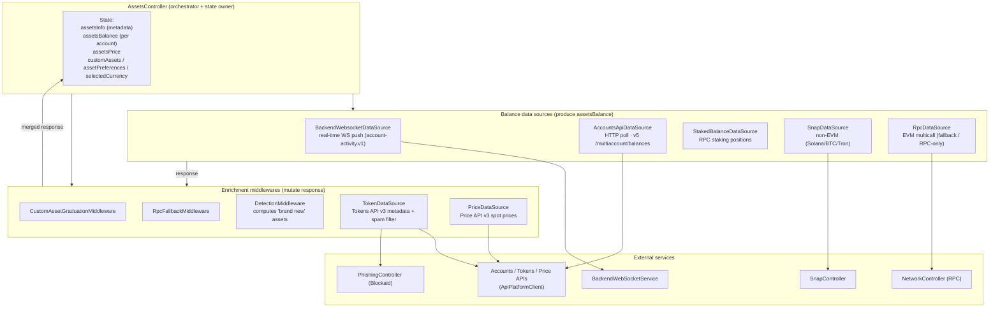
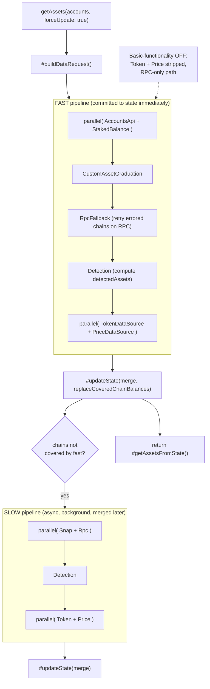
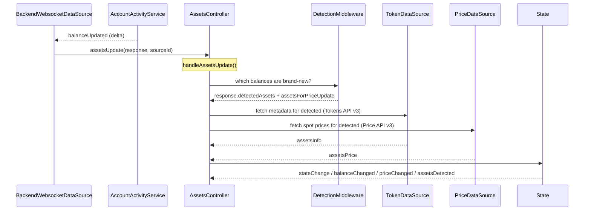
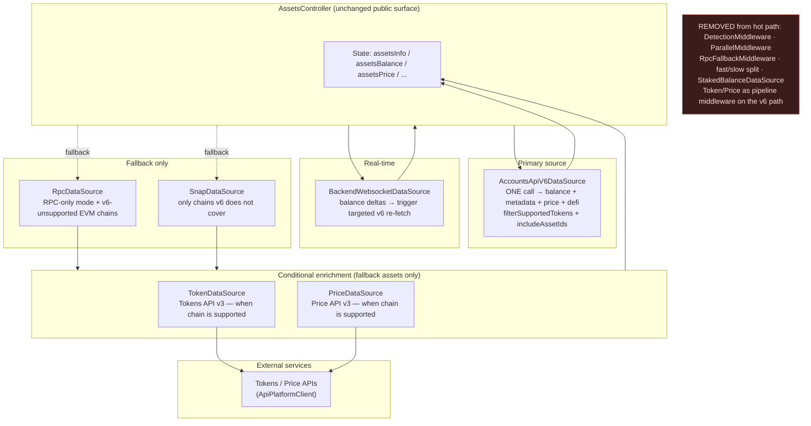
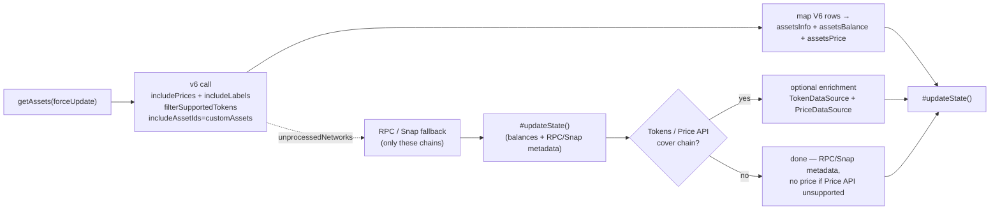
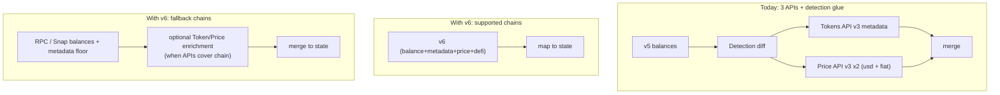
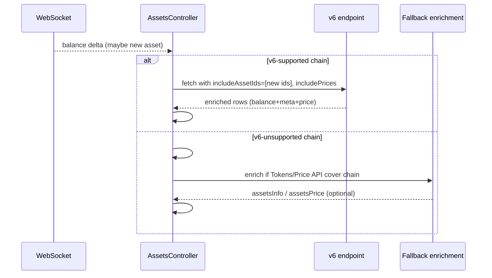
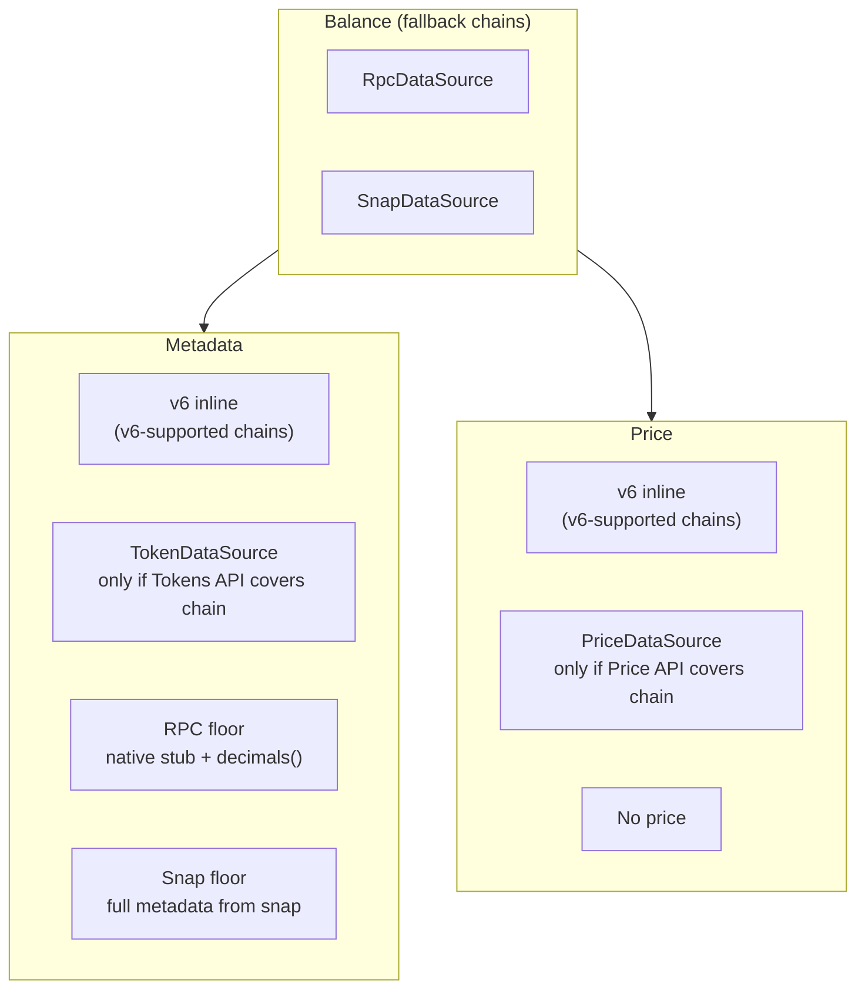

# AssetsController architecture & Accounts API v6 simplification

This document describes how `AssetsController` builds its state today, and how the
Accounts API **v6** balances endpoint (`/v6/multiaccount/balances`, already
available in `@metamask/core-backend`) lets us collapse most of the current
middleware machinery.

- [Part 1 — How `AssetsController` builds state today](#part-1--how-assetscontroller-builds-state-today)
- [Part 2 — Simplifying with Accounts API v6](#part-2--simplifying-with-accounts-api-v6)
- [Part 3 — What code we can remove or simplify](#part-3--what-code-we-can-remove-or-simplify)
- [Part 4 — Fallback chains & tiered enrichment](#part-4--fallback-chains--tiered-enrichment)
- [Caveats](#caveats)

---

## Part 1 — How `AssetsController` builds state today

### 1.1 The big picture

The controller does not fetch anything directly. It owns a set of **balance data
sources** and a set of **enrichment middlewares**, and it assembles them into
different pipelines depending on the trigger. State is built up by pushing a
mutable `context = { request, response }` object through a middleware chain
(`reduceRight` → onion model), then merging the final `response` into controller
state.



### 1.2 The "fast / slow" fetch pipeline (`getAssets({ forceUpdate: true })`)

This is the most complex part. A single refresh is split into **two pipelines**
because different sources have wildly different latencies. Each stage is a
middleware; balance sources and enrichment sources are wrapped in
`createParallelBalanceMiddleware` / `createParallelMiddleware` to run
concurrently, with chain-partitioning so no chain is fetched twice.



Key ordering detail: `DetectionMiddleware` must run **before**
`TokenDataSource`/`PriceDataSource`, because it populates
`response.detectedAssets` and `request.assetsForPriceUpdate`, which are the inputs
those two use to decide what metadata/prices to fetch. This "detect first, then
enrich" contract is the reason the pipeline is a strict chain rather than a flat
parallel fan-out.

### 1.3 The subscription / event pipeline (real-time updates)

Balances also arrive asynchronously, primarily from the WebSocket. Those go
through a *lighter* enrichment chain.



On top of that, `PriceDataSource` runs its **own** polling subscription (every
60s) that re-prices everything already in `assetsBalance`, and
`AccountsApiDataSource` runs its **own** balance polling subscription (every 30s).
So there are effectively three independent update mechanisms feeding the same
state.

### 1.4 Why this is "overcomplicated"

Building one coherent `{ balance, metadata, price }` record for an asset today
requires orchestrating **3 separate REST APIs + WS + RPC**, glued by a detection
step whose only job is to figure out which assets are new enough to warrant
metadata/price lookups:

- **balance** ← v5 Accounts API (or WS, or RPC, or Snap)
- **metadata** (name/symbol/decimals/image/spam) ← Tokens API v3 + Blockaid +
  occurrence-count heuristics
- **price** ← Price API v3 (twice: selected currency + USD)
- **"is this new?"** ← DetectionMiddleware, hand-rolled diffing against state

That fan-out is what forces the fast/slow split, the parallel-merge middlewares,
chain partitioning, RPC-fallback ordering, the detection→enrich contract, and the
three overlapping subscription loops.

---

## Part 2 — Simplifying with Accounts API v6

### 2.1 What v6 gives you in one call

Looking at `V6BalancesResponse` / `getV6MultiAccountBalancesQueryOptions` in
`@metamask/core-backend`, a single `/v6/multiaccount/balances` request returns,
**per account**, everything the enrichment chain currently reconstructs from three
APIs:

| v6 capability                        | Query flag                                     | Replaces today                              |
| ------------------------------------ | ---------------------------------------------- | ------------------------------------------- |
| Token + native balances              | (always)                                       | AccountsApi v5 balances                     |
| Solana token balances, Stellar trustlines | (always)                                  | part of SnapDataSource                      |
| DeFi positions (`category: 'defi'`)  | `includeDeFiBalances`                          | StakedBalanceDataSource (+ new DeFi)        |
| name / symbol / decimals             | (always)                                       | most of TokenDataSource metadata            |
| labels                               | `includeLabels`                                | TokenDataSource labels                      |
| spot `price`                         | `includePrices` + `vsCurrency`                 | PriceDataSource                             |
| spam filtering (only Token-API tokens) | `filterSupportedTokens`                     | occurrence-count + Blockaid filter          |
| detection confirmation               | `includeAssetIds` → `unprocessedIncludeAssetIds` | most of DetectionMiddleware               |
| canonical head (asset dedupe)        | `includeCanonicalHead`                         | custom-asset graduation logic               |

### 2.2 Simplified architecture

The controller keeps its identity (state shape, messenger API, events), but the
balance/metadata/price/detection fan-out collapses into **one primary data
source** for v6-supported chains. RPC and Snap survive as *fallbacks* for chains
v6 does not cover; `TokenDataSource` and `PriceDataSource` are repurposed as
**conditional enrichers** for those fallback assets when Tokens/Price API cover
the chain (see [Part 4](#part-4--fallback-chains--tiered-enrichment)).



### 2.3 Simplified fetch flow

The entire onion of Detection → Token → Price disappears on the **v6 path**,
because v6 returns an already-enriched response. Fallback chains follow a
separate tiered path (RPC/Snap first, then optional Token/Price enrichment).
See [Part 4](#part-4--fallback-chains--tiered-enrichment).



Compare the two "build one asset" paths:



### 2.4 Real-time still needs a small amount of glue

When the WebSocket pushes a balance delta for an asset on a **v6-supported**
chain, call v6 with `includeAssetIds: [newAssetId]` instead of
DetectionMiddleware → TokenDataSource → PriceDataSource.

For deltas on **v6-unsupported** chains, commit the balance from WS/RPC/Snap
first, then run the same conditional fallback enrichment described in
[Part 4](#part-4--fallback-chains--tiered-enrichment).



---

## Part 3 — What code we can remove or simplify

| Component                                                                | Fate with v6                              | Why                                                                                                                                             |
| ------------------------------------------------------------------------ | ----------------------------------------- | ----------------------------------------------------------------------------------------------------------------------------------------------- |
| `AccountsApiDataSource` (v5)                                             | **Replace** with `AccountsApiV6DataSource` | v6 supersets v5 balances and adds metadata/price/defi                                                                                           |
| `DetectionMiddleware`                                                    | **Remove** from v6 path; **replace** on fallback path | v6 does server-side detection via `includeAssetIds`/`unprocessedIncludeAssetIds` + `filterSupportedTokens`. On fallback chains, a simpler "assets missing metadata/price" check replaces the full state-diff contract |
| `PriceDataSource`                                                        | **Remove** from v6 middleware path; **repurpose** as conditional fallback enricher | v6 returns prices inline via `includePrices` + `vsCurrency`. Still needed for fallback-chain assets when Price API covers the chain; subscription shrinks to non-v6 assets only. See [Part 4](#part-4--fallback-chains--tiered-enrichment) |
| `TokenDataSource`                                                        | **Remove** from v6 middleware path; **repurpose** as conditional fallback enricher | v6 returns name/symbol/decimals/labels + spam filtering. Still needed to upgrade RPC/Snap stubs (images, spam filter) when Tokens API covers the chain. See [Part 4](#part-4--fallback-chains--tiered-enrichment) and caveats |
| `StakedBalanceDataSource`                                                | **Remove / fold in**                      | `includeDeFiBalances` returns DeFi + staking positions                                                                                          |
| `RpcFallbackMiddleware`                                                  | **Simplify to** `unprocessedNetworks` handoff | one source returns everything; fallback is just "these chains failed → RPC"                                                                     |
| `ParallelMiddleware` / `createParallelBalanceMiddleware` / chain partitioning | **Remove**                          | no multi-source fan-out to merge/partition on the primary path                                                                                  |
| Fast/slow split in `getAssets`                                          | **Collapse** to a single linear fetch     | the latency fan-out was driven by juggling 3 APIs + RPC/Snap                                                                                    |
| `CustomAssetGraduationMiddleware`                                        | **Simplify**                              | `includeCanonicalHead` + `includeAssetIds` give server-authoritative dedupe/confirmation                                                        |
| Overlapping subscription loops (v5 balance poll + price poll)            | **Collapse** to one v6 poll (or WS + targeted v6); **shrink** price poll to fallback assets | v6 poll covers supported chains; `PriceDataSource` subscription only re-prices non-v6 assets when Price API covers the chain |

**What stays:** the `AssetsController` state shape and messenger/event API (fully
backward compatible), `BackendWebsocketDataSource` for real-time,
`RpcDataSource` for RPC-only ("basic functionality off") mode and v6-unsupported
chains, `SnapDataSource` for chains v6 does not cover, and
`TokenDataSource` / `PriceDataSource` repurposed as **conditional fallback
enrichers** (not pipeline middleware on the v6 path). See
[Part 4](#part-4--fallback-chains--tiered-enrichment).

---

## Part 4 — Fallback chains & tiered enrichment

v6 will not cover every chain. Chains returned in `unprocessedNetworks` (or routed
to Snap from the start) still need balances, metadata, and prices — but **not
from the same sources as the v6 path**.

### 4.1 API coverage is not universal

Accounts API, Tokens API, and Price API each have **independent chain coverage**.
A chain can be:

- indexed for balances by v6 → full inline enrichment
- absent from v6 but present in Tokens API and/or Price API → fallback balances
  with optional API enrichment
- absent from all three → RPC or Snap is the only source; no prices if Price API
  does not cover the chain

There is no RPC or Snap fallback for **prices**. If Price API does not support a
chain, those assets simply have no entry in `assetsPrice`.

For **metadata**, RPC and Snap are the floor when Tokens API does not cover a
chain:

| Source | What it provides when Tokens API is unavailable |
| ------ | ----------------------------------------------- |
| `RpcDataSource` | Native token stub (`symbol`/`name` from chain status, `decimals: 18`). ERC-20 `decimals()` via multicall. No `name`/`symbol`/image for unknown ERC-20s unless already in state. |
| `SnapDataSource` | Full `assetsInfo` (and sometimes `assetsPrice`) returned by the snap handler. |

`TokenDataSource` is an **upgrade** on top of that floor, not a replacement for
it.

### 4.2 Tiered enrichment per asset



| Layer | v6-supported | Fallback + Tokens API | Fallback + no Tokens API | Price API unsupported |
| ----- | ------------ | --------------------- | ------------------------ | --------------------- |
| Balance | v6 | RPC / Snap | RPC / Snap | (same) |
| Metadata | v6 | TokenDataSource upgrades RPC/Snap stubs | RPC / Snap only | N/A |
| Price | v6 | PriceDataSource | PriceDataSource if supported | omit — no price |

### 4.3 How `TokenDataSource` and `PriceDataSource` are repurposed

They are **removed as pipeline middleware** on the v6 path (no
DetectionMiddleware → parallel Token + Price onion). They survive as **scoped,
conditional enrichers** invoked after fallback balances are committed:

1. **Scope by origin** — only asset IDs that came from `unprocessedNetworks` /
   Snap (or are explicitly missing metadata/price in state). v6-mapped assets
   are already enriched inline.
2. **Gate by API coverage** — before calling Tokens API or Price API, check
   whether the chain is supported. Skip silently when it is not.
3. **Do not block the hot path** — commit RPC/Snap balances (and their metadata
   floor) immediately; run Token/Price enrichment asynchronously when
   applicable.
4. **Skip when Snap is already complete** — Snap responses may already include
   `assetsInfo` and `assetsPrice`. Token/Price calls are upgrades for richer
   fields (images, Blockaid spam filtering, USD if v6 only returns one
   `vsCurrency`), not hard requirements.
5. **Shrink the price subscription** — today `PriceDataSource` re-prices
   everything in `assetsBalance` every 60s. After v6, the subscription only
   needs to cover fallback-chain assets (plus any v6 assets missing `usdPrice`
   if dual-currency is preserved via a dedicated Price API fetch; see caveats).

Invocation becomes a single explicit step after the fallback merge — not
`createParallelMiddleware` wrapped in a fast/slow pipeline:

```typescript
// Pseudocode — after RPC/Snap response is merged and committed
const fallbackAssetIds = assetIdsFromFallbackResponse(response);
const tokensApiIds = fallbackAssetIds.filter((id) => tokensApiCoversChain(id));
const priceApiIds = fallbackAssetIds.filter((id) => priceApiCoversChain(id));

if (tokensApiIds.length > 0) {
  await tokenDataSource.enrich({ assetIds: tokensApiIds });
}
if (priceApiIds.length > 0) {
  await priceDataSource.enrich({ assetIds: priceApiIds });
}
```

### 4.4 What replaces `DetectionMiddleware` on the fallback path

On the v6 path, detection is server-side (`includeAssetIds` /
`unprocessedIncludeAssetIds` + `filterSupportedTokens`).

On the fallback path, the equivalent is much simpler: **enrich any fallback
asset that lacks metadata or price in state**. No hand-rolled diff against the
full balance history, no `request.assetsForPriceUpdate` contract, no strict
ordering requirement with parallel middleware.

### 4.5 Lazy secondary enrichment on the v6 path

Even for v6-supported assets, `TokenDataSource` / `PriceDataSource` may still
run as a **lazy, one-shot secondary fetch** (not part of the balance hot path)
when the UI needs fields v6 does not return — images, rich market metadata,
or a dedicated USD price fetch. See [Caveats](#caveats).

---

## Caveats

Three things to confirm with the backend team before deleting code:

1. **Images and rich market data.** `V6BalanceItem` exposes `name`, `symbol`,
   `decimals`, `labels`, `price`, `canonicalHead` — but **no `iconUrl`/image** and
   none of the rich fields `TokenDataSource` stores today (`aggregators`,
   `occurrences`, `honeypotStatus`, `erc20Permit`, market cap / 24h change). If the
   UI needs asset images or that market metadata, `TokenDataSource`/`PriceDataSource`
   become *lazy secondary enrichment* on the v6 path (fetch once per asset), not
   part of the hot balance path. See [§4.5](#45-lazy-secondary-enrichment-on-the-v6-path).
2. **Multi-currency.** Today `PriceDataSource` fetches selected currency **and**
   USD. v6 takes a single `vsCurrency`, so preserving the `usdPrice` field means
   either two v6 calls or a small dedicated USD price fetch via Price API.
3. **Per-chain API coverage map.** Maintain (or source from backend) a list of
   which chains each API supports. Fallback enrichment gates on this: Tokens API
   for metadata upgrades, Price API for prices. Chains absent from both rely
   entirely on RPC/Snap metadata with no price. Confirm this map stays in sync
   as new chains are added.
