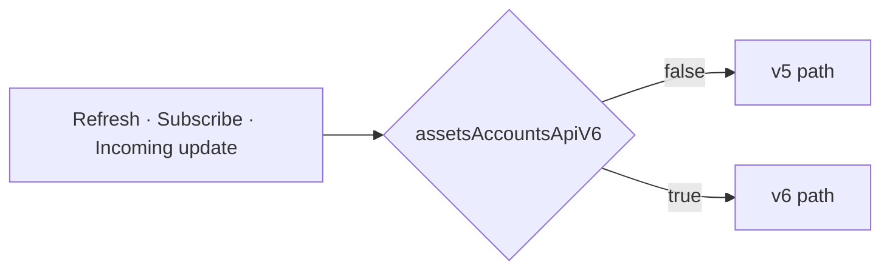
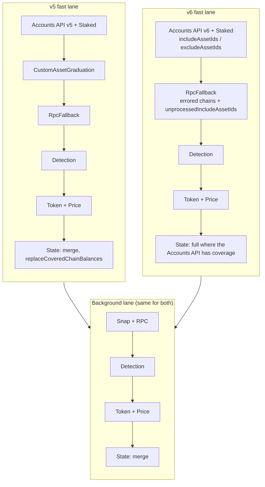
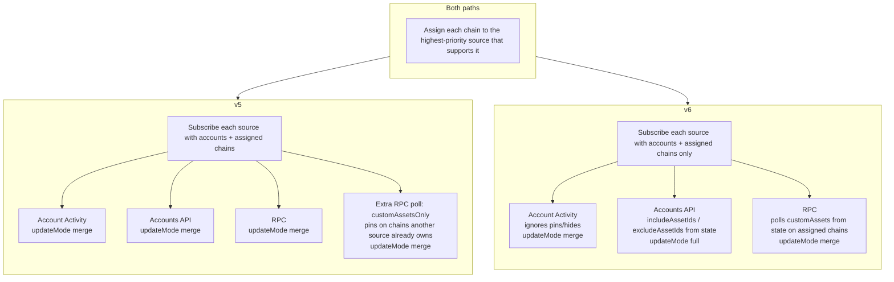
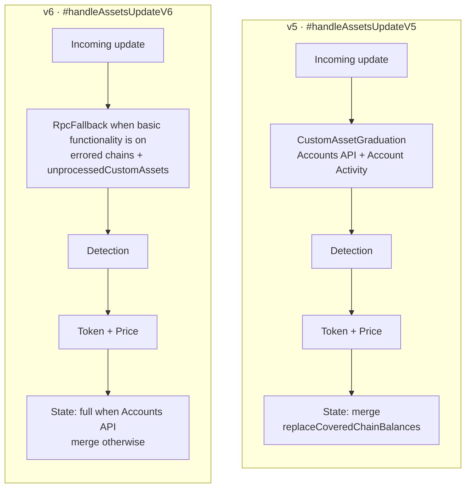

# AssetsController - Accounts API v5 and v6 side by side

## What this change is about

The AssetsController collects token balances, metadata, and prices for every
account and chain, and stores the result for the UI to render.

This release adds support for a new version of the Accounts API (**v6**) while
keeping the current one (**v5**) fully intact. Which one runs is decided at
runtime by the `assetsAccountsApiV6` remote feature flag:

- flag off, missing, or unreadable: the legacy **v5** path (today's production
  behavior)
- `assetsAccountsApiV6: true`: the new **v6** path

The flag is read in exactly one place, `AssetsController.#isBalanceV6Enabled()`,
and passed down to `AccountsApiDataSource` and `RpcFallbackMiddleware`.

## Vocabulary used below

| Term                          | Meaning                                                                                                                           |
| ----------------------------- | --------------------------------------------------------------------------------------------------------------------------------- |
| Pinned asset (custom asset)   | A token the user added manually (Manage Token flow). We always want to fetch it, even when the API does not return it on its own. |
| Hidden asset                  | A token the user chose to hide, so it should not be fetched or shown.                                                             |
| Data source                   | Where balances come from: the Accounts API, RPC nodes, a Snap, or staking.                                                        |
| Middleware                    | A step that enriches or repairs data after it is fetched (token detection, prices, metadata, RPC fallback).                       |
| Fast lane                     | The first, quick round of fetching. Its result is written to state right away so the UI can render.                               |
| Background lane               | The slower sources that run afterwards; their results are merged in.                                                              |
| Update mode `merge` vs `full` | `merge` keeps assets already in state that the response did not mention. `full` replaces the whole slice the source covers.       |
| Basic functionality           | The user setting that turns off network calls to MetaMask services.                                                               |

## Why there are two paths

Rather than scattering flag checks through one shared flow, the controller now
has two named flows:

- the **v5 path** preserves the old behavior exactly, so turning the flag off
  matches production
- the **v6 path** isolates the new behavior, so it can be evaluated on its own
  and the old path can later be deleted in one clean sweep

The split shows up in three places: a forced refresh, setting up live updates,
and handling an update once it arrives.

## 1. Forced refresh

Triggered by `getAssets(..., { forceUpdate: true })`. Both paths have the same
shape: build a request, run the fast lane, write state, then run the background
lane and merge its results.

The requests differ as well:

- **v5** asks for every pinned asset of the requested accounts, without scoping
  them to chains, and does not mention hidden assets.
- **v6** does not copy pins or hides onto the request. The Accounts API
  reads them from state (`includeAssetIds` / `excludeAssetIds`). A
  `customAssets` override still scopes a one-shot fetch (new pin, RPC
  fallback).

When basic functionality is off, both fast lanes shrink to
`Staked -> Detection`. The background lane is RPC only in both paths.

## 2. Setting up live updates (subscribe)

Both paths first hand each chain to the data source with the highest priority
for it. They differ in how pinned assets on those chains are covered:

- **v5** adds a separate RPC poll (`customAssetsOnly`) for pins that sit on a
  chain another source already owns.
- **v6** subscribe only assigns accounts and chains. The Accounts API reads
  pins and hides from state and sends them as `includeAssetIds` /
  `excludeAssetIds`. RPC polls `customAssets` from state on its assigned
  chains. Account Activity ignores pins/hides. Pins the API could not resolve
  are recovered by `RpcFallbackMiddleware` on that update.

## 3. Handling an incoming update

- **v5** (`#handleAssetsUpdateV5`): CustomAssetGraduation (for the Accounts API
  and AccountActivity) -> Detection -> Token + Price -> state written with
  `merge`, honoring `replaceCoveredChainBalances`.
- **v6** (`#handleAssetsUpdateV6`): RpcFallback when basic functionality is on
  (for errored chains and `unprocessedCustomAssets`) -> Detection -> Token +
  Price -> state written as `full` when the Accounts API marks it so.

In other words: v5 never runs `RpcFallbackMiddleware` here, and v6 never runs
`CustomAssetGraduationMiddleware` at all.

## Behavior differences at a glance

| Concern                   | v5                                          | v6                                                     |
| ------------------------- | ------------------------------------------- | ------------------------------------------------------ |
| Accounts API endpoint     | `fetchV5MultiAccountBalances`               | `fetchV6MultiAccountBalances`                          |
| Accounts API update mode  | `merge`                                     | `full`                                                 |
| Covered-chain merge       | Preserve old behavior                       | Replace the covered chain slice                        |
| Pinned asset preservation | Keep custom + staked pins in the merge path | Keep `unprocessedCustomAssets` until RPC resolves them |
| Hidden assets             | Not sent to the endpoint                    | Sent as `excludeAssetIds`                              |
| Token detection filter    | Drop unknown tokens when detection is off   | Not applied; v6 snapshot is kept in full               |
| RPC token fetch           | Flat `request.customAssets` for the chain   | Same: one EVM account per request                      |

## Where the code lives

| Concern               | v5                                         | v6                                                                    |
| --------------------- | ------------------------------------------ | --------------------------------------------------------------------- |
| Force-update request  | `#buildForceUpdateRequestV5`               | `#buildForceUpdateRequestV6`                                          |
| Force-update pipeline | `#forceUpdateAssetsV5`, `#runFastFetchV5`  | `#forceUpdateAssetsV6`, `#runFastFetchV6`                             |
| Fast lane composition | `buildFastFetchSources` (graduation on)    | `buildFastFetchSources` (graduation off)                              |
| Subscribe             | `#subscribeAssetsBalance` + RPC supplement | `#subscribeAssetsBalance`; Accounts API v6 include/exclude from state |
| Update handling       | `#handleAssetsUpdateV5`                    | `#handleAssetsUpdateV6`                                               |
| Balance merge         | `mergeAccountBalancesV5`                   | `mergeAccountBalancesV6`                                              |
| Accounts API fetch    | `#fetchV5Balances`                         | `#fetchV6Balances`                                                    |
| RPC fallback          | `#recoverV5`                               | `#recoverV6`                                                          |

## Deleting v5 after rollout

Once v6 is accepted as the only behavior:

1. Remove the v5 methods and every `!this.#isBalanceV6Enabled()` branch.
2. Keep the v6 methods as the single orchestration path.
3. Remove this document's v5/v6 comparison tables.
