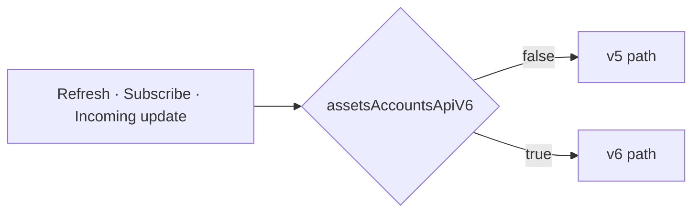
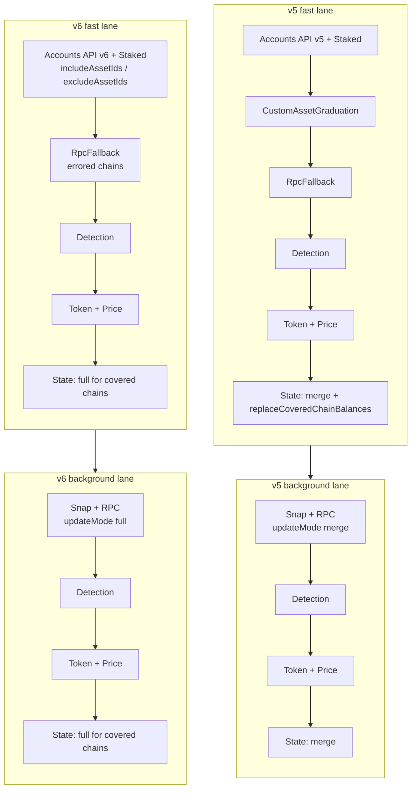
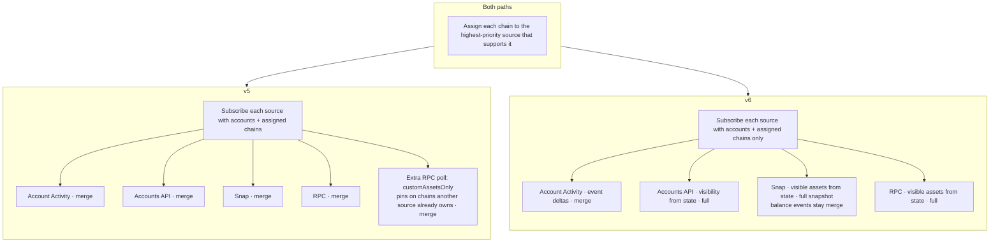
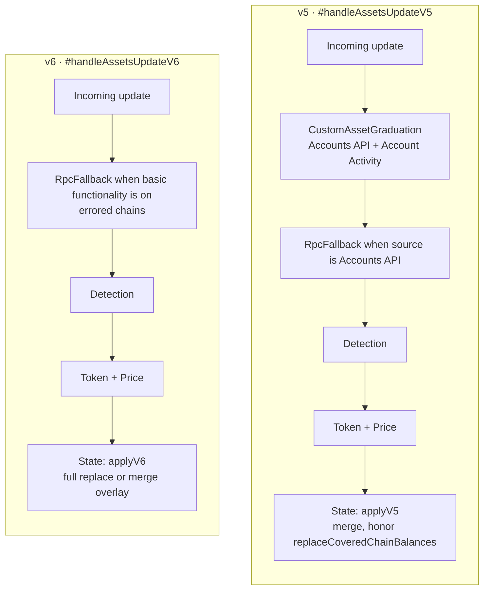

# Accounts API v6 integration

- Date: 2026-09-23
- Status: Accepted
- Package: `@metamask/assets-controller`

How AssetsController manages the visible asset set across Accounts API v5
and v6 while both paths ship behind `assetsAccountsApiV6`.

## What this change is about

The AssetsController collects token balances, metadata, and prices for every
account and chain, and stores the result for the UI to render. The hard part is
not fetching a balance — it is agreeing on **which tokens the user should see**,
and keeping that set intact as several sources write into the same state.

The two Accounts API versions answer that question differently:

- **v5**: the API decides what to return. The client cannot ask for a specific
  token, so anything the API does not index (a pin, mUSD at zero) is patched in
  afterwards — by RPC re-reads, a supplemental custom-asset poll, and custom
  asset graduation. Responses are overlaid onto state (`merge`), so nothing is
  ever removed and a stale token can linger.
- **v6**: the client declares the visible set up front as `includeAssetIds` /
  `excludeAssetIds`, and the answer is authoritative for the chains it covers
  (`full`). That removes the patch-ups, but it means every visible asset must
  appear in the snapshot — otherwise the replace would drop it.

Both paths ship together and stay fully separate. Which one runs is decided at
runtime by the `assetsAccountsApiV6` remote feature flag:

- flag off, missing, or unreadable: the legacy **v5** path (today's production
  behavior)
- `assetsAccountsApiV6: true`: the new **v6** path

The flag is read in exactly one place, `AssetsController.#isBalanceV6Enabled()`,
and injected into `AccountsApiDataSource`, `SnapDataSource`, `RpcDataSource`
(and through it `BalanceFetcher`), and `RpcFallbackMiddleware`.

## Vocabulary used below

| Term                          | Meaning                                                                                                                           |
| ----------------------------- | --------------------------------------------------------------------------------------------------------------------------------- |
| Pinned asset (custom asset)   | A token the user added manually (Manage Token flow). We always want to fetch it, even when the API does not return it on its own. |
| Hidden asset                  | A token the user chose to hide, so it should not be fetched or shown.                                                             |
| Default tracked asset         | A token the client always tracks on a chain even at zero (for example mUSD).                                                      |
| Visible asset                 | Native, pin, or default tracked asset that is not hidden. Staking vault IDs are not visible; a dedicated source owns them.        |
| Data source                   | Where balances come from: the Accounts API, RPC nodes, a Snap, or staking.                                                        |
| Middleware                    | A step that enriches or repairs data after it is fetched (token detection, prices, metadata, RPC fallback).                       |
| Fast lane                     | The first, quick round of fetching. Its result is written to state right away so the UI can render.                               |
| Background lane               | The slower sources that run afterwards; their results are merged in.                                                              |
| Update mode `merge` vs `full` | `merge` keeps assets already in state that the response did not mention. `full` replaces the whole slice the source covers.       |
| Failed chain                  | A chain the source could not answer in full. Its balances are dropped from the response and existing state is left unchanged.     |
| Basic functionality           | The user setting that turns off network calls to MetaMask services.                                                               |

## Why there are two paths

Rather than scattering flag checks through one shared flow, the controller now
has two named flows:

- the **v5 path** preserves the old behavior exactly, so turning the flag off
  matches production
- the **v6 path** isolates the new behavior, so it can be evaluated on its own
  and the old path can later be deleted in one clean sweep

The split shows up in three places: a forced refresh, setting up live updates,
and handling an update once it arrives.

## Shared visibility (v6)

v6 sources do not take pins or hides from the request. They all call
`getAssetVisibility(accountIds, chainIds)` (`utils/assetVisibility.ts`), which
reads controller state and returns:

- `visibleAssetIds`: natives (except chains with no native, e.g. Tempo), pins
  for those accounts, and default tracked assets, minus hidden and staking IDs
- `hiddenAssetIds`: hidden preferences on those chains

Accounts API sends those lists as `includeAssetIds` / `excludeAssetIds`. RPC
and Snap fetch the visible set and skip hidden IDs. Because a `full` snapshot
must mention every visible asset (at zero when unheld), Snap pads missing
visible IDs to `{ amount: '0' }`. RPC builds the same list from state, so a
successful chain is already complete.

`hideAsset` / `removeCustomAsset` re-run `#subscribeAssets` so the next poll
sees the new lists. `addCustomAsset` and `unhideAsset` also force-fetch that
token's chain (every pin from state, not only the new token) so a `full`
snapshot restores the balance immediately and cannot wipe the other pins.

## 1. Forced refresh

Triggered by `getAssets(..., { forceUpdate: true })`. Both paths have the same
shape: build a request, run the fast lane, write state, then run the background
lane.

The requests differ as well:

- **v5** puts every pinned asset of the requested accounts on
  `request.customAssets`, without scoping them to chains, and does not mention
  hidden assets. RPC fallback may add stale tracked assets to that list. Fast
  fetch then writes state as `merge` plus `replaceCoveredChainBalances`, which
  restores custom assets omitted by the API.
- **v6** does not copy pins or hides onto the request. The Accounts API reads
  visibility from state. Detected ERC-20 balances come back with the chain, so
  `updateMode: 'full'` is a complete snapshot for successful chains. A chain
  that is unprocessed, or that did not resolve every `includeAssetId`, is put
  in `errors` and contributes no balances. RPC fallback retries those **chains**
  in full from state and stamps `full`. Snap `#fetchV6` stamps `full` after
  zero-filling missing visible assets. Background Snap+RPC both stamp `full`;
  `mergeDataResponses` promotes `full` if any source did.

When basic functionality is off, both fast lanes shrink to
`Staked -> Detection`. The background lane is RPC only in both paths
(`merge` on v5, `full` on v6).

## 2. Setting up live updates (subscribe)

Both paths first hand each chain to the data source with the highest priority
for it (Accounts API, then Snap, then RPC, plus Account Activity and staking
on the chains they support).

- **v5** adds a separate RPC poll (`customAssetsOnly`) for pins that sit on a
  chain another source already owns.
- **v6** subscribe only assigns accounts and chains. There is no
  `customAssetsOnly` supplement: RPC already polls the visible set on the
  chains it was assigned, and Accounts API / Snap cover pins on their chains
  through visibility. Account Activity events, RPC token detection, staked
  balance updates, and Snap `accountBalancesUpdated` events stay `merge`.

## 3. Handling an incoming update

Both paths still run the Account Activity occurrence-floor filter when basic
functionality is on.

- **v5** (`#handleAssetsUpdateV5`): CustomAssetGraduation (Accounts API and
  Account Activity) → RpcFallback when the source is Accounts API → Detection →
  Token + Price → `applyV5AccountBalanceUpdate` (`effectiveAccountBalancesV5`).
- **v6** (`#handleAssetsUpdateV6`): never CustomAssetGraduation. RpcFallback
  when basic functionality is on (failed chains; native + visible assets from
  state, still `full`) → Detection → Token + Price →
  `applyV6AccountBalanceUpdate` (`effectiveAccountBalancesV6`).

`#updateState` picks the writer from the flag, not from `updateMode`:

- flag off → v5 always
- flag on → v6 always. Inside v6, `updateMode: 'merge'` overlays
  `{ ...previous, ...incoming }`; `updateMode: 'full'` replaces each covered
  chain slice. Visible assets the client asked for survive a `full` replace
  via `skipDelete` (natives, pins, and default tracked assets, plus staking
  vaults until Accounts API returns ETH staked balances). Hidden assets are
  excluded from the snapshot and dropped; unhide is expected to fetch again.

## Failed chains

A v6 source either contributes a complete chain snapshot or nothing for that
chain:

- Accounts API: unprocessed networks and unresolved `includeAssetIds` go in
  `errors`
- RPC: a failed `balanceOf` or unknown decimals fails the whole chain (v5
  still overlays the tokens that succeeded)
- Snap: a snap that does not own the account is skipped; remaining chains stay
  on the request for the next middleware
- `filterFailedChainBalances` strips balances on failed chains before state is
  written, so a partial chain cannot cover (and wipe) that slice

RpcFallback then retries only `errors` keys.

## Behavior differences at a glance

| Concern                   | v5                                                               | v6                                                                                          |
| ------------------------- | ---------------------------------------------------------------- | ------------------------------------------------------------------------------------------- |
| Accounts API endpoint     | `fetchV5MultiAccountBalances`                                    | `fetchV6MultiAccountBalances`                                                               |
| Fetch update mode         | `merge` for Accounts API, Snap, and RPC                          | `full` for Accounts API, Snap, and RPC                                                      |
| Subscribe update mode     | `merge` for every source                                         | `full` for Accounts API, Snap snapshots, and RPC; `merge` for events (Snap, Account Activity, staking, detection) |
| State writer              | `effectiveAccountBalancesV5`                                     | `effectiveAccountBalancesV6(updateMode)`                                                    |
| Covered-chain replace     | `replaceCoveredChainBalances` on force refresh; restore custom + staked | `full` replaces the covered slice; keep visible natives/pins/defaults + staking via `skipDelete` |
| Pinned assets             | `request.customAssets` + merge restore                           | Visibility → `includeAssetIds` / Snap zero-fill / RPC fetch list                            |
| Hidden assets             | Not sent to the endpoint                                         | `excludeAssetIds`; skipped by RPC and Snap; omitted balances dropped on `full` (unhide fetches) |
| Default tracked assets    | Survive only if already in state or returned                     | Always in visibility, so a `full` refresh keeps them at zero when unheld                    |
| Token detection filter    | Drop unknown tokens when detection is off                        | Not applied; v6 snapshot is kept in full                                                    |
| RPC token list            | Request `customAssets` + tracked balances                        | Visible natives, pins, and default tracked from state                                       |
| RPC pin supplement        | Extra `customAssetsOnly` poll                                    | None                                                                                        |
| Custom-asset graduation   | Fast lane and live Accounts API / Account Activity               | Never                                                                                       |
| Failed chain              | Overlay whatever tokens succeeded                                | Drop the chain's balances; leave existing state until RPC recovers it                       |

v6 `updateMode` by source:

| Source           | Fetch / force refresh | Subscribe / live updates                                      |
| ---------------- | --------------------- | ------------------------------------------------------------- |
| Accounts API     | `full`                | `full` (polls `fetch`)                                        |
| Snap             | `full`                | `full` initial fetch; balance events stay `merge`             |
| RPC              | `full`                | `full` (balance poll and tx refresh); detection stays `merge` |
| Account Activity | n/a (event-only)      | `merge`                                                       |
| Staked balances  | `merge`               | `merge`                                                       |

Fast-lane Accounts API `full` merged with staking `merge` still stamps `full`
(`mergeDataResponses` promotes it). Staking rows that are present in that
merged payload are written with the snapshot; if they are omitted, `skipDelete`
keeps the prior vault balance.

## Where the code lives

| Concern               | v5                                         | v6                                                                    |
| --------------------- | ------------------------------------------ | --------------------------------------------------------------------- |
| Flag                  | `#isBalanceV6Enabled` (shared)             | injected into Accounts API, Snap, RPC, BalanceFetcher, RpcFallback    |
| Visibility            | n/a (request `customAssets`)               | `getAssetVisibility` / `#getAssetVisibility`                          |
| Force-update request  | `#buildForceUpdateRequestV5`               | `#buildDataRequest` (pins read from state)                            |
| Force-update pipeline | `#forceUpdateAssetsV5`, `#runFastFetchV5`  | `#forceUpdateAssetsV6`, `#runFastFetchV6`                             |
| Fast lane composition | `buildFastFetchSources` (graduation on)    | `buildFastFetchSources` (graduation off)                              |
| Subscribe             | `#subscribeAssetsBalance` + RPC supplement | `#subscribeAssetsBalance` only                                        |
| Update handling       | `#handleAssetsUpdateV5`                    | `#handleAssetsUpdateV6`                                               |
| State apply           | `applyV5AccountBalanceUpdate`              | `applyV6AccountBalanceUpdate`                                         |
| Balance merge         | `effectiveAccountBalancesV5`               | `effectiveAccountBalancesV6`                                          |
| Accounts API fetch    | `#fetchV5Balances`                         | `#fetchV6Balances`                                                    |
| Snap fetch            | `#fetchV5`                                 | `#fetchV6`                                                            |
| RPC fetch             | `#fetchV5`                                 | `#fetchV6`                                                            |
| RPC fetch list        | `#getAssetsToFetchV5`                      | `#getAssetsToFetchV6`                                                 |
| RPC fallback          | `#recoverV5`                               | `#recoverV6`                                                          |
| Failed-chain filter   | `filterFailedChainBalances` (shared)       | same helper; v6 uses it to keep snapshots atomic                      |

## Deleting v5 after rollout

Once v6 is accepted as the only behavior:

1. Remove the v5 methods (`#fetchV5`, `#fetchV5Balances`, `#recoverV5`,
   `#forceUpdateAssetsV5`, `#handleAssetsUpdateV5`,
   `applyV5AccountBalanceUpdate`, `effectiveAccountBalancesV5`,
   `#subscribeRpcCustomAssetsSupplement`) and every
   `!this.#isBalanceV6Enabled()` branch.
2. Keep the v6 methods as the single orchestration path. Drop
   `isStakingContractAssetId` from `skipDelete` when Accounts API returns ETH
   staked balances, and drop its native branch when Accounts API always returns
   an explicit zero row for every requested native.
3. Remove this document's v5/v6 comparison tables.
