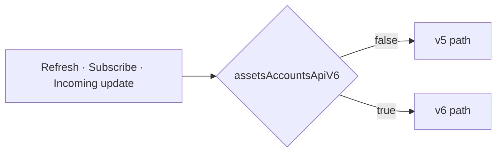
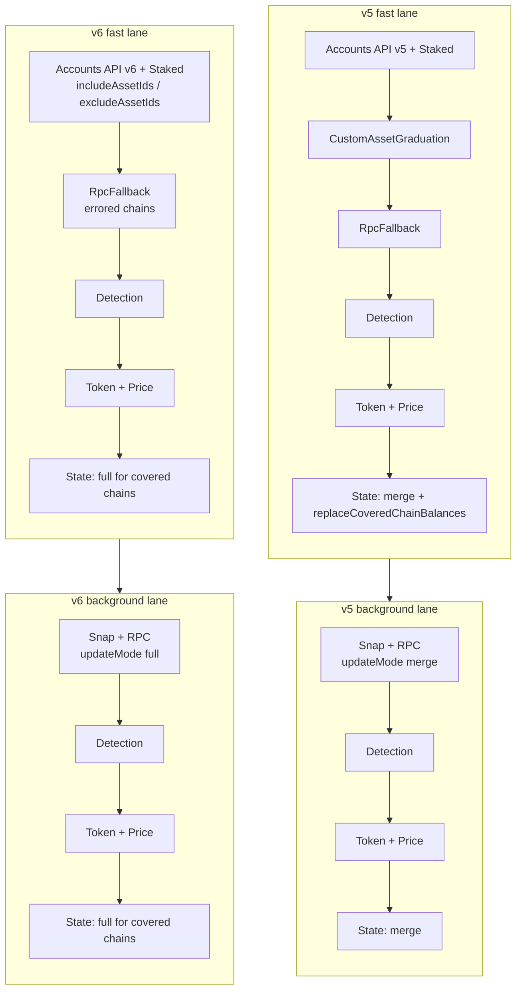
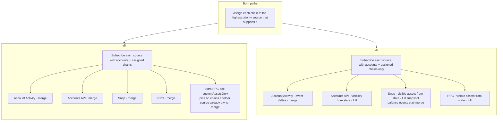
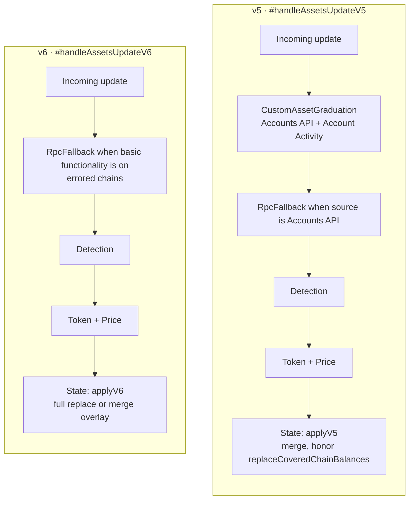
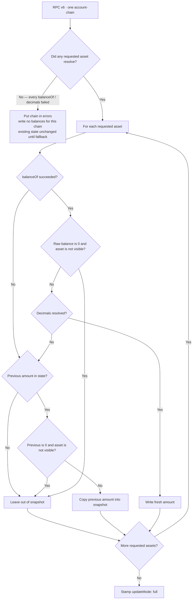
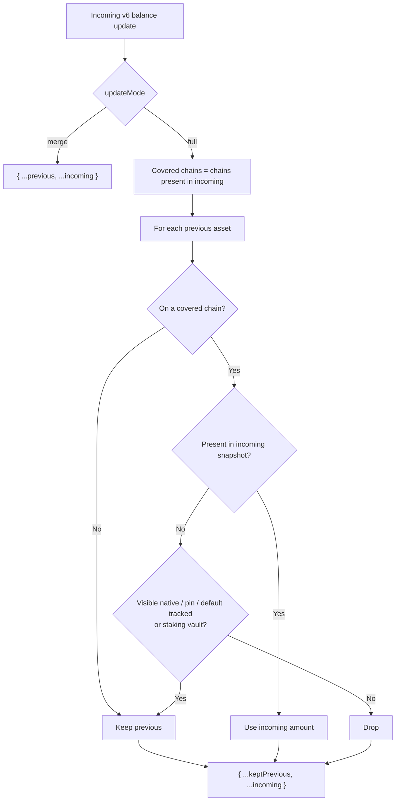
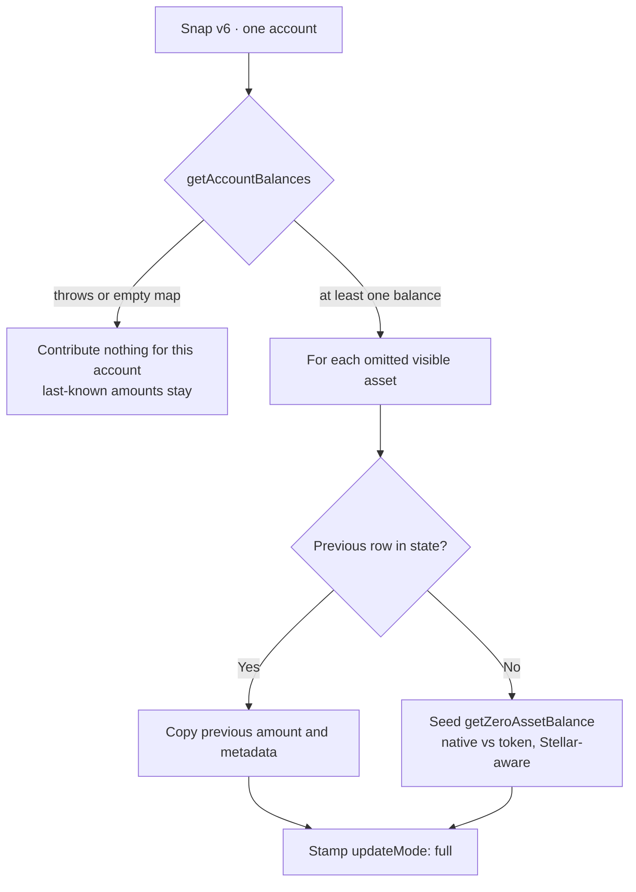

# Accounts API v6 integration

- Date: 2026-09-23
- Status: Accepted
- Package: `@metamask/assets-controller`

How AssetsController manages the visible asset set across Accounts API v5
and v6 while both paths ship behind `assetsAccountsApiV6`.

## What this change is about

The AssetsController collects token balances, metadata, and prices for every
account and chain, and stores the result for the UI to render. The hard part is
not fetching a balance — it is agreeing on **which tokens the user should see**,
and keeping that set intact as several sources write into the same state.

The two Accounts API versions answer that question differently:

- **v5**: the API decides what to return. The client cannot ask for a specific
  token, so anything the API does not index (a pin, mUSD at zero) is patched in
  afterwards — by RPC re-reads, a supplemental custom-asset poll, and custom
  asset graduation. Responses are overlaid onto state (`merge`), so nothing is
  ever removed and a stale token can linger.
- **v6**: the client declares the visible set up front as `includeAssetIds` /
  `excludeAssetIds`, and the answer is authoritative for the chains it covers
  (`full`). That removes the patch-ups, but it means every visible asset must
  appear in the snapshot — otherwise the replace would drop it.

Both paths ship together and stay fully separate. Which one runs is decided at
runtime by the `assetsAccountsApiV6` remote feature flag:

- flag off, missing, or unreadable: the legacy **v5** path (today's production
  behavior)
- `assetsAccountsApiV6: true`: the new **v6** path

The flag is read in exactly one place, `AssetsController.#isBalanceV6Enabled()`,
and injected into `AccountsApiDataSource`, `SnapDataSource`, `RpcDataSource`
(and through it `BalanceFetcher`), and `RpcFallbackMiddleware`.

## Vocabulary used below

| Term                          | Meaning                                                                                                                           |
| ----------------------------- | --------------------------------------------------------------------------------------------------------------------------------- |
| Pinned asset (custom asset)   | A token the user added manually (Manage Token flow). We always want to fetch it, even when the API does not return it on its own. |
| Hidden asset                  | A token the user chose to hide, so it should not be fetched or shown.                                                             |
| Default tracked asset         | A token the client always tracks on a chain even at zero (for example mUSD).                                                      |
| Visible asset                 | Native, pin, or default tracked asset that is not hidden. Staking vault IDs are not visible; a dedicated source owns them.        |
| Data source                   | Where balances come from: the Accounts API, RPC nodes, a Snap, or staking.                                                        |
| Middleware                    | A step that enriches or repairs data after it is fetched (token detection, prices, metadata, RPC fallback).                       |
| Fast lane                     | The first, quick round of fetching. Its result is written to state right away so the UI can render.                               |
| Background lane               | The slower sources that run afterwards; their results are merged in.                                                              |
| Update mode `merge` vs `full` | `merge` keeps assets already in state that the response did not mention. `full` replaces the whole slice the source covers.       |
| Failed chain                  | A chain the source could not answer in full. Its balances are dropped from the response and existing state is left unchanged.     |
| Basic functionality           | The user setting that turns off network calls to MetaMask services.                                                               |

## Why there are two paths

Rather than scattering flag checks through one shared flow, the controller now
has two named flows:

- the **v5 path** preserves the old behavior exactly, so turning the flag off
  matches production
- the **v6 path** isolates the new behavior, so it can be evaluated on its own
  and the old path can later be deleted in one clean sweep

The split shows up in three places: a forced refresh, setting up live updates,
and handling an update once it arrives.

## Shared visibility (v6)

v6 sources do not take pins or hides from the request. They all call
`getAssetVisibility(accountIds, chainIds)` (`utils/assetVisibility.ts`), which
reads controller state and returns:

- `visibleAssetIds`: natives (except chains with no native, e.g. Tempo), pins
  for those accounts, and default tracked assets, minus hidden and staking IDs
- `hiddenAssetIds`: hidden preferences on those chains

Accounts API sends those lists as `includeAssetIds` / `excludeAssetIds`. RPC
and Snap fetch the visible set and skip hidden IDs. Snap also asks the keyring
for those visible IDs (not only `listAccountAssets` holdings). Because a `full`
snapshot must mention every visible asset, Snap then fills any ID still
missing from a non-empty snap response — last-known amount if present,
otherwise `0`. An empty `getAccountBalances` result is treated as a failed
fetch, not a zero snapshot. RPC requests the visible set plus already-tracked
ERC-20s (detected tokens already in `assetsBalance`), always stamps `full`,
and carries the previous amount for any asset whose `balanceOf` or decimals
lookup failed so one unreadable token cannot wipe the rest of the chain.

`hideAsset` / `removeCustomAsset` re-run `#subscribeAssets` so the next poll
sees the new lists. `addCustomAsset` and `unhideAsset` also force-fetch that
token's chain (every pin from state, not only the new token) so a `full`
snapshot restores the balance immediately and cannot wipe the other pins.

## 1. Forced refresh

Triggered by `getAssets(..., { forceUpdate: true })`. Both paths have the same
shape: build a request, run the fast lane, write state, then run the background
lane.

The requests differ as well:

- **v5** puts every pinned asset of the requested accounts on
  `request.customAssets`, without scoping them to chains, and does not mention
  hidden assets. RPC fallback may add stale tracked assets to that list. Fast
  fetch then writes state as `merge` plus `replaceCoveredChainBalances`, which
  restores custom assets omitted by the API.
- **v6** does not copy pins or hides onto the request. The Accounts API reads
  visibility from state. Detected ERC-20 balances come back with the chain, so
  `updateMode: 'full'` is a complete snapshot for successful chains. A chain
  that is unprocessed, or that did not resolve every `includeAssetId`, is put
  in `errors` and contributes no balances. RPC fallback retries those **chains**
  in full from state. RPC always stamps `full`: resolved tokens get a fresh
  amount, unread tokens keep the amount already in state, and a chain that
  resolved nothing is listed in `errors` instead of writing an empty slice.
  Snap `#fetchV6` requests visible assets with listed holdings, stamps `full`,
  and fills omitted visible assets from current state (`0` if none). An empty
  `getAccountBalances` map (or a thrown fetch) contributes nothing, so last-
  known amounts are kept. Background Snap and
  RPC both stamp `full`. `mergeDataResponses` promotes `full` if any source did.

When basic functionality is off, both fast lanes shrink to
`Staked -> Detection`. The background lane is RPC only in both paths
(`merge` on v5; `full` on v6).

## 2. Setting up live updates (subscribe)

Both paths first hand each chain to the data source with the highest priority
for it (Accounts API, then Snap, then RPC, plus Account Activity and staking
on the chains they support).

- **v5** adds a separate RPC poll (`customAssetsOnly`) for pins that sit on a
  chain another source already owns.
- **v6** subscribe only assigns accounts and chains. There is no
  `customAssetsOnly` supplement: RPC already polls the visible set on the
  chains it was assigned, and Accounts API / Snap cover pins on their chains
  through visibility. Account Activity events, RPC token detection, staked
  balance updates, and Snap `accountBalancesUpdated` events stay `merge`.

## 3. Handling an incoming update

Both paths still run the Account Activity occurrence-floor filter when basic
functionality is on.

- **v5** (`#handleAssetsUpdateV5`): CustomAssetGraduation (Accounts API and
  Account Activity) → RpcFallback when the source is Accounts API → Detection →
  Token + Price → `applyV5AccountBalanceUpdate` (`effectiveAccountBalancesV5`).
- **v6** (`#handleAssetsUpdateV6`): never CustomAssetGraduation. RpcFallback
  when basic functionality is on (failed chains; native + visible assets from
  state, still `full`) → Detection → Token + Price →
  `applyV6AccountBalanceUpdate` (`effectiveAccountBalancesV6`).

`#updateState` picks the writer from the flag, not from `updateMode`:

- flag off → v5 always
- flag on → v6 always. Inside v6, `updateMode: 'merge'` overlays
  `{ ...previous, ...incoming }`; `updateMode: 'full'` replaces each covered
  chain slice. Visible assets the client asked for survive a `full` replace
  via `shouldKeepAsset` (natives, pins, and default tracked assets, plus staking)
  vaults until Accounts API returns ETH staked balances). Hidden assets are
  excluded from the snapshot and dropped; unhide is expected to fetch again.

## What a v6 `full` snapshot may drop

A `full` write is authoritative for the **chains it covers**. It must never
drop a token because one RPC read failed. It still drops tokens whose absence
means “gone”: a detected ERC-20 successfully read as `0`, a hidden token, or a
detected token a complete Accounts API snapshot never returned.

### RPC v6: build the snapshot

RPC fetch and poll (`#fetchV6` / `#handleBalanceUpdateV6`) share this tree.
Requested assets are the visible set plus already-tracked ERC-20s, minus
hidden and staking vault IDs.

A failed `balanceOf` or unknown decimals therefore keeps the last good amount
and still lets every other token on that chain update. Only a chain that
resolved **nothing** is treated as a failed chain.

### Controller: apply the snapshot

`effectiveAccountBalancesV6` is `{ ...keptPrevious, ...incoming }`. Incoming
always overwrites a kept row. Visible / staking only **survives omission** —
they do not freeze the previous amount when the snapshot includes them.

Detected tokens omitted from a `full` payload are dropped — that is how an
empty detected token leaves the list.

| Situation                                                                     | Result                                                                        |
| ----------------------------------------------------------------------------- | ----------------------------------------------------------------------------- |
| One RPC `balanceOf` or decimals lookup fails, others succeed                  | Keep previous amount for the unread token; rest of the chain updates (`full`) |
| RPC resolved nothing on the chain                                             | No write for that chain; state unchanged until RpcFallback                    |
| Detected ERC-20 successfully read as `0` (not native / pin / default tracked) | Omit from snapshot → `full` drops it                                          |
| Visible asset (native, pin, default tracked) at `0`                           | Write a zero row so `full` cannot drop it                                     |
| Hidden asset                                                                  | Not fetched; dropped on `full`                                                |
| Staking vault omitted from the snapshot                                       | Kept (`shouldKeepAsset`)                                                      |
| Accounts API `full` omits a detected token                                    | Dropped unless it is visible or staking                                       |
| `merge` event (detection, Account Activity, Snap balance event, staking)      | Overlay only; nothing is removed                                              |
| Snap `getAccountBalances` throws or returns `{}`                              | No write for that account; last-known amounts stay                            |
| Snap returns some balances but omits a visible asset that already has a row   | Copy that row into the snapshot (`full`)                                      |
| Snap omits a visible asset with no previous row                               | Seed a chain-specific zero (`getZeroAssetBalance`) so `full` cannot drop it   |

## When v6 keeps a stale balance

A `full` snapshot has three ways to treat an asset it did not freshly read:

| Choice      | What the snapshot does                          | What the user sees                                                                                            |
| ----------- | ----------------------------------------------- | ------------------------------------------------------------------------------------------------------------- |
| Wipe        | Write `0` (or an empty Stellar metadata object) | The token is still listed, but the amount looks spent or gone                                                 |
| Omit        | Leave it out of a `full` payload                | Detected tokens disappear from the list. Visible natives / pins / defaults survive only via `shouldKeepAsset` |
| Carry stale | Copy the last good row into the snapshot        | The token stays listed at the last successful read; the next poll retries                                     |

v6 chooses **carry stale** whenever a read failed but we already had an amount, and **omit the whole chain** (no write) when the source resolved nothing. It writes zero only when the source successfully reported zero, or when we must seed a visible asset that has never been seen.

Wipe is worse than a slightly old number. `0` reads as “you have nothing”: send and swap use that amount, and a Snap or RPC outage looks like a drained account. Last-known-good is still an observation we actually made.

Omit is worse on a `full` replace than it was on v5 `merge`. v5 overlaid whatever arrived and left the rest of state alone, so a missed token lingered. v6 replaces the covered chain slice: an omitted detected ERC-20 is dropped, so a single failed `balanceOf` would hide a token the user still holds. Copying the previous amount into the snapshot keeps that token on the list and still lets every other token on the chain update. Visible assets would survive omission through `shouldKeepAsset`, but putting the previous row in the snapshot makes the carry explicit and keeps Snap / RPC aligned with how the controller applies `full`.

Doing nothing for the **entire chain** because one token failed is also worse. RPC would then skip a successful ETH read just because one ERC-20 timed out. Carry the unread token, write fresh amounts for the rest. Only when **every** requested read failed (RPC) or the Snap returned no balances at all do we leave the chain untouched — there is no partial snapshot we trust, so we do not cover that slice.

### Snap v6: build the snapshot

### Stale balance scenarios

| Source       | What happened                                                                    | Stale?                                            | Why not wipe                                                                                                | Why not omit / no-op the chain                                                                                                                                 |
| ------------ | -------------------------------------------------------------------------------- | ------------------------------------------------- | ----------------------------------------------------------------------------------------------------------- | -------------------------------------------------------------------------------------------------------------------------------------------------------------- |
| Snap         | `getAccountBalances` throws, or returns `{}`                                     | Yes — whole account left as last written          | A failed Snap is not “balance is 0”. Showing `0` on SOL / XLM / BTC looks like the wallet emptied           | There is no complete snapshot. Writing `full` with zeros or an empty slice would cover the chain and wipe it                                                   |
| Snap         | Response lists some holdings but skips a pin / native / default we already track | Yes — that asset only                             | Same: omission is not a successful zero                                                                     | If we left it out, `full` would drop it or rely on `shouldKeepAsset`. Copying the row keeps the token listed while the rest of the Snap snapshot still updates |
| Snap         | Same skip, but we have never stored that asset                                   | No — seed a typed zero                            | First paint of a visible asset must appear or `full` drops it. This is a seed, not a wipe of a known amount | n/a                                                                                                                                                            |
| RPC          | One `balanceOf` or decimals lookup fails; others succeed; previous amount exists | Yes — that token only                             | A node timeout is not a zero read                                                                           | Omitting a detected ERC-20 from `full` removes it from the list. Failing the whole chain would also freeze tokens we did read                                  |
| RPC          | Same failure, previous is `0` and the asset is not visible                       | No — omit, `full` drops it                        | An unheld detected token at 0 should leave the list, same as a successful zero read                         | n/a                                                                                                                                                            |
| RPC          | Every requested asset on the chain failed                                        | Yes — whole chain, no write until RpcFallback     | Same as Snap empty / `{}`: we do not invent zeros                                                           | We also do not stamp `full` with an empty slice, which would cover the chain and wipe it                                                                       |
| Accounts API | Unprocessed network or unresolved `includeAssetIds`                              | Yes — chain listed in `errors`, balances stripped | Incomplete API payload is not “those tokens are gone”                                                       | RpcFallback retries the chain from state instead of showing `0`                                                                                                |

Successful zeros still win. Incoming always overwrites a kept row, so a real `0` from Snap, RPC, or Accounts API replaces stale. Stale is only for **failed or incomplete** reads.

## Failed chains

A v6 source either contributes a complete chain snapshot or nothing for that
chain:

- Accounts API: unprocessed networks and unresolved `includeAssetIds` go in
  `errors`
- RPC: a chain that resolved **nothing** goes in `errors`. A single failed
  `balanceOf` or unknown decimals does **not** fail the chain; the previous
  amount is carried so the snapshot stays complete. v5 still overlays only
  the tokens that succeeded (`merge`)
- Snap: a thrown `getAccountBalances`, an empty map, or a snap that does not
  own the account contributes nothing for that account; remaining chains stay
  on the request for the next middleware
- `filterFailedChainBalances` strips balances on failed chains before state is
  written, so an empty failed chain cannot cover (and wipe) that slice

RpcFallback then retries only `errors` keys.

## Behavior differences at a glance

| Concern                 | v5                                                                      | v6                                                                                                                                                   |
| ----------------------- | ----------------------------------------------------------------------- | ---------------------------------------------------------------------------------------------------------------------------------------------------- |
| Accounts API endpoint   | `fetchV5MultiAccountBalances`                                           | `fetchV6MultiAccountBalances`                                                                                                                        |
| Fetch update mode       | `merge` for Accounts API, Snap, and RPC                                 | `full` for Accounts API, Snap, and RPC; RPC carries previous amounts for unread tokens                                                               |
| Subscribe update mode   | `merge` for every source                                                | `full` for Accounts API, Snap snapshots, and RPC (carry previous on unread tokens); `merge` for events (Snap, Account Activity, staking, detection)  |
| State writer            | `effectiveAccountBalancesV5`                                            | `effectiveAccountBalancesV6(updateMode)`                                                                                                             |
| Covered-chain replace   | `replaceCoveredChainBalances` on force refresh; restore custom + staked | `full` replaces the covered slice; keep visible natives/pins/defaults + staking via `shouldKeepAsset`                                                |
| Pinned assets           | `request.customAssets` + merge restore                                  | Visibility → `includeAssetIds` / Snap fill from state-or-0 / RPC fetch list                                                                          |
| Hidden assets           | Not sent to the endpoint                                                | `excludeAssetIds`; skipped by RPC and Snap; omitted balances dropped on `full` (unhide fetches)                                                      |
| Default tracked assets  | Survive only if already in state or returned                            | Always in visibility, so a `full` refresh keeps them at zero when unheld                                                                             |
| Token detection filter  | Drop unknown tokens when detection is off                               | Not applied; v6 snapshot is kept in full                                                                                                             |
| RPC token list          | Request `customAssets` + tracked balances                               | Visible natives, pins, and default tracked from state, plus already-tracked ERC-20s                                                                  |
| RPC pin supplement      | Extra `customAssetsOnly` poll                                           | None                                                                                                                                                 |
| Custom-asset graduation | Fast lane and live Accounts API / Account Activity                      | Never                                                                                                                                                |
| Failed chain            | Overlay whatever tokens succeeded                                       | Accounts API / Snap drop the chain; RPC drops only chains that resolved nothing, and carries previous amounts for unread tokens on a `full` snapshot |

v6 `updateMode` by source:

| Source           | Fetch / force refresh                           | Subscribe / live updates                                                 |
| ---------------- | ----------------------------------------------- | ------------------------------------------------------------------------ |
| Accounts API     | `full`                                          | `full` (polls `fetch`)                                                   |
| Snap             | `full`                                          | `merge`                                                                  |
| RPC              | `full` (carry previous amount on unread tokens) | `full` (carry previous amount on unread tokens); detection stays `merge` |
| Account Activity | n/a (event-only)                                | `merge`                                                                  |
| Staked balances  | `merge`                                         | `merge`                                                                  |

Fast-lane Accounts API `full` merged with staking `merge` still stamps `full`
(`mergeDataResponses` promotes it). Staking rows that are present in that
merged payload are written with the snapshot; if they are omitted, `shouldKeepAsset`
keeps the prior vault balance.

## Where the code lives

| Concern               | v5                                         | v6                                                                 |
| --------------------- | ------------------------------------------ | ------------------------------------------------------------------ |
| Flag                  | `#isBalanceV6Enabled` (shared)             | injected into Accounts API, Snap, RPC, BalanceFetcher, RpcFallback |
| Visibility            | n/a (request `customAssets`)               | `getAssetVisibility` / `#getAssetVisibility`                       |
| Force-update request  | `#buildForceUpdateRequestV5`               | `#buildDataRequest` (pins read from state)                         |
| Force-update pipeline | `#forceUpdateAssetsV5`, `#runFastFetchV5`  | `#forceUpdateAssetsV6`, `#runFastFetchV6`                          |
| Fast lane composition | `buildFastFetchSources` (graduation on)    | `buildFastFetchSources` (graduation off)                           |
| Subscribe             | `#subscribeAssetsBalance` + RPC supplement | `#subscribeAssetsBalance` only                                     |
| Update handling       | `#handleAssetsUpdateV5`                    | `#handleAssetsUpdateV6`                                            |
| State apply           | `applyV5AccountBalanceUpdate`              | `applyV6AccountBalanceUpdate`                                      |
| Balance merge         | `effectiveAccountBalancesV5`               | `effectiveAccountBalancesV6`                                       |
| Accounts API fetch    | `#fetchV5Balances`                         | `#fetchV6Balances`                                                 |
| Snap fetch            | `#fetchV5`                                 | `#fetchV6`                                                         |
| RPC fetch             | `#fetchV5`                                 | `#fetchV6`                                                         |
| RPC fetch list        | `#getAssetsToFetchV5`                      | `#getAssetsToFetchV6`                                              |
| RPC fallback          | `#recoverV5`                               | `#recoverV6`                                                       |
| Failed-chain filter   | `filterFailedChainBalances` (shared)       | same helper; v6 uses it to keep snapshots atomic                   |

## Deleting v5 after rollout

Once v6 is accepted as the only behavior:

1. Remove the v5 methods (`#fetchV5`, `#fetchV5Balances`, `#recoverV5`,
   `#forceUpdateAssetsV5`, `#handleAssetsUpdateV5`,
   `applyV5AccountBalanceUpdate`, `effectiveAccountBalancesV5`,
   `#subscribeRpcCustomAssetsSupplement`) and every
   `!this.#isBalanceV6Enabled()` branch.
2. Keep the v6 methods as the single orchestration path. Drop
   `isStakingContractAssetId` from `shouldKeepAsset` when Accounts API returns ETH
   staked balances, and drop its native branch when Accounts API always returns
   an explicit zero row for every requested native.
3. Remove this document's v5/v6 comparison tables.
