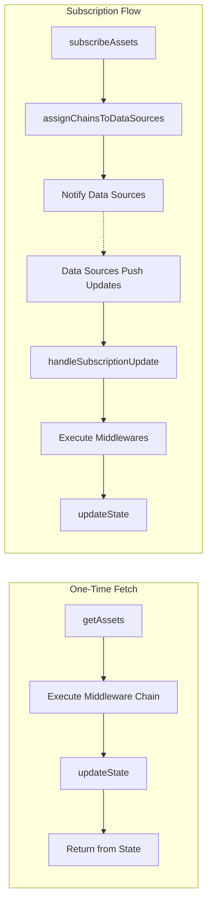

# AssetsController

## Overview

The `AssetsController` is a unified asset management system that provides real-time balance tracking across all blockchain networks (EVM and non-EVM) and all asset types (native tokens, ERC-20, NFTs, etc.). It follows a **middleware architecture**.

---

## Architecture

```
┌──────────────────────────────────────────────────────────────────────────────┐
│                              AssetsController                                 │
├──────────────────────────────────────────────────────────────────────────────┤
│  ┌─────────────┐  ┌─────────────┐  ┌─────────────┐  ┌─────────────┐          │
│  │   State     │  │Subscriptions│  │  Middleware │  │   Events    │          │
│  │  Manager    │  │   Manager   │  │    Chain    │  │  Publisher  │          │
│  └─────────────┘  └─────────────┘  └─────────────┘  └─────────────┘          │
├──────────────────────────────────────────────────────────────────────────────┤
│                                                                               │
│        Fetch Stack                          Event Stack                       │
│  ┌───────────────────┐               ┌───────────────────┐                   │
│  │     WebSocket     │               │                   │                   │
│  ├───────────────────┤               │                   │                   │
│  │    AccountsAPI    │               │                   │                   │
│  ├───────────────────┤               │                   │                   │
│  │       Snap        │               │                   │                   │
│  ├───────────────────┤               │                   │                   │
│  │       RPC         │               │                   │                   │
│  ├───────────────────┤               ├───────────────────┤                   │
│  │     Detection     │               │     Detection     │                   │
│  ├───────────────────┤               ├───────────────────┤                   │
│  │       Token       │               │       Token       │                   │
│  ├───────────────────┤               ├───────────────────┤                   │
│  │       Price       │               │       Price       │                   │
│  └───────────────────┘               └───────────────────┘                   │
│                                                                               │
│  On-demand data fetch                Process incoming updates                 │
│                                      (enrichment only)                        │
└──────────────────────────────────────────────────────────────────────────────┘
```

---

## Lifecycle Stages

### 1. Initialization

When the `AssetsController` constructor is called, it performs the following steps **synchronously**:

#### 1.1 Base Controller Setup

```typescript
super({
  name: 'AssetsController',
  messenger,
  metadata: stateMetadata,
  state: { ...defaultState, ...providedState },
});
```

#### 1.2 Initialize Internal State

```typescript
initializeState()
├── selectedAccounts = []  // Empty until account group event fires
├── enabledChains = extractEnabledChains(NetworkEnablementController.getState())
└── assetsPrice = {}  // In-memory price cache
```

#### 1.3 Subscribe to External Events

| Event | Handler | Purpose |
|-------|---------|---------|
| `AccountTreeController:selectedAccountGroupChange` | `handleAccountGroupChanged()` | Track active accounts |
| `NetworkEnablementController:stateChange` | `handleEnabledNetworksChanged()` | Track enabled chains |
| `AppStateController:appOpened` | `handleAppOpened()` | Start subscriptions |
| `AppStateController:appClosed` | `handleAppClosed()` | Stop subscriptions |
| `KeyringController:unlock` | `refreshSubscriptions()` | Resume on unlock |
| `KeyringController:lock` | `unsubscribeAll()` | Pause on lock |

#### 1.4 Register Action Handlers

```typescript
registerActionHandlers()
├── AssetsController:getAssets
├── AssetsController:getAssetsBalance
├── AssetsController:getAssetMetadata
└── AssetsController:getAssetsPrice
```

#### 1.5 Register Data Sources

```typescript
registerDefaultDataSources()
├── BackendWebsocketDataSource (priority: 100) - Real-time WebSocket
├── AccountsApiDataSource      (priority: 99)  - HTTP polling fallback
├── SnapDataSource             (priority: 81)  - Solana/Bitcoin/Tron snaps
└── RpcDataSource              (priority: 50)  - Direct blockchain RPC
```

For each data source:

1. Create fetch middleware
2. Subscribe to `activeChainsUpdated` event
3. Trigger initial `getActiveChains()` refresh
4. Sort by priority (highest first)

#### 1.6 Register Middlewares

```typescript
registerDefaultMiddlewares()
├── TokenDataSource middleware   - Enriches responses with token metadata
└── DetectionMiddleware          - Identifies assets without metadata
```

**Order matters**: Middlewares are stacked with `reduceRight`, so Detection runs first (populates `detectedAssets`), then Token uses that data.

---

### 2. Start (App Opened)

When the app opens or the keyring unlocks:

```
handleAppOpened() / KeyringController:unlock
│
├── refreshSubscriptions()
│   │
│   └── For each selectedAccount:
│       ├── getEnabledChainsForAccount(account)  // Respect account scopes
│       ├── assignChainsToDataSources(chains)    // Priority-based
│       └── subscribeAssets({ account, chainIds, dataTypes: ['balance', 'metadata', 'price'] })
│           │
│           └── For each dataSource (in parallel):
│               ├── Filter chains this source handles
│               ├── Call dataSource:subscribe via Messenger
│               │   └── Data sources handle all subscribed dataTypes (balance, metadata, price)
│               └── Subscribe to dataSource:assetsUpdated events
│
└── fetchAssets()
    │
    └── For each selectedAccount:
        ├── getEnabledChainsForAccount(account)
        └── getAssets([account], { chainIds, forceUpdate: true })
            │
            └── executeMiddlewares(request)
                ├── BackendWebsocket handles eip155:1, eip155:137...
                ├── AccountsApi handles remaining API-supported chains
                ├── SnapDataSource handles solana:*, bip122:*...
                ├── RpcDataSource handles any remaining EVM chains
                ├── DetectionMiddleware marks assets without metadata
                ├── TokenDataSource enriches metadata
                └── PriceDataSource fetches prices for discovered assets
```

---

### 3. Runtime

#### 3.1 One-Time Fetch (Sync)

Used for initial load, force refresh, or on-demand queries:

```typescript
async getAssets(accounts, { chainIds, forceUpdate })
│
├── If forceUpdate:
│   ├── executeMiddlewares(middlewares, request)
│   └── updateState(response)
│
└── Return getAssetsFromState(accounts, chainIds)
```

#### 3.2 Async Subscriptions

Data sources push updates via Messenger events. All data types (balance, metadata, price) flow through the same unified subscription:

```
DataSource publishes: "{DataSourceName}:assetsUpdated"
│
└── handleSubscriptionUpdate(response)
    │
    │   Response contains any combination of:
    │   ├── assetsBalance   - Balance updates
    │   ├── assetsMetadata  - Metadata updates
    │   └── assetsPrice     - Price updates
    │
    ├── executeMiddlewares(additionalMiddlewares, request, response)
    │   ├── DetectionMiddleware - Marks assets without metadata
    │   ├── TokenDataSource - Fetches missing metadata
    │   └── PriceDataSource - Fetches prices for detected assets
    │
    └── updateState(enrichedResponse)
        │
        ├── Normalize asset IDs (checksum EVM addresses)
        ├── Merge into persisted state
        │   ├── assetsMetadata[assetId] = metadata
        │   └── assetsBalance[accountId][assetId] = balance
        ├── Update in-memory price cache (assetsPrice)
        │
        └── Publish events:
            ├── AssetsController:stateChange
            ├── AssetsController:balanceChanged (if amount changed)
            ├── AssetsController:priceChanged (if price changed)
            └── AssetsController:assetsDetected (if assets without metadata)
```

#### 3.3 Chain Assignment Algorithm

```typescript
assignChainsToDataSources(requestedChains)
│
├── remainingChains = Set(requestedChains)
│
└── For each dataSource (sorted by priority DESC):
    │
    ├── availableChains = availableChainsPerSource.get(sourceId)
    │
    ├── chainsForThisSource = remainingChains ∩ availableChains
    │
    ├── remainingChains = remainingChains - chainsForThisSource
    │
    └── assignment.set(sourceId, chainsForThisSource)

Result: Higher priority sources get first pick; lower priority act as fallbacks
```

#### 3.4 Event Handlers

| Event | Action |
|-------|--------|
| Account group changed | Refresh subscriptions + fetch for new accounts |
| Enabled networks changed | Update subscriptions, fetch new chains, cleanup removed |
| Data source chains changed | Refresh subscriptions, fetch for newly available chains |
| App opened | Start subscriptions + initial fetch |
| App closed | Stop all subscriptions |
| Keyring unlock | Refresh subscriptions |
| Keyring lock | Unsubscribe all |

---

### 4. Stop (App Closed / Lock)

When the app closes or the keyring locks:

```
handleAppClosed() / KeyringController:lock
│
└── unsubscribeAll()
    │
    └── For each activeSubscription:
        ├── Call subscription.unsubscribe()
        │   ├── Run cleanup functions (Messenger unsubscribes)
        │   └── Data sources stop their update mechanisms
        │
        └── activeSubscriptions.clear()
```

**Note**: State is preserved; only subscriptions are stopped to conserve resources.

---

### 5. Destroy (Cleanup)

When the controller is destroyed:

```
destroy()
│
├── Clean up data source chain change listeners
│   └── dataSourceCleanups.forEach(cleanup => cleanup())
│
├── Clear chain tracking
│   └── availableChainsPerSource.clear()
│
├── Unsubscribe all active subscriptions (includes price updates)
│   └── unsubscribeAll()
│
└── Unregister action handlers
    ├── AssetsController:getAssets
    ├── AssetsController:getAssetsBalance
    ├── AssetsController:getAssetMetadata
    └── AssetsController:getAssetsPrice
```

---

## State Structure

### Persisted State

```typescript
{
  // Shared metadata (stored once per asset)
  assetsMetadata: {
    "eip155:1/slip44:60": { type: "native", symbol: "ETH", ... },
    "eip155:1/erc20:0xA0b8...": { type: "erc20", symbol: "USDC", ... },
  },
  
  // Per-account balances
  assetsBalance: {
    "account-uuid-1": {
      "eip155:1/slip44:60": { amount: "1000000000000000000" },
      "eip155:1/erc20:0xA0b8...": { amount: "1000000" },
    },
    "account-uuid-2": { ... },
  },
}
```

### In-Memory State

```typescript
{
  // Price data (not persisted)
  assetsPrice: {
    "eip155:1/slip44:60": { price: 2500, priceChange24h: 2.5, ... },
  },
  
  // Selected accounts from current account group
  selectedAccounts: InternalAccount[],
  
  // Enabled chains from NetworkEnablementController
  enabledChains: ChainId[],
  
  // Available chains per data source
  availableChainsPerSource: Map<string, Set<ChainId>>,
  
  // Active subscriptions by account ID
  activeSubscriptions: Map<string, SubscriptionResponse>,
}
```

---

## Public API

This section documents the public API available for **other controllers** (via Messenger) and **UI components** (via selectors/hooks).

---

### Messenger Actions

Other controllers can call these actions via the Messenger pattern:

#### `AssetsController:getState`

Returns the current persisted state.

```typescript
const state = messenger.call('AssetsController:getState');
// Returns: AssetsControllerState
```

**Return Type:**

```typescript
interface AssetsControllerState {
  assetsMetadata: { [assetId: string]: AssetMetadata };
  assetsBalance: { [accountId: string]: { [assetId: string]: AssetBalance } };
}
```

---

#### `AssetsController:getAssets`

Get complete asset data including balance, metadata, and price with computed fiat value.

```typescript
const assets = await messenger.call(
  'AssetsController:getAssets',
  accounts,      // InternalAccount[]
  options?       // GetAssetsOptions
);
```

**Parameters:**

| Parameter | Type | Required | Description |
|-----------|------|----------|-------------|
| `accounts` | `InternalAccount[]` | Yes | Accounts to fetch assets for |
| `options.chainIds` | `ChainId[]` | No | Filter by chains (default: all enabled chains) |
| `options.assetTypes` | `AssetType[]` | No | `'fungible'` \| `'nft'` (default: `['fungible']`) |
| `options.forceUpdate` | `boolean` | No | Force fresh fetch from data sources |
| `options.dataTypes` | `DataType[]` | No | `'balance'` \| `'metadata'` \| `'price'` (default: all) |

**Return Type:**

```typescript
Record<AccountId, Record<Caip19AssetId, Asset>>

interface Asset {
  id: Caip19AssetId;           // "eip155:1/erc20:0xA0b8..."
  chainId: ChainId;            // "eip155:1"
  balance: AssetBalance;       // { amount: "1000000" }
  metadata: AssetMetadata;     // { type, symbol, name, decimals, image, ... }
  price: AssetPrice;           // { price: 2500, priceChange24h: 2.5, ... }
  fiatValue: number;           // Computed: (balance / 10^decimals) * price
}
```

**Example:**

```typescript
// Get all fungible assets for selected accounts on Ethereum mainnet
const assets = await messenger.call('AssetsController:getAssets', accounts, {
  chainIds: ['eip155:1'],
  assetTypes: ['fungible'],
  forceUpdate: true,
});

// Access ETH balance for first account
const ethAsset = assets[accounts[0].id]['eip155:1/slip44:60'];
console.log(`ETH Balance: ${ethAsset.fiatValue} USD`);
```

---

#### `AssetsController:getAssetsBalance`

Get only balance data (lighter query).

```typescript
const balances = await messenger.call(
  'AssetsController:getAssetsBalance',
  accounts,
  options?
);
```

**Return Type:**

```typescript
Record<AccountId, Record<Caip19AssetId, AssetBalance>>

interface AssetBalance {
  amount: string;  // Raw amount as string (e.g., "1000000000000000000" for 1 ETH)
}
```

**Example:**

```typescript
const balances = await messenger.call('AssetsController:getAssetsBalance', accounts, {
  chainIds: ['eip155:1', 'eip155:137'],
  forceUpdate: true,
});

// Get raw ETH balance
const ethBalance = balances[accountId]['eip155:1/slip44:60'].amount;
```

---

#### `AssetsController:getAssetMetadata`

Get metadata for a specific asset (symbol, name, decimals, image, etc.).

```typescript
const metadata = await messenger.call(
  'AssetsController:getAssetMetadata',
  'eip155:1/erc20:0xa0b86991c6218b36c1d19d4a2e9eb0ce3606eb48' // USDC on Ethereum
);
```

**Return Type:**

```typescript
AssetMetadata | undefined

interface AssetMetadata {
  type: 'native' | 'erc20' | 'erc721' | 'erc1155' | 'spl' | string;
  symbol: string;      // "ETH", "USDC"
  name: string;        // "Ethereum", "USD Coin"
  decimals: number;    // 18, 6, etc.
  image?: string;      // Logo URL
  isSpam?: boolean;    // Spam detection flag
  verified?: boolean;  // Verification status
}
```

---

#### `AssetsController:getAssetsPrice`

Get only price data.

```typescript
const prices = await messenger.call(
  'AssetsController:getAssetsPrice',
  accounts,
  options?
);
```

**Return Type:**

```typescript
Record<Caip19AssetId, AssetPrice>

interface AssetPrice {
  price: number;           // Current price in USD
  priceChange24h?: number; // 24h change percentage
  lastUpdated: number;     // Timestamp
  marketCap?: number;
  volume24h?: number;
}
```

---

### Published Events

Subscribe to these events for real-time updates.

#### `AssetsController:stateChange`

Emitted on any state change.

```typescript
messenger.subscribe('AssetsController:stateChange', (state) => {
  console.log('State updated:', state);
});
```

**Payload:**

```typescript
{
  assetsMetadata: { [assetId: string]: AssetMetadata };
  assetsBalance: { [accountId: string]: { [assetId: string]: AssetBalance } };
}
```

---

#### `AssetsController:balanceChanged`

Emitted when a specific asset balance changes.

```typescript
messenger.subscribe('AssetsController:balanceChanged', (event) => {
  console.log(`Balance changed for ${event.accountId}`);
  console.log(`Asset: ${event.assetId}`);
  console.log(`${event.previousAmount} → ${event.newAmount}`);
});
```

**Payload:**

```typescript
{
  accountId: AccountId;       // Account UUID
  assetId: Caip19AssetId;     // "eip155:1/slip44:60"
  previousAmount: string;     // "1000000000000000000"
  newAmount: string;          // "2000000000000000000"
}
```

---

#### `AssetsController:priceChanged`

Emitted when asset prices are updated.

```typescript
messenger.subscribe('AssetsController:priceChanged', (event) => {
  console.log('Prices updated for:', event.assetIds);
});
```

**Payload:**

```typescript
{
  assetIds: Caip19AssetId[];  // ["eip155:1/slip44:60", "eip155:1/erc20:0x..."]
}
```

---

#### `AssetsController:assetsDetected`

Emitted when assets without metadata are detected for an account.

```typescript
messenger.subscribe('AssetsController:assetsDetected', (event) => {
  console.log(`New assets detected for ${event.accountId}:`, event.assetIds);
});
```

**Payload:**

```typescript
{
  accountId: AccountId;
  assetIds: Caip19AssetId[];
}
```

---

### Type Definitions

#### Identifier Types

```typescript
// CAIP-19 asset identifier
// Format: "{chainId}/{assetNamespace}:{assetReference}"
type Caip19AssetId = string;
// Examples:
// - Native ETH: "eip155:1/slip44:60"
// - USDC on Ethereum: "eip155:1/erc20:0xA0b86991c6218b36c1d19D4a2e9Eb0cE3606eB48"
// - SOL: "solana:5eykt4UsFv8P8NJdTREpY1vzqKqZKvdp/slip44:501"
// - SPL Token: "solana:5eykt4UsFv8P8NJdTREpY1vzqKqZKvdp/spl:EPjFWdd5..."

// CAIP-2 chain identifier
type ChainId = string;
// Examples: "eip155:1", "eip155:137", "solana:5eykt4UsFv8P8NJdTREpY1vzqKqZKvdp"

// Account UUID (from AccountsController, NOT the blockchain address)
type AccountId = string;
// Example: "c3c7f9a2-8b1d-4e5f-9a2c-1b3d4e5f6a7b"
```

#### Asset Types

```typescript
// Asset type for filtering
type AssetType = 'fungible' | 'nft' | 'collectible';

// Data types for selective fetching
type DataType = 'balance' | 'metadata' | 'price';
```

---

### Usage Examples

#### For Other Controllers

```typescript
// In another controller that needs asset data
class MyController {
  constructor({ messenger }) {
    this.messenger = messenger;
    
    // Subscribe to balance changes
    messenger.subscribe('AssetsController:balanceChanged', (event) => {
      this.handleBalanceChange(event);
    });
  }

  async getAccountValue(account: InternalAccount): Promise<number> {
    const assets = await this.messenger.call(
      'AssetsController:getAssets',
      [account],
      { assetTypes: ['fungible'] }
    );
    
    // Sum all fiat values
    return Object.values(assets[account.id])
      .reduce((total, asset) => total + asset.fiatValue, 0);
  }
}
```

#### For UI Components (React)

```typescript
// Selector for getting assets from Redux state
export const selectAssetsForAccount = (state, accountId) => {
  const { assetsMetadata, assetsBalance } = state.AssetsController;
  const { assetsPrice } = state; // In-memory prices from a separate slice
  
  const accountBalances = assetsBalance[accountId] || {};
  
  return Object.entries(accountBalances).map(([assetId, balance]) => {
    const metadata = assetsMetadata[assetId];
    const price = assetsPrice[assetId] || { price: 0 };
    
    const normalizedAmount = parseFloat(balance.amount) / Math.pow(10, metadata.decimals);
    const fiatValue = normalizedAmount * price.price;
    
    return {
      id: assetId,
      balance,
      metadata,
      price,
      fiatValue,
    };
  });
};

// React hook for subscribing to balance changes
function useBalanceChanges(accountId) {
  const [lastChange, setLastChange] = useState(null);
  
  useEffect(() => {
    const unsubscribe = messenger.subscribe(
      'AssetsController:balanceChanged',
      (event) => {
        if (event.accountId === accountId) {
          setLastChange(event);
        }
      }
    );
    return unsubscribe;
  }, [accountId]);
  
  return lastChange;
}
```

#### Force Refresh Pattern

```typescript
// Pull-to-refresh handler
async function handleRefresh(accounts) {
  await messenger.call('AssetsController:getAssets', accounts, {
    forceUpdate: true,
    dataTypes: ['balance', 'metadata', 'price'],
  });
}
```

#### Filtering by Chain

```typescript
// Get only Polygon assets
const polygonAssets = await messenger.call('AssetsController:getAssets', accounts, {
  chainIds: ['eip155:137'],
});

// Get assets across multiple chains
const multiChainAssets = await messenger.call('AssetsController:getAssets', accounts, {
  chainIds: ['eip155:1', 'eip155:137', 'eip155:42161'],
});
```

---

## Data Source Priority

### Primary Data Sources (Balance Providers)

| Priority | Data Source | Update Mechanism | Chains |
|----------|-------------|------------------|--------|
| 100 | BackendWebsocketDataSource | Real-time WebSocket push | API-supported EVM |
| 99 | AccountsApiDataSource | HTTP polling | API-supported chains |
| 81 | SnapDataSource | Snap keyring events | Solana, Bitcoin, Tron |
| 50 | RpcDataSource | Direct RPC polling | Any EVM chain |

**Fallback behavior**: If a higher-priority source fails or doesn't support a chain, lower-priority sources handle it automatically.

### Middlewares (Enrichment)

These middlewares process responses after primary data sources fetch balance data:

| Middleware | Purpose | When It Runs |
|------------|---------|--------------|
| DetectionMiddleware | Identifies assets without metadata | After balance fetch |
| TokenDataSource | Enriches with token metadata (symbol, name, image) | After detection |
| PriceDataSource | Fetches USD prices for assets | After metadata enrichment |

All middlewares are part of the unified `subscribeAssets` flow—there are no separate subscription mechanisms.

---

## Diagrams

### Initialization & Dependencies

```mermaid
flowchart TB
    subgraph Extension["MetaMask Extension"]
        MI[MetaMask Controller Init]
        DSI[DataSourceInit]
        ACI[AssetsController Init]
    end

    subgraph DataSourcesInit["Data Sources Initialization"]
        IM[initMessengers]
        IDS[initDataSources]
        SP[createSnapProvider]
    end

    subgraph Messengers["Child Messengers"]
        RPCm[RpcDataSource Messenger]
        WSm[BackendWebsocket Messenger]
        APIm[AccountsApi Messenger]
        SNAPm[SnapDataSource Messenger]
        TOKm[TokenDataSource Messenger]
        PRICEm[PriceDataSource Messenger]
        DETm[DetectionMiddleware Messenger]
    end

    subgraph DataSources["Data Source Instances"]
        RPC[RpcDataSource - Priority 50]
        WS[BackendWebsocketDS - Priority 100]
        API[AccountsApiDS - Priority 99]
        SNAP[SnapDataSource - Priority 81]
        TOK[TokenDataSource]
        PRICE[PriceDataSource]
        DET[DetectionMiddleware]
    end

    subgraph ExternalDeps["External Dependencies"]
        NC[NetworkController]
        ATC[AccountTreeController]
        NEC[NetworkEnablementController]
        KC[KeyringController]
        ASC[AppStateController]
        BWSS[BackendWebSocketService]
        BAC[BackendApiClient]
        SC[SnapController]
    end

    MI --> DSI
    DSI --> IM
    DSI --> SP
    IM --> RPCm & WSm & APIm & SNAPm & TOKm & PRICEm & DETm
    SP --> SNAPm
    
    IM --> IDS
    IDS --> RPC & WS & API & SNAP & TOK & PRICE & DET

    DSI --> ACI
    
    RPCm -.-> NC
    WSm -.-> BWSS
    APIm -.-> BAC
    SNAPm -.-> SC
    TOKm -.-> BAC
    PRICEm -.-> BAC

    ACI -.-> ATC
    ACI -.-> NEC
    ACI -.-> KC
    ACI -.-> ASC
```



### Runtime Data Flow



---

## Quick Start

### Initialization (Extension/Mobile)

```typescript
import { AssetsController } from '@metamask/assets-controllers';

const assetsController = new AssetsController({
  messenger: controllerMessenger,
  state: existingState,           // Optional: restore persisted state
  defaultUpdateInterval: 30_000,  // Optional: polling hint (30s default)
});
```

### Basic Usage (Controllers)

```typescript
// Get all assets with fiat values
const assets = await messenger.call('AssetsController:getAssets', accounts, {
  forceUpdate: true,
});

// Get just balances (lighter)
const balances = await messenger.call('AssetsController:getAssetsBalance', accounts);

// Get state directly
const state = messenger.call('AssetsController:getState');
```

### Event Subscriptions (UI)

```typescript
// Balance changes (real-time updates)
messenger.subscribe('AssetsController:balanceChanged', (event) => {
  console.log(`${event.assetId}: ${event.previousAmount} → ${event.newAmount}`);
});

// New asset detection
messenger.subscribe('AssetsController:assetsDetected', (event) => {
  showNotification(`Found ${event.assetIds.length} new tokens!`);
});

// Price updates
messenger.subscribe('AssetsController:priceChanged', ({ assetIds }) => {
  refreshPriceDisplay(assetIds);
});
```

### Cleanup

```typescript
assetsController.destroy();
```

