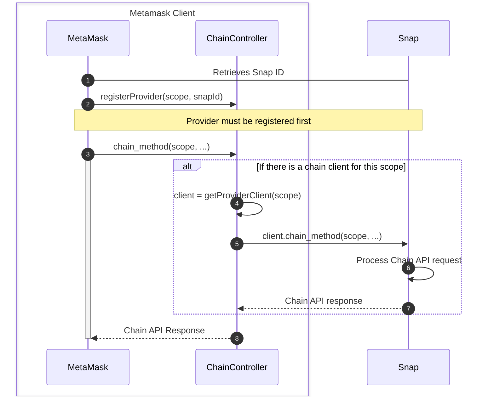
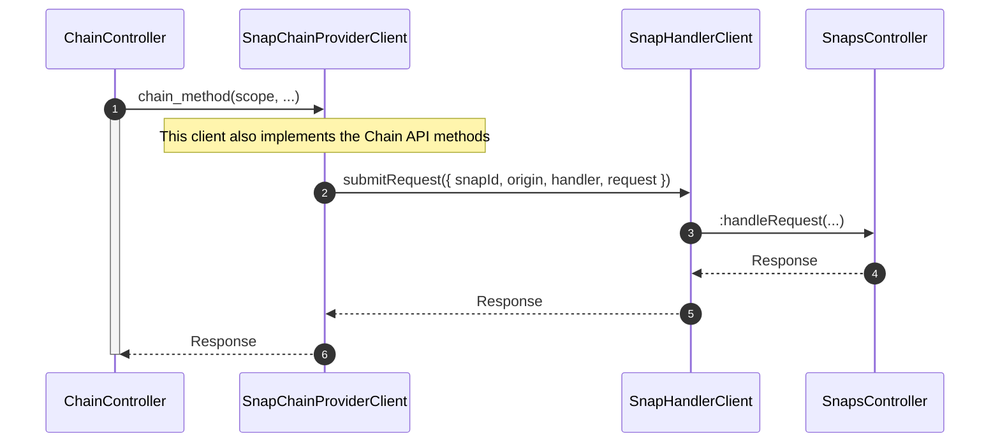

# `@metamask/chain-controller`

Manages chain-agnostic providers implementing the chain API.

## Installation

`yarn add @metamask/chain-controller`

or

`npm install @metamask/chain-controller`

## Contributing

This package is part of a monorepo. Instructions for contributing can be found in the [monorepo README](https://github.com/MetaMask/core#readme).

## Description

This controller is responsible to "bridge" Snaps that implements the [Chain API] and a MetaMask
client.

The controller maps a "chain provider" to its CAIP-2 (chain id) identifier
(named `scope` in the [Chain API]).
The MetaMask client can then use an external source (outside for current controllers that
only support EVM networks) to fetch information from a non-EVM network.

The controller itself also implements the [Chain API]. Its uses the `scope` (that is always
required for any methods) to identify the chain provider and then forward the method call to this
provider.

The calls are dispatched through the `SnapsController:handleRequest`'s action.

Here's the high-level flow when invoking a [Chain API]'s method:

Clients and Snap interactions:

## Resources

- [Chain API](https://github.com/MetaMask/chain-api/)
