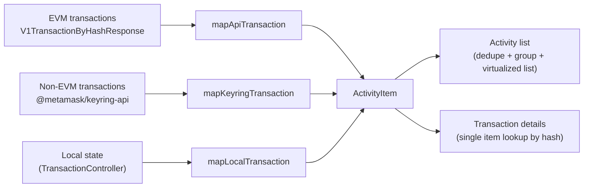

# Activity Mappers

These mappers normalize different shapes from various data sources, currently:

- EVM transactions from the Accounts REST endpoint
- Non-EVM transactions from the multichain / keyring transaction model
- Local transaction state from `TransactionController`

Each mapper is a pure function that returns the shared `ActivityItem` shape consumed by MetaMask clients (extension and mobile) for activity lists and transaction details.

---

## Table of contents

- [Architecture](#architecture)
- [Mappers](#mappers)
  - [EVM transactions: API mapper](#evm-transactions-api-mapper)
  - [Non-EVM transactions: keyring mapper](#non-evm-transactions-keyring-mapper)
  - [Local state: TransactionController mapper](#local-state-transactioncontroller-mapper)
- [Where mappers are used](#where-mappers-are-used)
- [Adding a new activity type](#adding-a-new-activity-type)
- [Adding a new mapper / data source](#adding-a-new-mapper--data-source)

---

## Architecture

1. **Single output type** — every mapper returns `ActivityItem`
2. **Pure functions** — mappers do not touch Redux or client stores. Clients fetch/join state before calling these functions.

---

## Mappers

### EVM transactions: API mapper

File: `api-transaction-mapper.ts`

Input: `V1TransactionByHashResponse` from `@metamask/core-backend`

The Accounts API classifies each transaction with a `transactionCategory`. The mapper further classifies and maps each item to the UI-facing activity kind.

Notes:

- Backend API improvements are ongoing
- Native / fee tokens may omit `assetId` and instead set `assetType: 'native'` so clients can resolve icons from chain metadata

---

### Non-EVM transactions: keyring mapper

File: `keyring-transaction-mapper.ts`

Input: `Transaction` from `@metamask/keyring-api`

Notes:

The mapper is chain-agnostic. Clients should patch missing / `UNKNOWN` asset units from `AssetsController` (or equivalent) metadata before calling it when needed.

---

### Local state: TransactionController mapper

File: `local-transaction-mapper.ts`

Input: a `TransactionGroup` from `helpers/transactions.ts` — the shape the EVM `TransactionController` produces after grouping by nonce (`initialTransaction`, `primaryTransaction`, plus cancel/retry siblings), optionally enriched by the client (`sourceToken`, `destinationToken`, fees, etc.)

This mapper only classifies `ActivityKind`. It is a stand-in until the indexed API picks up the transaction; clients should defer accurate token/amount/asset details to the API mapper on refetch.

---

## Where mappers are used

| Client concern | Mapper used |
| -------------- | ----------- |
| Local pending / confirmed EVM groups | `mapLocalTransaction` per `TransactionGroup`, after computing enrichments |
| Non-EVM keyring history | `mapKeyringTransaction` per keyring `Transaction`, after patching missing units |
| Indexed EVM history / details | `mapApiTransaction` per API response |

Exact selector / hook names live in each client; this package only owns the pure mapping layer.

---

## Adding a new activity type

1. **Define the kind** in [`../types.ts`](../types.ts): add the literal to `ActivityKind`, add a matching `ActivityData<…>` variant with that kind's fields.
2. **Emit it** from one or more mappers.
3. **Render it** in each client’s activity row / details templates.

---

## Adding a new mapper / data source

Use a new mapper when a source has its own data model and can't be reasonably squeezed through one of the three existing mappers.

1. Create a mapper file with a pure function returning a single `ActivityItem`.
2. Export it from [`../index.ts`](../index.ts).
3. Wire the client to read the data source and call the mapper once per item, then include the result in the client's activity list dedupe path.
4. Update this README.
