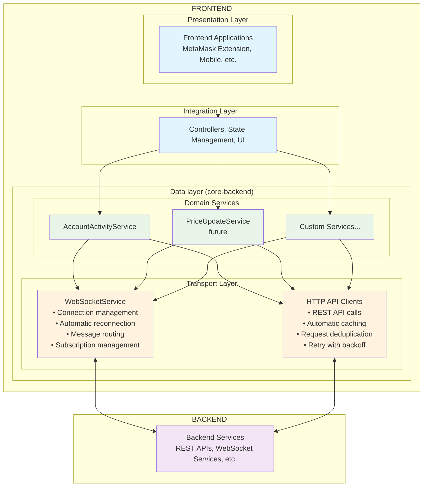
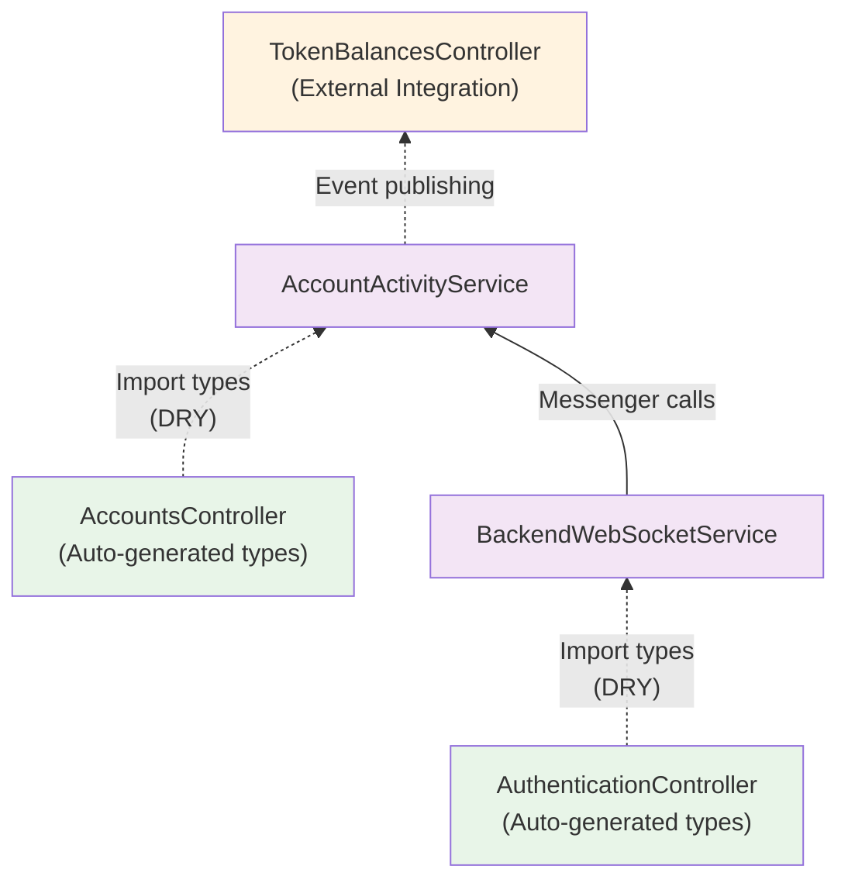

# `@metamask/core-backend`

Core backend services for MetaMask, serving as the data layer between Backend services (REST APIs, WebSocket services) and Frontend applications (Extension, Mobile). Provides authenticated real-time data delivery including account activity monitoring, price updates, and WebSocket connection management with type-safe controller integration.

## Table of Contents

- [`@metamask/core-backend`](#metamaskcore-backend)
  - [Table of Contents](#table-of-contents)
  - [Installation](#installation)
  - [Quick Start](#quick-start)
    - [Basic Usage](#basic-usage)
    - [Integration with Controllers](#integration-with-controllers)
  - [Architecture \& Design](#architecture--design)
    - [Layered Architecture](#layered-architecture)
    - [Dependencies Structure](#dependencies-structure)
    - [Data Flow](#data-flow)
      - [Sequence Diagram: Real-time Account Activity Flow](#sequence-diagram-real-time-account-activity-flow)
      - [Key Flow Characteristics](#key-flow-characteristics)
  - [WebSocket Connection Management](#websocket-connection-management)
    - [Connection Requirements](#connection-requirements)
    - [Connection Behavior](#connection-behavior)
  - [HTTP API](#http-api)
    - [Overview](#overview)
    - [Features](#features)
    - [Quick Start](#quick-start-1)
    - [API Clients](#api-clients)
      - [AccountsApiClient](#accountsapiclient)
      - [PricesApiClient](#pricesapiclient)
      - [TokenApiClient](#tokenapiclient)
      - [TokensApiClient](#tokensapiclient)
    - [Configuration](#configuration)
    - [Cache Management](#cache-management)
  - [API Reference](#api-reference)
    - [BackendWebSocketService](#backendwebsocketservice)
      - [Constructor Options](#constructor-options)
      - [Methods](#methods)
    - [AccountActivityService](#accountactivityservice)
      - [Constructor Options](#constructor-options-1)
      - [Methods](#methods-1)
      - [Events Published](#events-published)

## Installation

```bash
yarn add @metamask/core-backend
```

or

```bash
npm install @metamask/core-backend
```

## Quick Start

### Basic Usage

**WebSocket for Real-time Updates:**

```typescript
import {
  BackendWebSocketService,
  AccountActivityService,
} from '@metamask/core-backend';

// Initialize Backend WebSocket service
const backendWebSocketService = new BackendWebSocketService({
  messenger: backendWebSocketServiceMessenger,
  url: 'wss://api.metamask.io/ws',
  timeout: 15000,
  requestTimeout: 20000,
});

// Initialize Account Activity service
const accountActivityService = new AccountActivityService({
  messenger: accountActivityMessenger,
});

// Connect and subscribe to account activity
await backendWebSocketService.connect();
await accountActivityService.subscribe({
  address: 'eip155:0:0x742d35cc6634c0532925a3b8d40c4e0e2c6e4e6',
});

// Listen for real-time updates
messenger.subscribe('AccountActivityService:transactionUpdated', (tx) => {
  console.log('New transaction:', tx);
});

messenger.subscribe(
  'AccountActivityService:balanceUpdated',
  ({ address, updates }) => {
    console.log(`Balance updated for ${address}:`, updates);
  },
);
```

**HTTP API for REST Requests:**

```typescript
import { ApiPlatformClient } from '@metamask/core-backend';

// Create API client
const apiClient = new ApiPlatformClient({
  clientProduct: 'metamask-extension',
  getBearerToken: async () => authController.getBearerToken(),
});

// Fetch data with automatic caching and deduplication
const balances = await apiClient.accounts.fetchV5MultiAccountBalances([
  'eip155:1:0x742d35cc6634c0532925a3b8d40c4e0e2c6e4e6',
]);

const prices = await apiClient.prices.fetchV3SpotPrices([
  'eip155:1/slip44:60', // ETH
  'eip155:1/erc20:0xa0b86991c6218b36c1d19d4a2e9eb0ce3606eb48', // USDC
]);
```

### Integration with Controllers

```typescript
// Coordinate with TokenBalancesController for fallback polling
messenger.subscribe(
  'BackendWebSocketService:connectionStateChanged',
  (info) => {
    if (info.state === 'CONNECTED') {
      // Reduce polling when WebSocket is active
      messenger.call(
        'TokenBalancesController:updateChainPollingConfigs',
        { '0x1': { interval: 600000 } }, // 10 min backup polling
        { immediateUpdate: false },
      );
    } else {
      // Increase polling when WebSocket is down
      const defaultInterval = messenger.call(
        'TokenBalancesController:getDefaultPollingInterval',
      );
      messenger.call(
        'TokenBalancesController:updateChainPollingConfigs',
        { '0x1': { interval: defaultInterval } },
        { immediateUpdate: true },
      );
    }
  },
);

// Listen for account changes and manage subscriptions
messenger.subscribe(
  'AccountsController:selectedAccountChange',
  async (selectedAccount) => {
    if (selectedAccount) {
      await accountActivityService.subscribe({
        address: selectedAccount.address,
      });
    }
  },
);
```

## Architecture & Design

### Layered Architecture



### Dependencies Structure



### Data Flow

#### Sequence Diagram: Real-time Account Activity Flow

```mermaid
sequenceDiagram
    participant TBC as TokenBalancesController
    participant AA as AccountActivityService
    participant WS as BackendWebSocketService
    participant HTTP as HTTP Services<br/>(APIs & RPC)
    participant Backend as WebSocket Endpoint<br/>(Backend)

    Note over TBC,Backend: Initial Setup
    TBC->>HTTP: Initial balance fetch via HTTP<br/>(first request for current state)

    WS->>Backend: WebSocket connection request
    Backend->>WS: Connection established
    WS->>AA: WebSocket connection status notification<br/>(BackendWebSocketService:connectionStateChanged)<br/>{state: 'CONNECTED'}

    AA->>AA: call('AccountsController:getSelectedAccount')
    AA->>WS: subscribe({channels, callback})
    WS->>Backend: {event: 'subscribe', channels: ['account-activity.v1.eip155:0:0x123...']}
    Backend->>WS: {event: 'subscribe-response', subscriptionId: 'sub-456'}

    Note over WS,Backend: System notification sent automatically upon subscription
    Backend->>WS: {event: 'system-notification', data: {chainIds: ['eip155:1', 'eip155:137', ...], status: 'up'}}
    WS->>AA: System notification received
    AA->>AA: Track chains as 'up' internally
    AA->>TBC: Chain availability notification<br/>(AccountActivityService:statusChanged)<br/>{chainIds: ['0x1', '0x89', ...], status: 'up'}
    TBC->>TBC: Increase polling interval from 20s to 10min<br/>(.updateChainPollingConfigs({0x89: 600000}))

    Note over TBC,Backend: User Account Change

    par StatusChanged Event
      TBC->>HTTP: Fetch balances for new account<br/>(fill transition gap)
    and Account Subscription
      AA->>AA: User switched to different account<br/>(AccountsController:selectedAccountChange)
      AA->>WS: subscribe (new account)
      WS->>Backend: {event: 'subscribe', channels: ['account-activity.v1.eip155:0:0x456...']}
      Backend->>WS: {event: 'subscribe-response', subscriptionId: 'sub-789'}
      AA->>WS: unsubscribe (previous account)
      WS->>Backend: {event: 'unsubscribe', subscriptionId: 'sub-456'}
      Backend->>WS: {event: 'unsubscribe-response'}
    end


    Note over TBC,Backend: Real-time Data Flow

    Backend->>WS: {event: 'notification', channel: 'account-activity.v1.eip155:0:0x123...',<br/>data: {address, tx, updates}}
    WS->>AA: Direct callback routing
    AA->>AA: Validate & process AccountActivityMessage

    par Balance Update
        AA->>TBC: Real-time balance change notification<br/>(AccountActivityService:balanceUpdated)<br/>{address, chain, updates}
        TBC->>TBC: Update balance state directly<br/>(or fallback poll if error)
    and Transaction and Activity Update (Not yet implemented)
        AA->>AA: Process transaction data<br/>(AccountActivityService:transactionUpdated)<br/>{tx: Transaction}
        Note right of AA: Future: Forward to TransactionController<br/>for transaction state management<br/>(pending → confirmed → finalized)
    end

    Note over TBC,Backend: System Notifications

    Backend->>WS: {event: 'system-notification', data: {chainIds: ['eip155:137'], status: 'down'}}
    WS->>AA: System notification received
    AA->>AA: Process chain status change
    AA->>TBC: Chain status notification<br/>(AccountActivityService:statusChanged)<br/>{chainIds: ['eip155:137'], status: 'down'}
    TBC->>TBC: Decrease polling interval from 10min to 20s<br/>(.updateChainPollingConfigs({0x89: 20000}))
    TBC->>HTTP: Fetch balances immediately

    Backend->>WS: {event: 'system-notification', data: {chainIds: ['eip155:137'], status: 'up'}}
    WS->>AA: System notification received
    AA->>AA: Process chain status change
    AA->>TBC: Chain status notification<br/>(AccountActivityService:statusChanged)<br/>{chainIds: ['eip155:137'], status: 'up'}
    TBC->>TBC: Increase polling interval from 20s to 10min<br/>(.updateChainPollingConfigs({0x89: 600000}))

    Note over TBC,Backend: Connection Health Management

    Backend-->>WS: Connection lost
    WS->>AA: WebSocket connection status notification<br/>(BackendWebSocketService:connectionStateChanged)<br/>{state: 'DISCONNECTED'}
    AA->>AA: Mark all tracked chains as 'down'<br/>(flush internal tracking set)
    AA->>TBC: Chain status notification for all tracked chains<br/>(AccountActivityService:statusChanged)<br/>{chainIds: ['0x1', '0x89', ...], status: 'down'}
    TBC->>TBC: Decrease polling interval from 10min to 20s<br/>(.updateChainPollingConfigs({0x89: 20000}))
    TBC->>HTTP: Fetch balances immediately
    WS->>WS: Automatic reconnection<br/>with exponential backoff
    WS->>Backend: Reconnection successful

    Note over AA,Backend: Restart initial setup - resubscribe and get fresh chain status
    AA->>WS: subscribe (same account, new subscription)
    WS->>Backend: {event: 'subscribe', channels: ['account-activity.v1.eip155:0:0x123...']}
    Backend->>WS: {event: 'subscribe-response', subscriptionId: 'sub-999'}
    Backend->>WS: {event: 'system-notification', data: {chainIds: [...], status: 'up'}}
    WS->>AA: System notification received
    AA->>AA: Track chains as 'up' again
    AA->>TBC: Chain availability notification<br/>(AccountActivityService:statusChanged)<br/>{chainIds: [...], status: 'up'}
    TBC->>TBC: Increase polling interval back to 10min
```



#### Key Flow Characteristics

1. **Initial Setup**: BackendWebSocketService establishes connection, then AccountActivityService subscribes to selected account. Backend automatically sends a system notification with all chains that are currently up. AccountActivityService tracks these chains internally and notifies TokenBalancesController, which increases polling interval to 5 min
2. **Chain Status Tracking**: AccountActivityService maintains an internal set of chains that are 'up' based on system notifications. On disconnect, it marks all tracked chains as 'down' before clearing the set
3. **System Notifications**: Backend automatically sends chain status updates (up/down) upon subscription and when status changes. AccountActivityService forwards these to TokenBalancesController, which adjusts polling intervals (up: 5min, down: 30s + immediate fetch)
4. **User Account Changes**: When users switch accounts, AccountActivityService unsubscribes from old account and subscribes to new account. Backend sends fresh system notification with current chain status for the new account
5. **Connection Resilience**: On reconnection, AccountActivityService resubscribes to selected account and receives fresh chain status via system notification. Automatic reconnection with exponential backoff
6. **Real-time Updates**: Backend pushes data through: Backend → BackendWebSocketService → AccountActivityService → TokenBalancesController (+ future TransactionController integration)
7. **Parallel Processing**: Transaction and balance updates processed simultaneously - AccountActivityService publishes both transactionUpdated (future) and balanceUpdated events in parallel
8. **Direct Balance Processing**: Real-time balance updates bypass HTTP polling and update TokenBalancesController state directly

## WebSocket Connection Management

### Connection Requirements

The WebSocket connects when **ALL 3 conditions are true**:

1. ✅ **Feature enabled** - `isEnabled()` callback returns `true` (feature flag)
2. ✅ **User signed in** - `AuthenticationController.isSignedIn = true`
3. ✅ **Wallet unlocked** - `KeyringController.isUnlocked = true`

**Plus:** Platform code must call `connect()` when app opens/foregrounds and `disconnect()` when app closes/backgrounds.

### Connection Behavior

**Idempotent `connect()`:**

- Safe to call multiple times - validates conditions and returns early if already connected
- Multiple rapid calls reuse the same connection promise (no duplicate connections)
- No debouncing needed - handled automatically

**Auto-Reconnect:**

- ✅ **Unexpected disconnects** (network issues, server restart) → Auto-reconnect
- ❌ **Manual disconnects** (app backgrounds, wallet locks, user signs out) → Stay disconnected

## HTTP API

### Overview

The HTTP API provides type-safe clients for accessing MetaMask backend REST APIs. It uses `@tanstack/query-core` for intelligent caching, request deduplication, and automatic retries.

**Available APIs:**

| API          | Base URL                      | Purpose                                        |
| ------------ | ----------------------------- | ---------------------------------------------- |
| **Accounts** | `accounts.api.cx.metamask.io` | Balances, transactions, NFTs, token discovery  |
| **Prices**   | `price.api.cx.metamask.io`    | Spot prices, exchange rates, historical prices |
| **Token**    | `token.api.cx.metamask.io`    | Token metadata, trending, top gainers          |
| **Tokens**   | `tokens.api.cx.metamask.io`   | Bulk asset operations, supported networks      |

### Features

- ✅ **Automatic request deduplication** - Identical concurrent requests share a single network call
- ✅ **Intelligent caching** - Configurable stale times per data type (prices: 30s, balances: 1min, networks: 30min)
- ✅ **Automatic retries** - Exponential backoff with jitter, skips 4xx errors (except 429, 408)
- ✅ **Type safety** - Full TypeScript support with response types
- ✅ **Bearer token caching** - Auth tokens cached for 5 minutes
- ✅ **Unified client** - Single entry point or individual API clients

### Quick Start

```typescript
import {
  ApiPlatformClient,
  createApiPlatformClient,
} from '@metamask/core-backend';

// Create unified client
const client = new ApiPlatformClient({
  clientProduct: 'metamask-extension',
  clientVersion: '12.0.0',
  getBearerToken: async () => authController.getBearerToken(),
});

// Access API methods through sub-clients
const networks = await client.accounts.fetchV2SupportedNetworks();
const balances = await client.accounts.fetchV5MultiAccountBalances([
  'eip155:1:0x742d35cc6634c0532925a3b8d40c4e0e2c6e4e6',
]);
const prices = await client.prices.fetchV3SpotPrices([
  'eip155:1/erc20:0xa0b86991c6218b36c1d19d4a2e9eb0ce3606eb48',
]);
const tokenList = await client.token.fetchTokenList(1);
const assets = await client.tokens.fetchV3Assets([
  'eip155:1/erc20:0xa0b86991c6218b36c1d19d4a2e9eb0ce3606eb48',
]);
```

Or use individual clients:

```typescript
import { AccountsApiClient, PricesApiClient } from '@metamask/core-backend';

const accountsClient = new AccountsApiClient({
  clientProduct: 'metamask-extension',
});

const pricesClient = new PricesApiClient({
  clientProduct: 'metamask-extension',
  getBearerToken: async () => token,
});
```

### API Clients

#### AccountsApiClient

Handles account-related operations including balances, transactions, NFTs, and token discovery.

| Method                                                  | Description                                |
| ------------------------------------------------------- | ------------------------------------------ |
| `fetchV1SupportedNetworks()`                            | Get supported networks (v1)                |
| `fetchV2SupportedNetworks()`                            | Get supported networks (v2)                |
| `fetchV2ActiveNetworks(accountIds, options?)`           | Get active networks by CAIP-10 account IDs |
| `fetchV2Balances(address, options?)`                    | Get balances for single address            |
| `fetchV2BalancesWithOptions(address, options?)`         | Get balances with filters                  |
| `fetchV4MultiAccountBalances(addresses, options?)`      | Get balances for multiple addresses        |
| `fetchV5MultiAccountBalances(accountIds, options?)`     | Get balances using CAIP-10 IDs             |
| `fetchV1TransactionByHash(chainId, txHash, options?)`   | Get transaction by hash                    |
| `fetchV1AccountTransactions(address, options?)`         | Get account transactions                   |
| `fetchV4MultiAccountTransactions(accountIds, options?)` | Get multi-account transactions             |
| `fetchV1AccountRelationship(chainId, from, to)`         | Get address relationship                   |
| `fetchV2AccountNfts(address, options?)`                 | Get account NFTs                           |
| `fetchV2AccountTokens(address, options?)`               | Get detected ERC20 tokens                  |
| `invalidateBalances()`                                  | Invalidate all balance cache               |
| `invalidateAccounts()`                                  | Invalidate all account cache               |

#### PricesApiClient

Handles price-related operations including spot prices, exchange rates, and historical data.

| Method                                                                  | Description                                      |
| ----------------------------------------------------------------------- | ------------------------------------------------ |
| `fetchPriceV1SupportedNetworks()`                                       | Get price-supported networks (v1)                |
| `fetchPriceV2SupportedNetworks()`                                       | Get price-supported networks in CAIP format (v2) |
| `fetchV1ExchangeRates(baseCurrency)`                                    | Get exchange rates for base currency             |
| `fetchV1FiatExchangeRates()`                                            | Get fiat exchange rates                          |
| `fetchV1CryptoExchangeRates()`                                          | Get crypto exchange rates                        |
| `fetchV1SpotPricesByCoinIds(coinIds)`                                   | Get spot prices by CoinGecko IDs                 |
| `fetchV1SpotPriceByCoinId(coinId, currency?)`                           | Get single coin spot price                       |
| `fetchV1TokenPrices(chainId, addresses, options?)`                      | Get token prices on chain                        |
| `fetchV1TokenPrice(chainId, address, currency?)`                        | Get single token price                           |
| `fetchV2SpotPrices(chainId, addresses, options?)`                       | Get spot prices with market data                 |
| `fetchV3SpotPrices(assetIds, options?)`                                 | Get spot prices by CAIP-19 asset IDs             |
| `fetchV1HistoricalPricesByCoinId(coinId, options?)`                     | Get historical prices by CoinGecko ID            |
| `fetchV1HistoricalPricesByTokenAddresses(chainId, addresses, options?)` | Get historical prices for tokens                 |
| `fetchV1HistoricalPrices(chainId, address, options?)`                   | Get historical prices for single token           |
| `fetchV3HistoricalPrices(chainId, assetType, options?)`                 | Get historical prices by CAIP-19                 |
| `fetchV1HistoricalPriceGraphByCoinId(coinId, options?)`                 | Get price graph by CoinGecko ID                  |
| `fetchV1HistoricalPriceGraphByTokenAddress(chainId, address, options?)` | Get price graph by token address                 |
| `invalidatePrices()`                                                    | Invalidate all price cache                       |

#### TokenApiClient

Handles token metadata, lists, and trending/popular token discovery.

| Method                                             | Description                     |
| -------------------------------------------------- | ------------------------------- |
| `fetchNetworks()`                                  | Get all networks                |
| `fetchNetworkByChainId(chainId)`                   | Get network by chain ID         |
| `fetchTokenList(chainId, options?)`                | Get token list for chain        |
| `fetchV1TokenMetadata(chainId, address, options?)` | Get token metadata              |
| `fetchTokenDescription(chainId, address)`          | Get token description           |
| `fetchV3TrendingTokens(chainIds, options?)`        | Get trending tokens             |
| `fetchV3TopGainers(chainIds, options?)`            | Get top gainers/losers          |
| `fetchV3PopularTokens(chainIds, options?)`         | Get popular tokens              |
| `fetchTopAssets(chainId)`                          | Get top assets for chain        |
| `fetchV1SuggestedOccurrenceFloors()`               | Get suggested occurrence floors |

#### TokensApiClient

Handles bulk token operations and supported network queries.

| Method                            | Description                                                 |
| --------------------------------- | ----------------------------------------------------------- |
| `fetchTokenV1SupportedNetworks()` | Get token-supported networks (v1)                           |
| `fetchTokenV2SupportedNetworks()` | Get token-supported networks with full/partial support (v2) |
| `fetchV3Assets(assetIds)`         | Fetch assets by CAIP-19 IDs                                 |
| `invalidateTokens()`              | Invalidate all token cache                                  |

### Configuration

```typescript
type ApiPlatformClientOptions = {
  /** Client product identifier (e.g., 'metamask-extension', 'metamask-mobile') */
  clientProduct: string;
  /** Optional client version (default: '1.0.0') */
  clientVersion?: string;
  /** Function to get bearer token for authenticated requests */
  getBearerToken?: () => Promise<string | undefined>;
  /** Optional custom QueryClient instance for shared caching */
  queryClient?: QueryClient;
};
```

**Default Stale Times:**

| Data Type          | Stale Time |
| ------------------ | ---------- |
| Prices             | 30 seconds |
| Balances           | 1 minute   |
| Transactions       | 30 seconds |
| Networks           | 10 minutes |
| Supported Networks | 30 minutes |
| Token Metadata     | 5 minutes  |
| Token List         | 10 minutes |
| Exchange Rates     | 5 minutes  |
| Trending           | 2 minutes  |
| Auth Token         | 5 minutes  |

**Override Stale Time:**

```typescript
// Use custom stale time for specific request
const balances = await client.accounts.fetchV5MultiAccountBalances(
  accountIds,
  { networks: ['eip155:1'] },
  { staleTime: 10000 }, // 10 seconds
);
```

### Cache Management

```typescript
// Invalidate all caches
await client.invalidateAll();

// Invalidate auth token (on logout)
await client.invalidateAuthToken();

// Domain-specific invalidation
await client.accounts.invalidateBalances();
await client.prices.invalidatePrices();
await client.tokens.invalidateTokens();

// Clear all cached data
client.clear();

// Check if query is fetching
const isFetching = client.isFetching(['accounts', 'balances']);

// Access cached data directly
const cached = client.getCachedData(['accounts', 'balances', 'v5', { ... }]);

// Set cached data
client.setCachedData(queryKey, data);

// Access underlying QueryClient for advanced usage
const queryClient = client.queryClient;
```

## API Reference

### BackendWebSocketService

The core WebSocket client providing connection management, authentication, and message routing.

#### Constructor Options

```typescript
interface BackendWebSocketServiceOptions {
  messenger: BackendWebSocketServiceMessenger;
  url: string;
  timeout?: number;
  reconnectDelay?: number;
  maxReconnectDelay?: number;
  requestTimeout?: number;
  enableAuthentication?: boolean;
  enabledCallback?: () => boolean;
}
```

#### Methods

- `connect(): Promise<void>` - Establish authenticated WebSocket connection
- `disconnect(): Promise<void>` - Close WebSocket connection
- `subscribe(options: SubscriptionOptions): Promise<SubscriptionResult>` - Subscribe to channels
- `sendRequest(message: ClientRequestMessage): Promise<ServerResponseMessage>` - Send request/response messages
- `channelHasSubscription(channel: string): boolean` - Check subscription status
- `findSubscriptionsByChannelPrefix(prefix: string): SubscriptionInfo[]` - Find subscriptions by prefix
- `getConnectionInfo(): WebSocketConnectionInfo` - Get detailed connection state

### AccountActivityService

High-level service for monitoring account activity using WebSocket data.

#### Constructor Options

```typescript
interface AccountActivityServiceOptions {
  messenger: AccountActivityServiceMessenger;
  subscriptionNamespace?: string;
}
```

#### Methods

- `subscribe(subscription: SubscriptionOptions): Promise<void>` - Subscribe to account activity
- `unsubscribe(subscription: SubscriptionOptions): Promise<void>` - Unsubscribe from account activity

#### Events Published

- `AccountActivityService:balanceUpdated` - Real-time balance changes
- `AccountActivityService:transactionUpdated` - Transaction status updates
- `AccountActivityService:statusChanged` - Chain/service status changes
