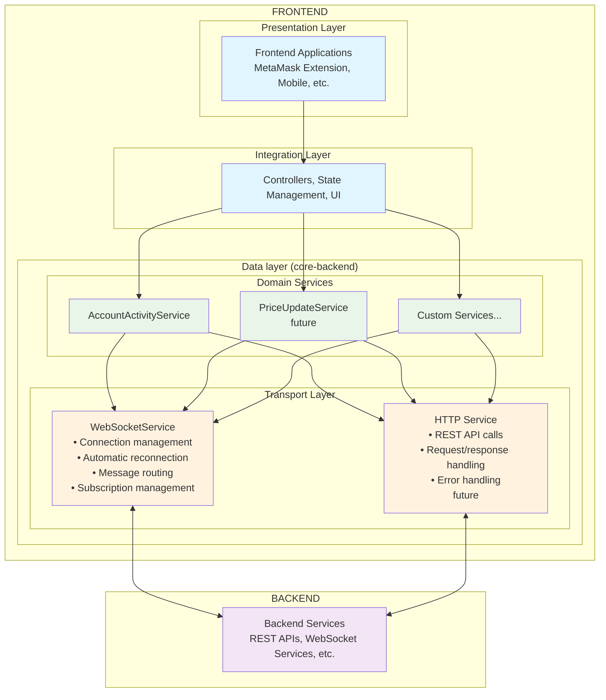
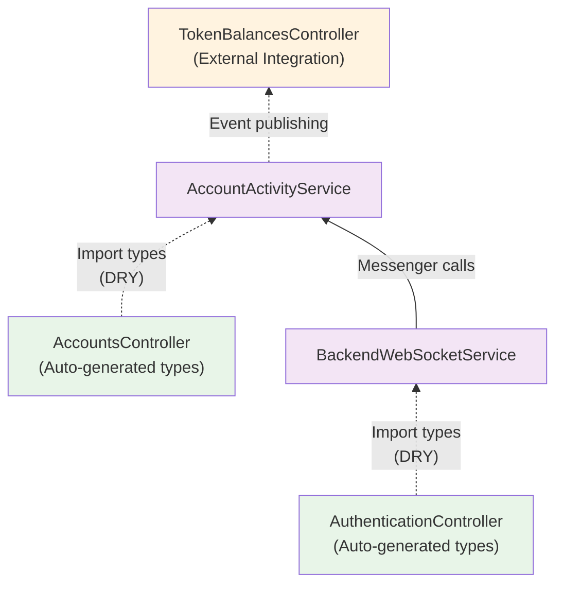
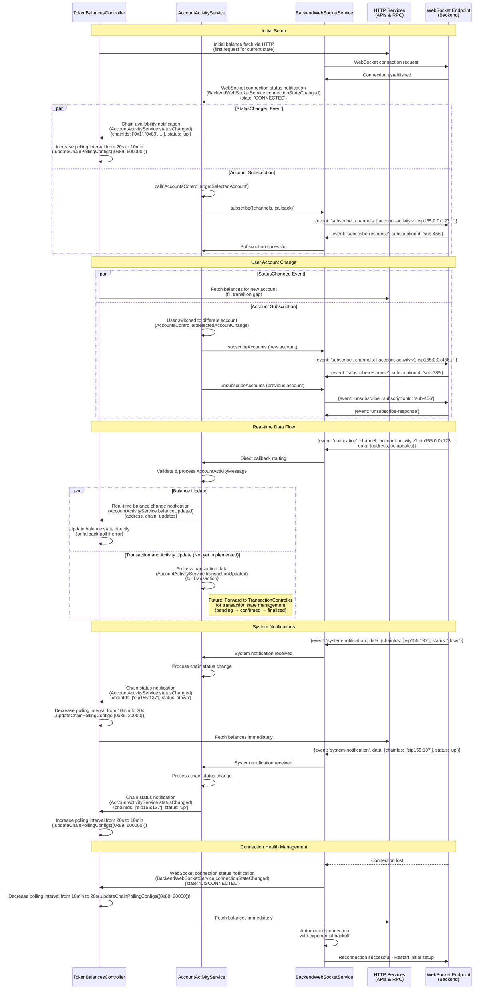

# `@metamask/core-backend`

Core backend services for MetaMask, serving as the data layer between Backend services (REST APIs, WebSocket services) and Frontend applications (Extension, Mobile). Provides authenticated real-time data delivery including account activity monitoring, price updates, and WebSocket connection management with type-safe controller integration.

## Table of Contents

- [`@metamask/core-backend`](#metamaskcore-backend)
  - [Table of Contents](#table-of-contents)
  - [Installation](#installation)
  - [Quick Start](#quick-start)
    - [Basic Usage](#basic-usage)
    - [Integration with Controllers](#integration-with-controllers)
  - [Architecture \& Design](#architecture--design)
    - [Layered Architecture](#layered-architecture)
    - [Dependencies Structure](#dependencies-structure)
    - [Data Flow](#data-flow)
      - [Sequence Diagram: Real-time Account Activity Flow](#sequence-diagram-real-time-account-activity-flow)
      - [Key Flow Characteristics](#key-flow-characteristics)
  - [API Reference](#api-reference)
    - [BackendWebSocketService](#backendwebsocketservice)
      - [Constructor Options](#constructor-options)
      - [Methods](#methods)
    - [AccountActivityService](#accountactivityservice)
      - [Constructor Options](#constructor-options-1)
      - [Methods](#methods-1)
      - [Events Published](#events-published)

## Installation

```bash
yarn add @metamask/core-backend
```

or

```bash
npm install @metamask/core-backend
```

## Quick Start

### Basic Usage

```typescript
import {
  BackendWebSocketService,
  AccountActivityService,
} from '@metamask/core-backend';

// Initialize Backend WebSocket service
const backendWebSocketService = new BackendWebSocketService({
  messenger: backendWebSocketServiceMessenger,
  url: 'wss://api.metamask.io/ws',
  timeout: 15000,
  requestTimeout: 20000,
});

// Initialize Account Activity service  
const accountActivityService = new AccountActivityService({
  messenger: accountActivityMessenger,
});

// Connect and subscribe to account activity
await backendWebSocketService.connect();
await accountActivityService.subscribeAccounts({
  address: 'eip155:0:0x742d35cc6634c0532925a3b8d40c4e0e2c6e4e6',
});

// Listen for real-time updates
messenger.subscribe('AccountActivityService:transactionUpdated', (tx) => {
  console.log('New transaction:', tx);
});

messenger.subscribe(
  'AccountActivityService:balanceUpdated',
  ({ address, updates }) => {
    console.log(`Balance updated for ${address}:`, updates);
  },
);
```

### Integration with Controllers

```typescript
// Coordinate with TokenBalancesController for fallback polling
messenger.subscribe(
  'BackendWebSocketService:connectionStateChanged',
  (info) => {
    if (info.state === 'CONNECTED') {
      // Reduce polling when WebSocket is active
      messenger.call(
        'TokenBalancesController:updateChainPollingConfigs',
        { '0x1': { interval: 600000 } }, // 10 min backup polling
        { immediateUpdate: false },
      );
    } else {
      // Increase polling when WebSocket is down
      const defaultInterval = messenger.call(
        'TokenBalancesController:getDefaultPollingInterval',
      );
      messenger.call(
        'TokenBalancesController:updateChainPollingConfigs',
        { '0x1': { interval: defaultInterval } },
        { immediateUpdate: true },
      );
    }
  },
);

// Listen for account changes and manage subscriptions
messenger.subscribe(
  'AccountsController:selectedAccountChange',
  async (selectedAccount) => {
    if (selectedAccount) {
      await accountActivityService.subscribeAccounts({
        address: selectedAccount.address,
      });
    }
  },
);
```

## Architecture & Design

### Layered Architecture



### Dependencies Structure



### Data Flow

#### Sequence Diagram: Real-time Account Activity Flow



#### Key Flow Characteristics

1. **Initial Setup**: BackendWebSocketService establishes connection, then AccountActivityService simultaneously notifies all chains are up AND subscribes to selected account, TokenBalancesController increases polling interval to 10 min, then makes initial HTTP request for current balance state
2. **User Account Changes**: When users switch accounts, AccountActivityService unsubscribes from old account, TokenBalancesController makes HTTP calls to fill data gaps, then AccountActivityService subscribes to new account
3. **Real-time Updates**: Backend pushes data through: Backend → BackendWebSocketService → AccountActivityService → TokenBalancesController (+ future TransactionController integration)
4. **System Notifications**: Backend sends chain status updates (up/down) through WebSocket, AccountActivityService processes and forwards to TokenBalancesController which adjusts polling intervals and fetches balances immediately on chain down (chain down: 10min→20s + immediate fetch, chain up: 20s→10min)
5. **Parallel Processing**: Transaction and balance updates processed simultaneously - AccountActivityService publishes both transactionUpdated (future) and balanceUpdated events in parallel
6. **Dynamic Polling**: TokenBalancesController adjusts HTTP polling intervals based on WebSocket connection health (10 min when connected, 20s when disconnected)
7. **Direct Balance Processing**: Real-time balance updates bypass HTTP polling and update TokenBalancesController state directly
8. **Connection Resilience**: Automatic reconnection with resubscription to selected account
9. **Ultra-Simple Error Handling**: Any error anywhere → force reconnection (no nested try-catch)

## API Reference

### BackendWebSocketService

The core WebSocket client providing connection management, authentication, and message routing.

#### Constructor Options

```typescript
interface BackendWebSocketServiceOptions {
  messenger: BackendWebSocketServiceMessenger;
  url: string;
  timeout?: number;
  reconnectDelay?: number;
  maxReconnectDelay?: number;
  requestTimeout?: number;
  enableAuthentication?: boolean;
  enabledCallback?: () => boolean;
}
```

#### Methods

- `connect(): Promise<void>` - Establish authenticated WebSocket connection
- `disconnect(): Promise<void>` - Close WebSocket connection  
- `subscribe(options: SubscriptionOptions): Promise<SubscriptionResult>` - Subscribe to channels
- `sendRequest(message: ClientRequestMessage): Promise<ServerResponseMessage>` - Send request/response messages
- `channelHasSubscription(channel: string): boolean` - Check subscription status
- `findSubscriptionsByChannelPrefix(prefix: string): SubscriptionInfo[]` - Find subscriptions by prefix
- `getConnectionInfo(): WebSocketConnectionInfo` - Get detailed connection state

### AccountActivityService

High-level service for monitoring account activity using WebSocket data.

#### Constructor Options

```typescript
interface AccountActivityServiceOptions {
  messenger: AccountActivityServiceMessenger;
  subscriptionNamespace?: string;
}
```

#### Methods

- `subscribeAccounts(subscription: AccountSubscription): Promise<void>` - Subscribe to account activity
- `unsubscribeAccounts(subscription: AccountSubscription): Promise<void>` - Unsubscribe from account activity

#### Events Published

- `AccountActivityService:balanceUpdated` - Real-time balance changes
- `AccountActivityService:transactionUpdated` - Transaction status updates
- `AccountActivityService:statusChanged` - Chain/service status changes
