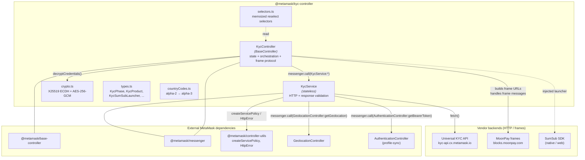
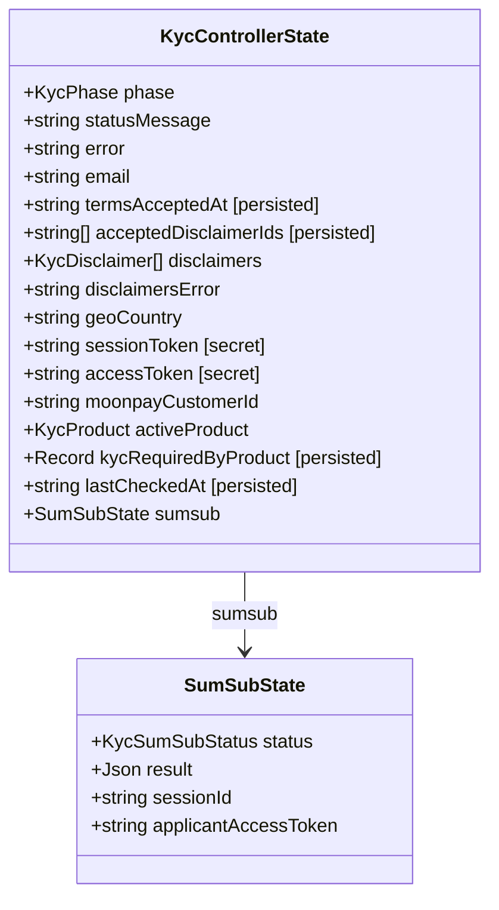
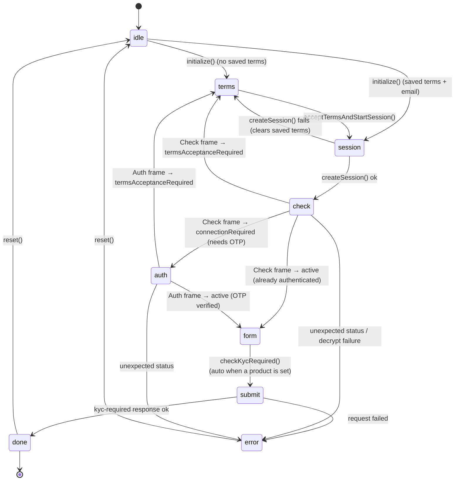
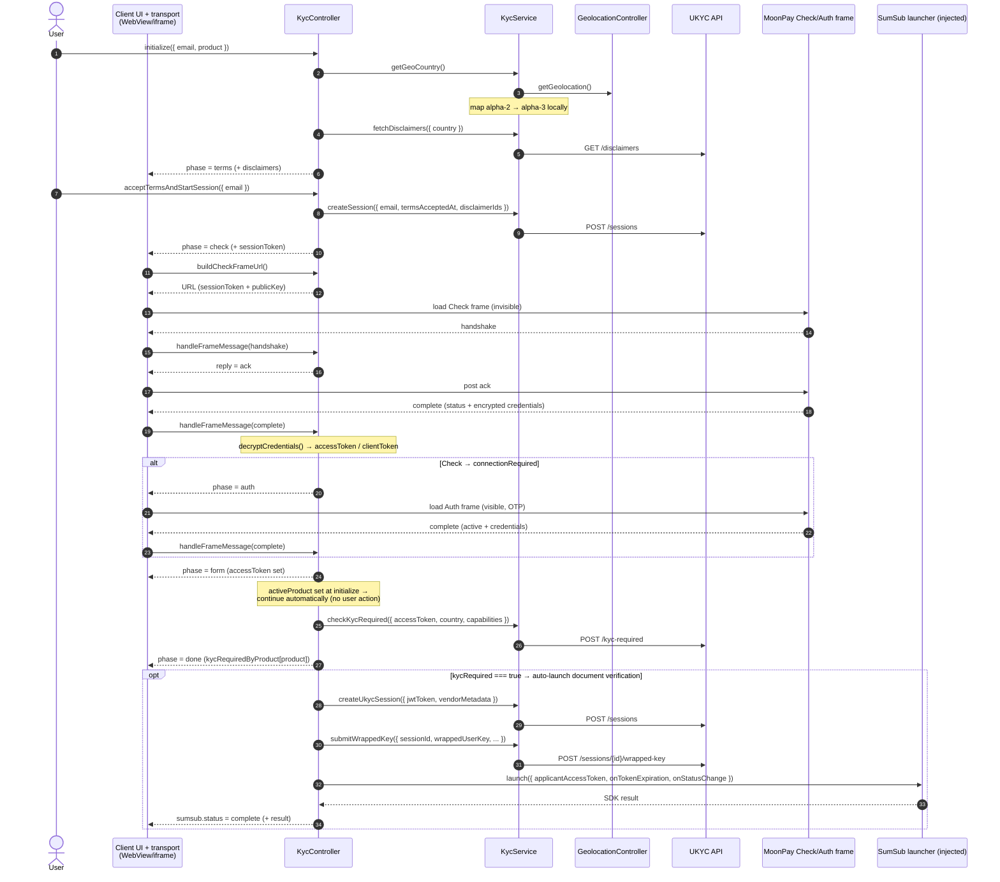
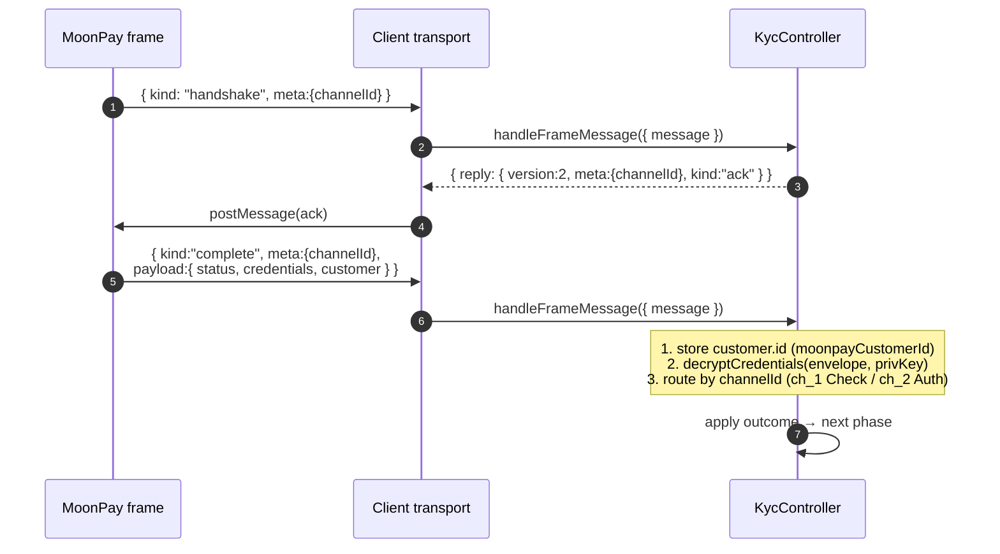
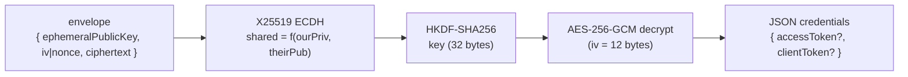
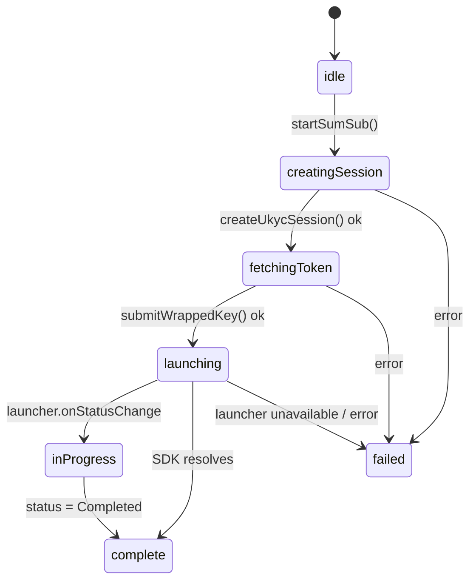
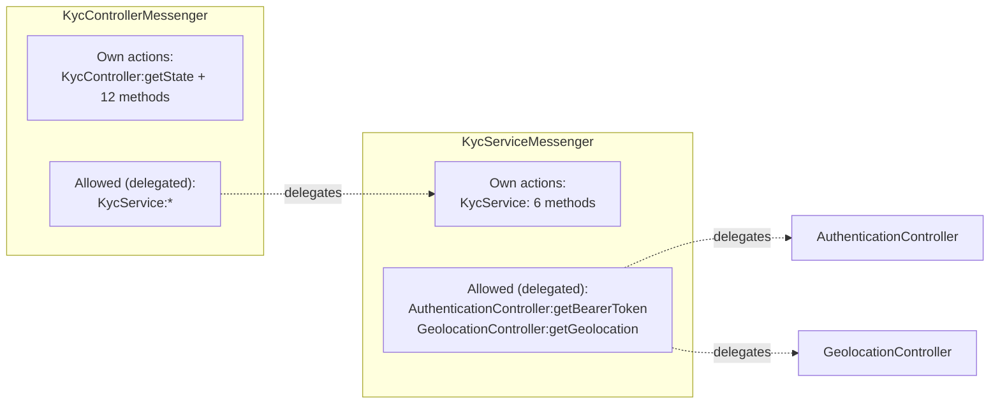
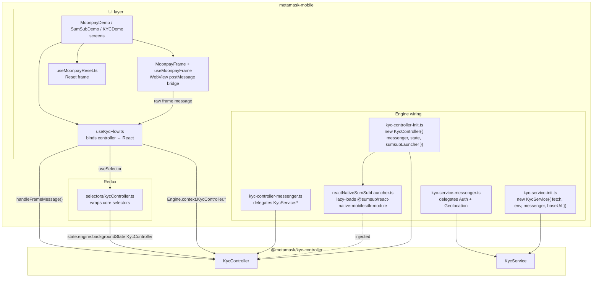

# KYC Controller `@metamask/kyc-controller`

Shared KYC / identity verification controller used across MetaMask clients

## Installation

`yarn add @metamask/kyc-controller`

or

`npm install @metamask/kyc-controller`

## Development

To rebuild the package automatically whenever you change a source file, run the `build:watch` script:

`yarn workspace @metamask/kyc-controller run build:watch`

This watches `src/**/*.ts` and re-runs the build on each change (it also performs an initial build on start), which is useful when developing against a client that consumes this package locally.

## Contributing

This package is part of a monorepo. Instructions for contributing can be found in the [monorepo README](https://github.com/MetaMask/core#readme).


## Architecture

`@metamask/kyc-controller` is a shared, **platform-agnostic** package that owns
the end-to-end KYC / identity-verification flow used across MetaMask clients
(mobile, extension, web). It hides the vendor implementation (currently
**MoonPay** for identity + **SumSub** for document verification) behind a
vendor-neutral, per-product surface consumed by features such as **ramps** and
**card**.

This document explains:

- The package's internal building blocks and responsibilities.
- How the pieces communicate (messenger actions, injected adapters).
- The identity flow as a state machine and an end-to-end sequence.
- The encrypted frame message protocol and crypto.
- How the **metamask-mobile** client wires everything together on the client
  side.

---

### 1. Design principles

The package is built around a few deliberate constraints:

| Principle | How it shows up in the code |
| --- | --- |
| **Vendor-neutral surface** | Consumers deal with `KycProduct` (`'ramps' \| 'card'`) and a phase machine, never with MoonPay/SumSub specifics. `KycVendor` is internal. |
| **Platform-agnostic core** | No React, no `Buffer`/`atob`, no native SDK imports. Crypto uses `@noble/*` + `@scure/base`. WebView/iframe presentation and the SumSub SDK are **injected** by each client. |
| **Controller owns orchestration; clients own presentation** | `KycController` owns all state, HTTP orchestration, crypto and the frame protocol. Clients only render frames, forward raw messages, and present the SumSub SDK. |
| **Stateless service** | `KycService` performs HTTP only; it holds no state and derives auth/geolocation from other controllers via the messenger. |
| **Everything through the messenger** | Both classes register their public methods as messenger actions, and reach external capabilities (auth token, geolocation) via delegated actions. |

---

### 2. Component overview

The package splits cleanly into a **stateful orchestrator** (`KycController`), a
**stateless HTTP client** (`KycService`), and supporting modules (crypto,
selectors, types).



#### 2.1 `KycController`

- Extends `BaseController<'KycController', KycControllerState, KycControllerMessenger>`.
- Holds **all flow state** (see [§3](#3-state-shape)).
- Owns an ephemeral **X25519 keypair** (`#keypair`) generated at construction —
  never persisted, used only for the frame key exchange.
- Registers its public methods as messenger actions via
  `registerMethodActionHandlers`.
- Calls `KycService` exclusively **through the messenger** (`KycService:*`
  actions), never a direct reference.
- Delegates SumSub SDK presentation to an injected `sumsubLauncher`
  (`KycSumSubLauncher`).
- When the flow is scoped to a product (passed to `initialize` /
  `acceptTermsAndStartSession` and stored as `activeProduct`), automatically
  runs the KYC-required check once authenticated and chains into document
  verification when KYC is required — no extra consumer calls needed.

Exposed messenger actions (`MESSENGER_EXPOSED_METHODS`):

`initialize`, `loadDisclaimers`, `acceptTermsAndStartSession`,
`clearSavedTerms`, `handleFrameMessage`, `buildCheckFrameUrl`,
`buildAuthFrameUrl`, `buildResetFrameUrl`, `checkKycRequired`, `getKycStatus`,
`startSumSub`, `reset`.

#### 2.2 `KycService`

- **Stateless**, platform-agnostic HTTP client for the Universal KYC (UKYC)
  backend.
- Base URL derived from `env` (`production` / `development`) or an explicit
  `baseUrl` override.
- Every request is wrapped in a **service policy** (`createServicePolicy`) for
  retries/circuit-breaking, and carries a **bearer token** obtained from
  `AuthenticationController:getBearerToken`.
- Every response is validated with **superstruct** before being returned;
  malformed responses throw a descriptive error.
- Resolves the customer's country from `GeolocationController:getGeolocation`
  and maps alpha-2 → alpha-3.

Exposed messenger actions (`MESSENGER_EXPOSED_METHODS`):

`getGeoCountry`, `fetchDisclaimers`, `createSession`, `checkKycRequired`,
`createUkycSession`, `submitWrappedKey`.

Endpoints:

| Method | HTTP | Endpoint | Purpose |
| --- | --- | --- | --- |
| `getGeoCountry` | — | (geolocation action) | Resolve alpha-3 country |
| `fetchDisclaimers` | `GET` | `/vendors/moonpay/disclaimers?country=` | Terms to accept |
| `createSession` | `POST` | `/vendors/moonpay/sessions` | Create vendor session |
| `checkKycRequired` | `POST` | `/vendors/moonpay/kyc-required` | Is KYC required? (normalizes `required` → `kycRequired`) |
| `createUkycSession` | `POST` | `/sessions` | Start SumSub sub-flow |
| `submitWrappedKey` | `POST` | `/sessions/{id}/wrapped-key` | Exchange wrapped key → applicant token |

### 2.3 `crypto.ts`

Implements the Check/Auth frame credential decryption:

1. Client generates an X25519 keypair; the public key (hex) is added to the
   frame URL.
2. The frame returns `{ ephemeralPublicKey, iv|nonce, ciphertext }`.
3. Client derives `shared = X25519(ourPriv, theirEphemeralPub)`, then
   `key = HKDF-SHA256(shared, 32 bytes)`, then AES-256-GCM decrypts the
   ciphertext (which includes the 16-byte tag). IV must be 12 bytes.

It tolerates envelopes delivered as an object, a JSON string, or base64(JSON),
and hex-or-base64 binary fields.

#### 2.4 `selectors.ts`

Memoized `reselect` selectors over `KycControllerState`:
`selectKycPhase`, `selectKycSumSub`, and the parametric
`selectIsKycRequiredForProduct(product)`.

---

### 3. State shape



> Note: nullable fields (`error`, `email`, `sessionToken`, …) are typed as
> `T | null` in the source; `Record` is `Partial<Record<KycProduct, boolean>>`.
> Types are simplified above for diagram readability.

State metadata highlights (`kycControllerMetadata`):

- **Persisted** (`persist: true`): `termsAcceptedAt`, `acceptedDisclaimerIds`,
  `kycRequiredByProduct`, `lastCheckedAt`. These survive restarts so the flow
  can skip already-accepted terms and reuse cached results.
- **Secrets, never persisted / never logged**: `sessionToken`, `accessToken`,
  `moonpayCustomerId`, `email`, `disclaimers`, and the whole `sumsub` sub-tree.
- Additional non-state secrets kept **off** the state object entirely: the
  X25519 private key (`#keypair`) and the Auth-frame client token
  (`#authClientToken`).

---

### 4. The identity flow (phase state machine)

`KycPhase` models the linear identity flow. Each transition is driven by a
controller method or an incoming frame message.



> When the flow is scoped to a product (a `product` is passed to `initialize`
> or `acceptTermsAndStartSession`), reaching `form` **automatically** runs the
> KYC-required check (`form → submit → done`) with no user interaction, and — if
> KYC is required — automatically launches the SumSub document-verification
> sub-flow (see [§7](#7-sumsub-sub-flow)). When no product is set the flow stops
> at `form` and the consumer drives `checkKycRequired` / `startSumSub` manually.

Phase meanings (from `types.ts`):

| Phase | Meaning |
| --- | --- |
| `idle` | Nothing started. |
| `terms` | Waiting for the customer to accept vendor terms. |
| `session` | Creating the vendor session. |
| `check` | Running the **invisible** connection-check frame. |
| `auth` | Running the **visible** authentication (email OTP) frame. |
| `form` | Authenticated. Auto-runs the KYC-required check when a product is set; otherwise waits for the consumer. |
| `submit` | Submitting the KYC-required check. |
| `done` | Complete — see `kycRequiredByProduct` / `sumsub`. Document verification auto-launches when KYC is required. |
| `error` | Halted — see `error`. |

---

### 5. End-to-end sequence

This sequence shows the full happy path including the two frames and the SumSub
hand-off. The **client transport** (WebView on mobile, iframe on web) is
generic — it only forwards raw frame messages to `handleFrameMessage` and posts
back any returned `reply`.



> The KYC-required check and the document-verification launch after `form` are
> driven by the controller itself, not the user — the flow captures the
> `product` at `initialize` and continues automatically. If `initialize` is
> called without a `product`, the flow stops at `form` and the consumer triggers
> `checkKycRequired` (and later `startSumSub`) explicitly.

---

### 6. Frame message protocol & crypto

The Check, Auth and Reset frames all speak a small `postMessage` protocol.
`KycController.handleFrameMessage` implements the identity portion; the client
transport is responsible only for delivering messages and injecting replies.



Channels: `ch_1` = Check, `ch_2` = Auth, `ch_reset` = Reset.

Credential decryption (`crypto.ts`):



Check-frame outcomes (`#handleCheckOutcome`):

- `active` + `accessToken` → phase `form` (already authenticated).
- `connectionRequired` + `clientToken` → store `#authClientToken`, phase `auth`.
- `termsAcceptanceRequired` → clear saved terms, phase `terms`.
- anything else → `error`.

Auth-frame outcomes (`#handleAuthOutcome`):

- `active` + `accessToken` → phase `form`.
- `termsAcceptanceRequired` → clear saved terms, phase `terms`.
- anything else → `error`.

---

### 7. SumSub sub-flow

The document-verification sub-flow tracks its own status independently of the
identity `phase`, and delegates the actual SDK presentation to the injected
launcher.



The `KycSumSubLauncher` interface (injected per client):

```ts
type KycSumSubLauncher = {
  isAvailable(): boolean;
  launch(params: KycSumSubLaunchParams): Promise<Record<string, unknown>>;
};
```

`launch` receives `applicantAccessToken`, an `onTokenExpiration` callback (the
controller re-runs `submitWrappedKey` to refresh), and an `onStatusChange`
callback that the controller maps into `sumsub.status`.

---

### 8. Messenger wiring

Both classes are messenger-driven. The controller depends on the service's
actions; the service depends on auth + geolocation actions from other
controllers.



- `KycController` emits `KycController:stateChange` and exposes
  `KycController:getState` plus its method actions.
- `KycController`'s `AllowedActions` = `KycServiceMethodActions` — it can call
  the service.
- `KycService`'s `AllowedActions` = the auth bearer-token and geolocation
  actions.

---

### 9. Client-side usage (metamask-mobile)

The mobile app is a reference consumer. It wires the controller/service into the
Engine, injects a React Native SumSub launcher, bridges WebView frame messages,
and reads state through Redux selectors. The **package stays free of any of
this** — all React/native/WebView code lives in the app.



#### 9.1 Engine wiring

- **`kyc-controller-init.ts`** constructs `KycController` with the persisted
  state slice and injects `reactNativeSumSubLauncher`.
- **`kyc-service-init.ts`** constructs `KycService` with the global `fetch`, an
  `env` derived from `isProduction()`, and (currently) a dev `baseUrl` override.
- **`kyc-controller-messenger.ts`** delegates the six `KycService:*` actions to
  the controller's messenger.
- **`kyc-service-messenger.ts`** delegates
  `AuthenticationController:getBearerToken` and
  `GeolocationController:getGeolocation` to the service's messenger.

#### 9.2 SumSub launcher adapter

`reactNativeSumSubLauncher` implements `KycSumSubLauncher`:

- `isAvailable()` checks for the native module (`NativeModules.SNSMobileSDKModule`).
- `launch()` **lazily imports** `@sumsub/react-native-mobilesdk-module` (so
  merely wiring the controller never loads the native module — important for
  Jest / Expo Go), initializes the SDK with the applicant token, and forwards
  `onStatusChanged` / token-expiration callbacks back to the controller.

#### 9.3 React binding — `useKycFlow`

A thin hook that:

- Reads controller state from Redux via the `selectors/kycController.ts`
  selectors.
- Forwards user intents to controller actions through
  `Engine.context.KycController.*` (`initialize`, `acceptTermsAndStartSession`,
  `checkKycRequired`, `startSumSub`, `clearSavedTerms`, `reset`).
- Builds frame URLs on demand (`buildCheckFrameUrl` / `buildAuthFrameUrl`) as
  the phase changes.
- Bridges WebView frame messages into `handleFrameMessage` and posts back the
  returned `reply`.
- Keeps view-only concerns (email input, debug log, frame visibility) in local
  React state.

#### 9.4 WebView transport — `useMoonpayFrame` / `MoonpayFrame`

- Injects a `postMessage` bridge into the frame that forwards the frame's
  outbound messages to React Native via `window.ReactNativeWebView.postMessage`.
- **Validates the origin** (`https://blocks.moonpay.com`) before handing a
  message to the controller.
- Implements `reply()` by dispatching a `MessageEvent` back into the WebView on
  both `document` and `window` (platform quirk between iOS WKWebView and Android
  System WebView).
- The Check frame is rendered **invisible** (1×1, opacity 0) unless the user
  toggles it in the debug panel; the Auth frame is rendered visibly for OTP.

#### 9.5 Redux selectors

`selectors/kycController.ts` wraps the package's core selectors and reads the
slice at `state.engine.backgroundState.KycController`, exposing app-friendly
selectors (`selectKycPhase`, `selectKycSumSub`,
`selectIsKycRequiredForProduct(product)`, plus per-field selectors).

---

### 10. Boundaries & responsibilities summary

```mermaid
graph LR
    subgraph shared["Shared package (platform-agnostic)"]
        A1["Flow orchestration + state"]
        A2["HTTP + response validation"]
        A3["Crypto (X25519 / AES-GCM)"]
        A4["Frame message protocol"]
        A5["Selectors + vendor-neutral types"]
    end
    subgraph client["Client (per platform)"]
        B1["Engine/DI wiring"]
        B2["WebView / iframe transport"]
        B3["SumSub SDK launcher"]
        B4["Auth token + geolocation providers"]
        B5["UI + Redux binding"]
    end
    shared -. injected adapters .- client
```



| Concern | Owner |
| --- | --- |
| Flow phase machine & state | `KycController` (shared) |
| UKYC HTTP + validation + retries | `KycService` (shared) |
| Credential decryption / key exchange | `crypto.ts` (shared) |
| Frame message semantics | `KycController.handleFrameMessage` (shared) |
| Frame **transport** (WebView/iframe) | Client |
| SumSub SDK presentation | Client (via `KycSumSubLauncher`) |
| Auth bearer token / geolocation | Other controllers (via messenger) |
| Persistence of state | Client (base-controller persistence) |

---

### Appendix — key source files

| File | Responsibility |
| --- | --- |
| `src/KycController.ts` | Stateful orchestrator, phase machine, frame protocol. |
| `src/KycService.ts` | Stateless UKYC HTTP client + superstruct validation. |
| `src/crypto.ts` | X25519 ECDH + AES-256-GCM credential decryption. |
| `src/selectors.ts` | Memoized selectors over controller state. |
| `src/types.ts` | `KycPhase`, `KycProduct`, `KycSumSubLauncher`, etc. |
| `src/countryCodes.ts` | ISO alpha-2 → alpha-3 mapping. |
| `src/index.ts` | Public exports (no barrel wildcards). |

Reference client (metamask-mobile):

| File | Responsibility |
| --- | --- |
| `app/core/Engine/controllers/kyc/kyc-controller-init.ts` | Construct controller + inject launcher. |
| `app/core/Engine/controllers/kyc/kyc-service-init.ts` | Construct service. |
| `app/core/Engine/controllers/kyc/reactNativeSumSubLauncher.ts` | Native SumSub adapter. |
| `app/core/Engine/messengers/kyc/*.ts` | Messenger delegation. |
| `app/components/Views/MoonpayDemo/useKycFlow.ts` | React ↔ controller binding. |
| `app/components/Views/MoonpayDemo/useMoonpayFrame.ts` | WebView postMessage bridge. |
| `app/selectors/kycController.ts` | Redux selectors. |

