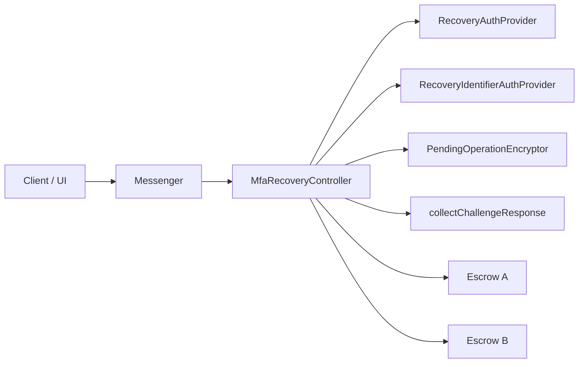
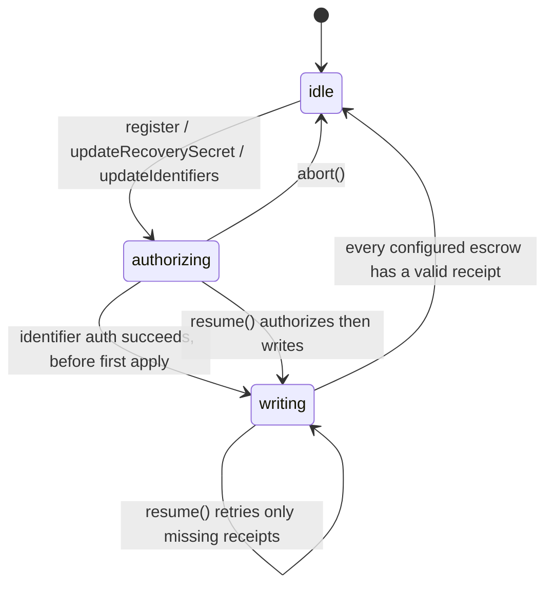
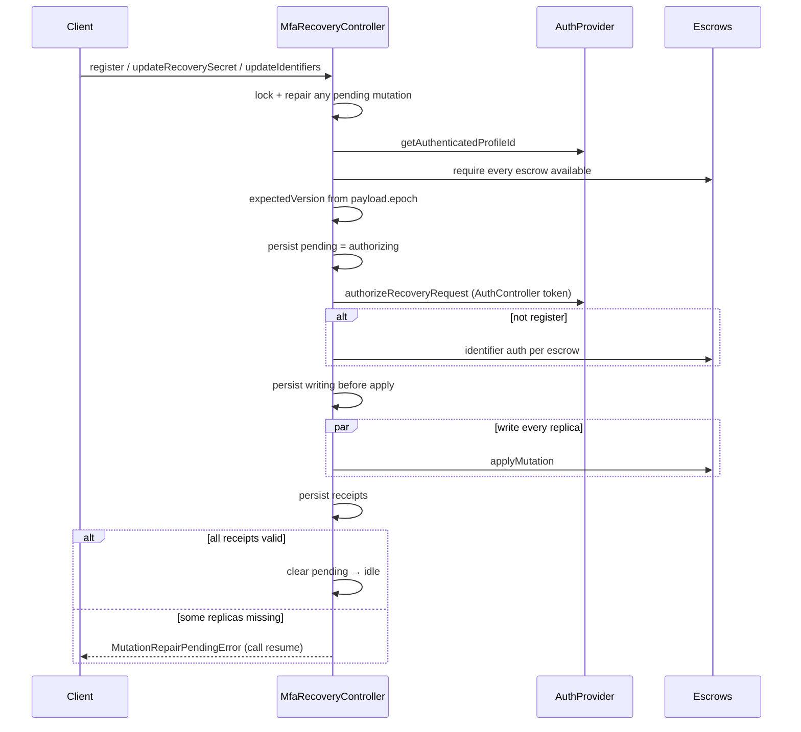
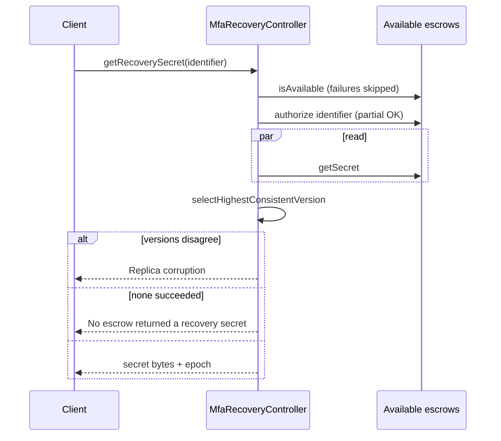
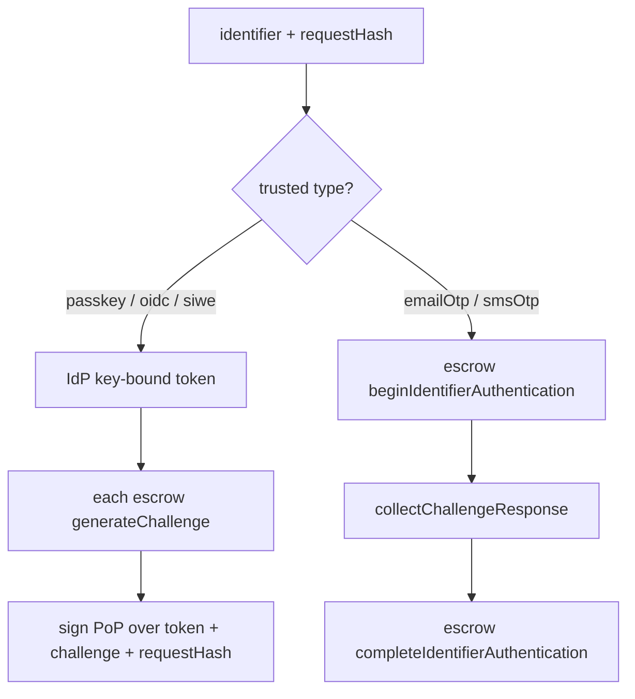
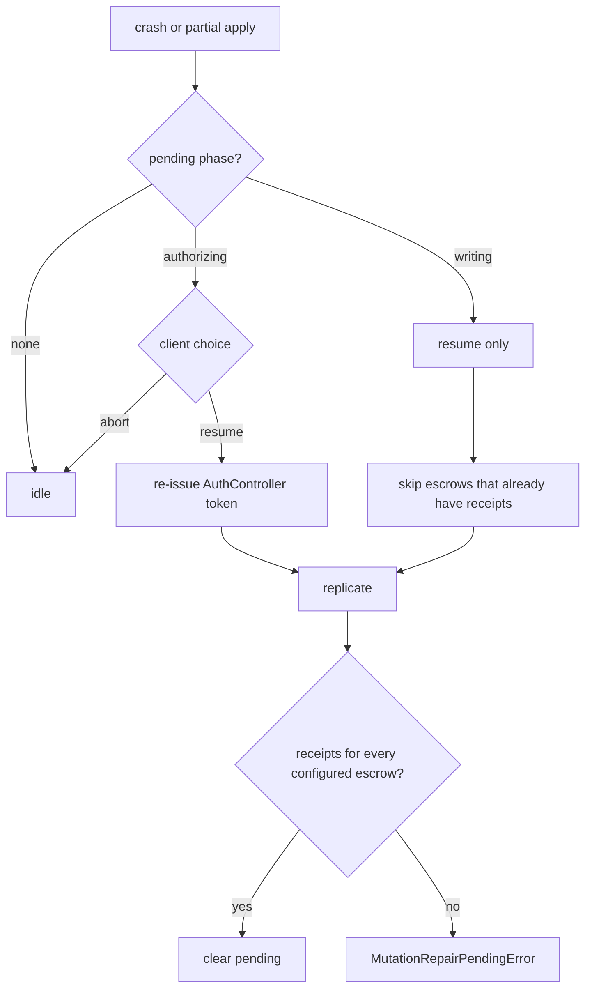

# `@metamask/mfa-recovery-controller`

Orchestration layer for MFA recovery. The controller never stores the recovery
secret in controller state. It replicates a full copy of that secret to every
configured escrow, and persists only an **encrypted** pending mutation so a
crash can finish the same write.

## Architecture

The controller is a coordinator. Auth, identifier proofs, escrow I/O,
encryption, and OTP collection are all injected.

| Piece                      | Role                                                                      |
| -------------------------- | ------------------------------------------------------------------------- |
| `pendingOperation`         | Only persisted field: encrypted `authorizing` / `writing` blob, or `null` |
| `escrows[]`                | Build-time replica set; mutations require **all** of them                 |
| `authProvider`             | Profile id + request-bound AuthController token                           |
| `identifierAuthProvider`   | Key-bound IdP assertion (passkey / OIDC / SIWE)                           |
| `collectChallengeResponse` | OTP (or similar) for email/SMS identifiers                                |
| `#withLock`                | Serializes public methods so two mutations cannot interleave              |

Identifier types pick the auth mode from a trusted table, not a client flag:
`passkey` / `oidc` / `siwe` → key-bound; `emailOtp` / `smsOtp` → escrow
challenge.

Public surface: `register`, `updateRecoverySecret`, `updateIdentifiers`,
`getRecoverySecret`, `resume`, `abort`, `getPhase`.

## State machine

Persisted phase is derived from decrypted pending state: no pending → `idle`.

Rules:

- **`abort()`** is allowed only in `authorizing` (no escrow write yet).
- **`writing`** must be finished with `resume()`, not aborted.
- `writing` is persisted before the **first escrow apply** after identifier
  authorization succeeds, so an ambiguous apply failure remains resumable while
  pre-write authorization failures stay abortable.
- Today, a new mutation also calls `#repairPendingMutation` first, then starts
  a **second** mutation if repair succeeds. `resume()` is the dedicated repair
  API.

## Mutation sequence (`register` / updates)

Mutations are all-or-nothing across the configured escrow set. Reads are not.

Versioning:

- `register` uses payload `epoch` `0` → version `0 → 1`
- updates use the caller-supplied payload `epoch` as the current version, then
  `n → n+1`. Escrows reject a mismatch.

`resume()` is the same write path without creating a new mutation: authorizing
pending gets a fresh token then replicates; writing pending retries only
escrows that do not already have a stored receipt.

## Read sequence (`getRecoverySecret`)

Reads tolerate down replicas. They do **not** repair pending writes. The
selected replica version is returned as `epoch` so a later
`updateRecoverySecret` / `updateIdentifiers` can be formed without a locally
stored version.

If a mutation is stuck in `writing`, replicas can already disagree. A read in
that window can look like corruption; finish with `resume()` first.

## Identifier auth (inside writes and reads)

On **mutation**, every target escrow must authorize or the write does not
start. On **read**, failed authorizations are skipped.

## Crash / repair

