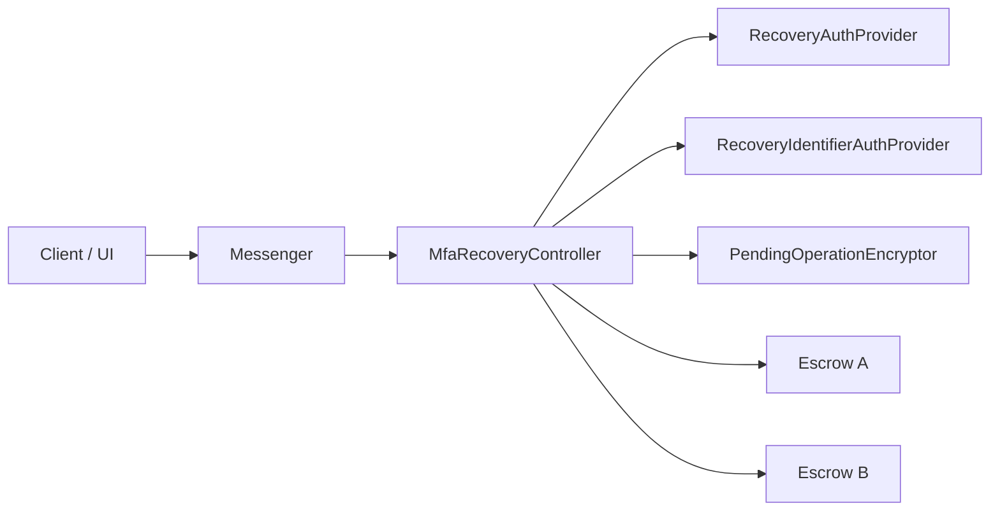
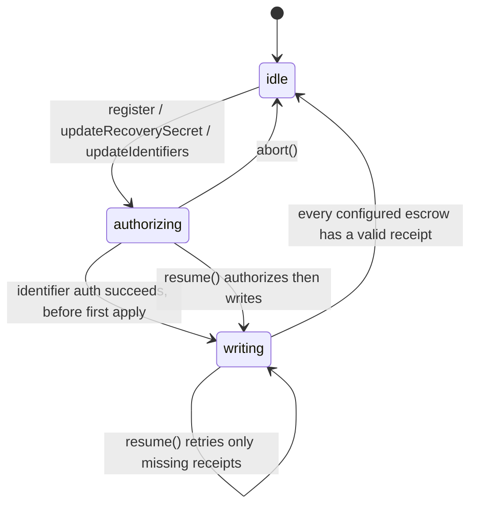
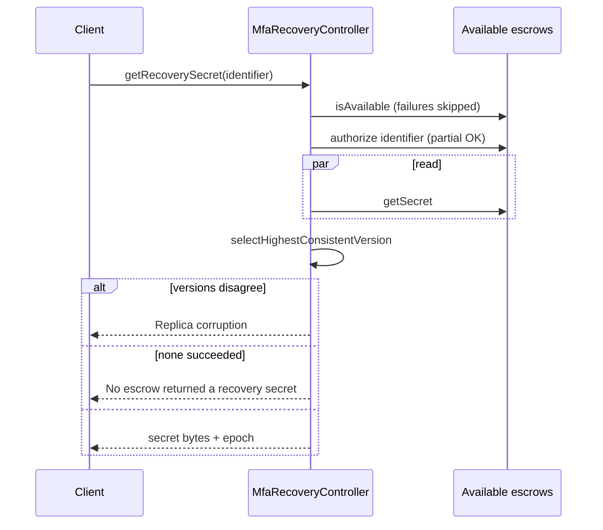
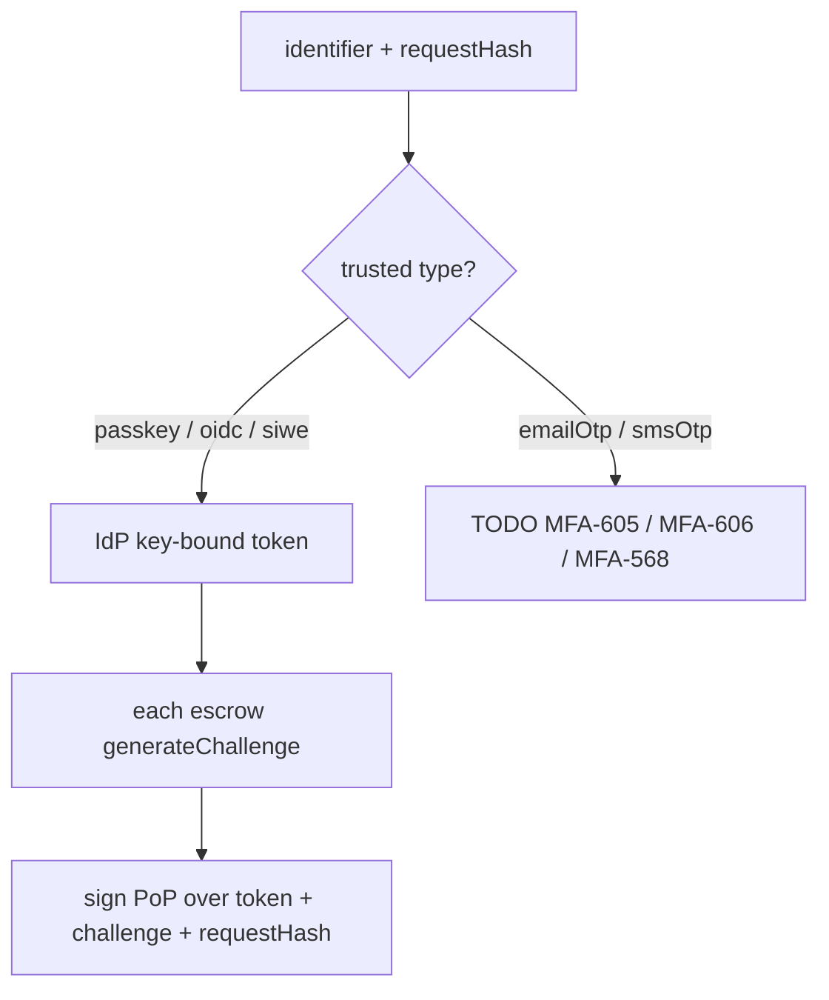
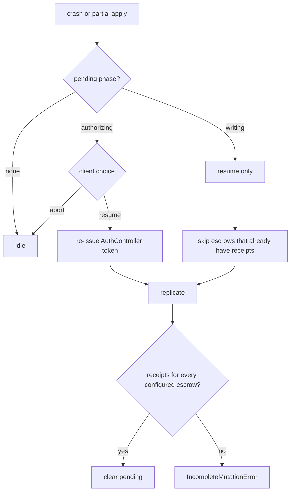

# `@metamask/mfa-recovery-controller`

Orchestration layer for MFA recovery. The controller never stores the recovery
secret in controller state. It replicates a full copy of that secret to every
configured escrow, and persists only an **encrypted** pending mutation so a
crash can finish the same write.

## Architecture

The controller is a coordinator. Auth, identifier proofs, escrow I/O, and
encryption are injected. OTP collection is not wired yet.



| Piece                    | Role                                                                      |
| ------------------------ | ------------------------------------------------------------------------- |
| `pendingOperation`       | Only persisted field: encrypted `authorizing` / `writing` blob, or `null` |
| `escrows[]`              | Build-time replica set; mutations require **all** of them                 |
| `authProvider`           | Profile id + request-bound AuthController token                           |
| `identifierAuthProvider` | Key-bound IdP assertion (passkey / OIDC / SIWE)                           |
| `#withLock`              | Serializes public methods so two mutations cannot interleave              |

Identifier types pick the auth mode from a trusted table, not a client flag:
`passkey` / `oidc` / `siwe` → key-bound. `emailOtp` / `smsOtp` escrow-challenge
is not wired yet (MFA-605 / MFA-606 / MFA-568).

`register` and `updateIdentifiers` require at least two identifiers.

Recovery secrets are wrapped in transit with escrow-wrap-v1 (P-256 ECDH, HKDF,
ChaCha20-Poly1305). Pending state stores the secret as 0x-hex; `payloadHash`
is the hash of that pending payload. At apply, each escrow gets
`{ pkE, ciphertext }` wrapped to its own wrap key. Reads bind the client's
ephemeral `pkE` into the `getSecret` request hash.

Public surface: `register`, `updateRecoverySecret`, `updateIdentifiers`,
`getRecoverySecret`, `resume`, `abort`, `getPhase`.

## State machine

Persisted phase is derived from decrypted pending state: no pending → `idle`.



Rules:

- **`abort()`** drops `authorizing` only. `writing` must `resume()`.
- `writing` is persisted before the **first escrow apply** after identifier
  authorization succeeds, so an ambiguous apply failure remains resumable while
  pre-write authorization failures stay abortable.
- `register` / `updateRecoverySecret` / `updateIdentifiers` require idle
  pending state. `resume()` finishes a persisted mutation.

## Mutation sequence (`register` / updates)

Mutations are all-or-nothing across the configured escrow set. Reads are not.

```mermaid
sequenceDiagram
  participant C as Client
  participant M as MfaRecoveryController
  participant A as AuthProvider
  participant E as Escrows

  C->>M: register / updateRecoverySecret / updateIdentifiers
  M->>M: lock; reject if a mutation is already pending
  M->>A: getAuthenticatedProfileId
  M->>E: require every escrow available
  M->>M: expectedVersion from caller epoch (register uses 0)
  M->>M: persist pending = authorizing
  M->>A: authorizeRecoveryRequest (AuthController token)
  alt not register
    M->>E: identifier auth per escrow
  end
  M->>M: persist writing before apply
  par write every replica
    M->>E: applyMutation
  end
  M->>M: persist receipts
  alt all receipts valid
    M->>M: clear pending → idle
  else some replicas missing
    M-->>C: IncompleteMutationError (call resume)
  end
```

Versioning:

- Version lives on the mutation (`expectedVersion` / `newVersion`), which is
  what escrows apply. `epoch` is only the client-facing name for the current
  replica version returned by `getRecoverySecret`.
- `register` uses expectedVersion `0` → version `0 → 1`
- updates take the caller-supplied `epoch` as `expectedVersion`, then
  `n → n+1`. Escrows reject a mismatch.
- Mutation `audiences` is the full configured replica-id list, in that order.
  Each replica should require an exact match to its configured set (a
  cubist-only deploy is `["cubist"]`; adding another escrow means every replica
  is rebuilt with the expanded list).

`resume()` is the same write path without creating a new mutation: authorizing
pending gets a fresh token then replicates; writing pending retries only
escrows that do not already have a stored receipt.

## Read sequence (`getRecoverySecret`)

Reads tolerate down replicas. They do **not** repair pending writes. The
selected replica version is returned as `epoch` so a later
`updateRecoverySecret` / `updateIdentifiers` can be formed without a locally
stored version.



`getRecoverySecret` refuses while phase is `writing`. Replicas can disagree
in that window; finish with `resume()` first.

## Identifier auth (inside writes and reads)



On **mutation**, every target escrow must authorize or the write does not
start. On **read**, failed authorizations are skipped.

## Crash / repair


