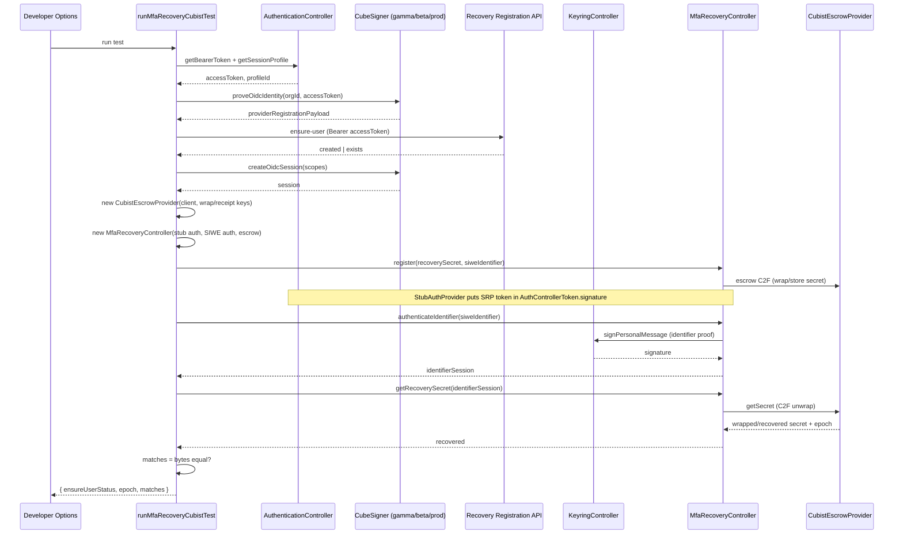

# Cubist MFA recovery integration test sequence

Harness flow for `runMfaRecoveryCubistTest` (Developer Options → Cubist
gamma/beta/prod). Setup (OIDC proof, ensure-user, session, provider
construction) happens outside the controller; the controller only runs
`register` → `authenticateIdentifier` → `getRecoverySecret`.

