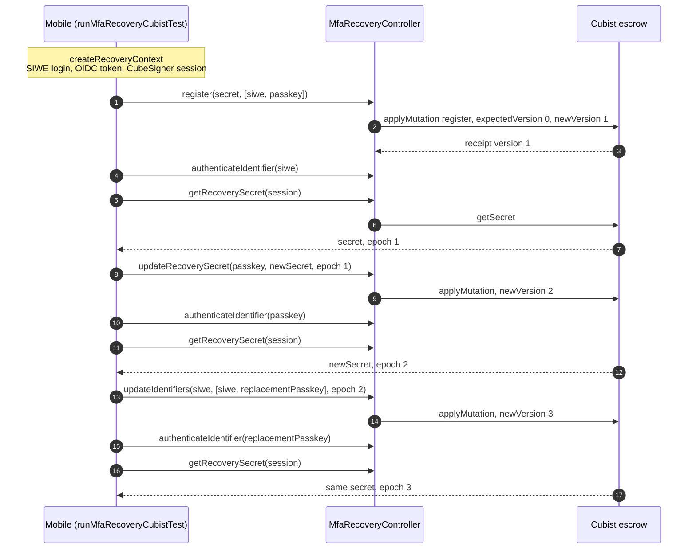
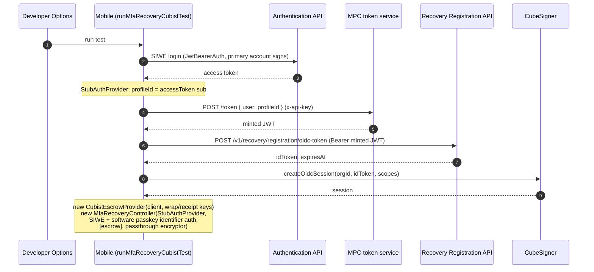
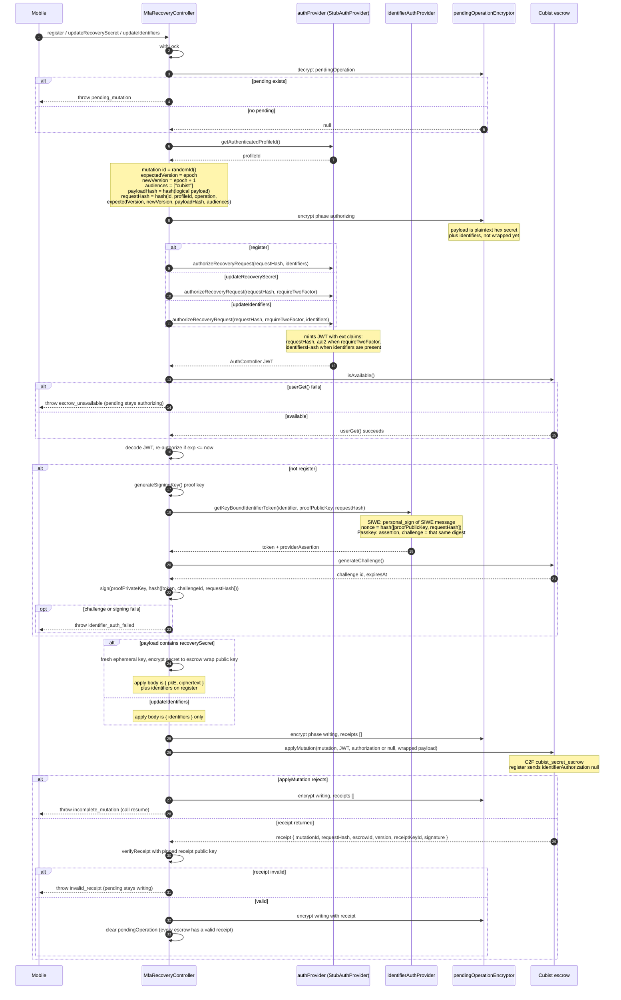
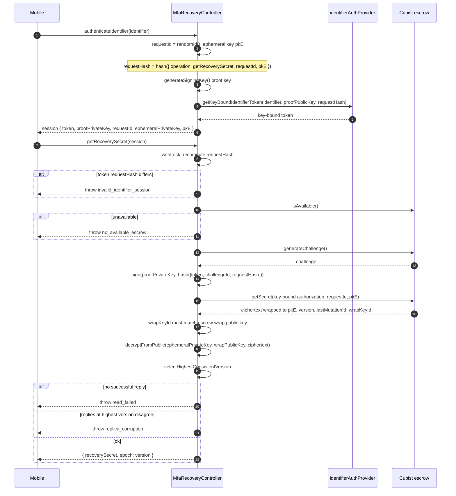

# Cubist MFA recovery integration test sequence

Harness flow for `runMfaRecoveryCubistTest` in MetaMask Mobile (Developer
Options, Cubist gamma/beta/prod). Mobile drives one `MfaRecoveryController`
against a single Cubist escrow (`id: cubist`) through three mutations, reading
the secret back after each one. The general controller design is in
[ARCHITECTURE.md](./ARCHITECTURE.md); treat the TypeScript in `src/` as the
source of truth if a diagram drifts.

- Versions: `0 → 1` (register), `1 → 2` (update secret), `2 → 3` (update
  identifiers).
- Pending state: `idle → authorizing → writing → idle` for every mutation.

Sections:

- [Setup — outside the controller](#setup-outside-the-controller)
- [Write path — `register`, `updateRecoverySecret`, `updateIdentifiers`](#write-path-mutate)
- [Read path — `authenticateIdentifier`, `getRecoverySecret`](#read-path)

## Overview

Each step only runs if the previous read returned the expected secret.

## Setup (outside the controller)

The controller does not call the Authentication API, the MPC token service,
the Recovery Registration API, or CubeSigner. Mobile does all of this before
constructing the controller (see
[Cubist store sequence](./ARCHITECTURE.md#cubist-store-sequence)).

**Notes**

- `POST /token` is the MPC service's development-only token route. It is not
  mounted in production builds.
- `StubAuthProvider` and `passthroughEncryptor` come from `tests/stubs.ts`.

## Write path: `#mutate`

`register`, `updateRecoverySecret`, and `updateIdentifiers` share this path
(`#mutate` and `#replicateMutation` in `src/MfaRecoveryController.ts`). The
controller holds a lock for the whole mutation. Repair of an existing pending
mutation is `resume()` only (see
[Crash / repair](./ARCHITECTURE.md#crash--repair)).

`register` and `updateIdentifiers` require at least two distinct identifiers
(`type + namespace + value`). `siwe` and `passkey` are both `key-bound`.

| Operation              | Epoch in                 | Payload hashed           | Identifier proof        | AuthController token                               |
| ---------------------- | ------------------------ | ------------------------ | ----------------------- | -------------------------------------------------- |
| `register`             | `0`                      | identifiers + hex secret | none                    | `requestHash` + identifiers, no `requireTwoFactor` |
| `updateRecoverySecret` | epoch from the last read | hex secret only          | the identifier argument | `requireTwoFactor`                                 |
| `updateIdentifiers`    | epoch from the last read | identifiers only         | the identifier argument | `requireTwoFactor` + identifiers                   |

**Notes**

- `newVersion` must be `expectedVersion + 1`; the escrow rejects a mismatch.
- The secret is wrapped per escrow only at `applyMutation`
  (`#payloadForEscrow`); pending state keeps the hex secret. In this harness
  the encryptor is a JSON passthrough.
- Receipts are checked by `verifyMutationReceipt` (`src/escrow-utils.ts`),
  which requires a matching `escrowId` and then calls the provider's
  `verifyReceipt` (`src/escrow-providers/cubist-escrow-provider.ts`).
- Key-bound identifier proofs are built by `requestKeyBoundIdentifierToken`
  and `authorizeEscrowsWithToken` (`src/identifier-auth.ts`).

## Read path

`getRecoverySecret` (`src/MfaRecoveryController.ts`) does not wait for or
repair a pending mutation. It takes the session from `authenticateIdentifier`
and checks that the session token is still bound to the same read hash. See
also [Read sequence](./ARCHITECTURE.md#read-sequence-getrecoverysecret).

**Notes**

- `selectHighestConsistentVersion` (`src/escrow-utils.ts`) keeps successful
  escrow replies, takes the highest `version`, and requires every reply at
  that version to share the same `lastMutationId` and secret bytes.
- Per-escrow failures (`generateChallenge` or `getSecret` rejecting,
  `wrap_key_mismatch`, a failed decrypt) only drop that reply. With one escrow, any of them surfaces as
  `read_failed`.
- Mobile compares the returned bytes to the secret it last wrote.
