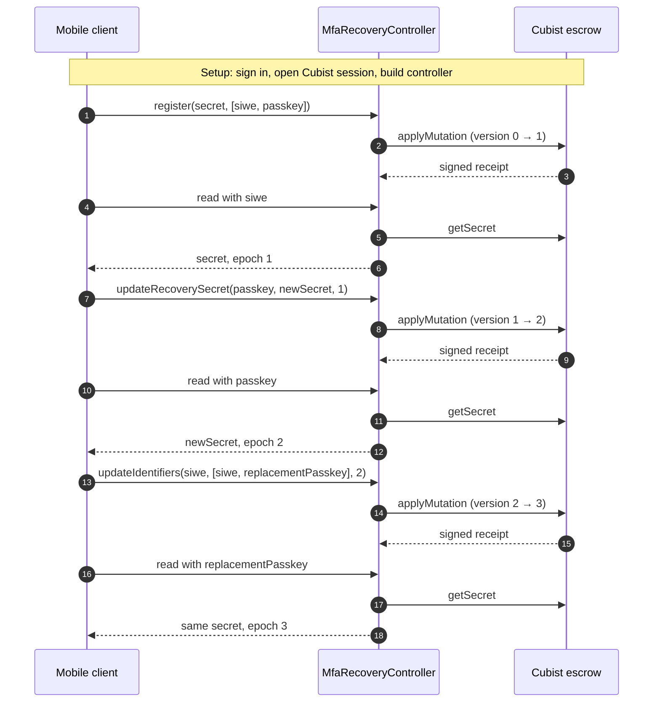
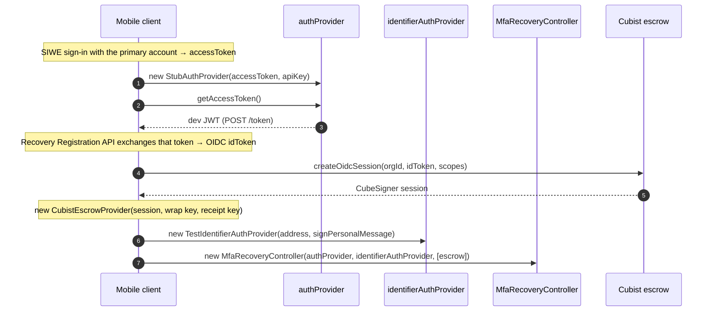
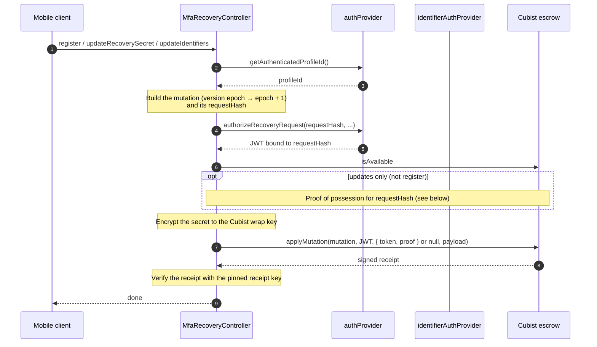
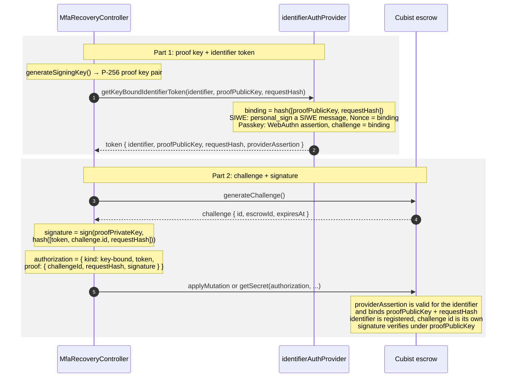
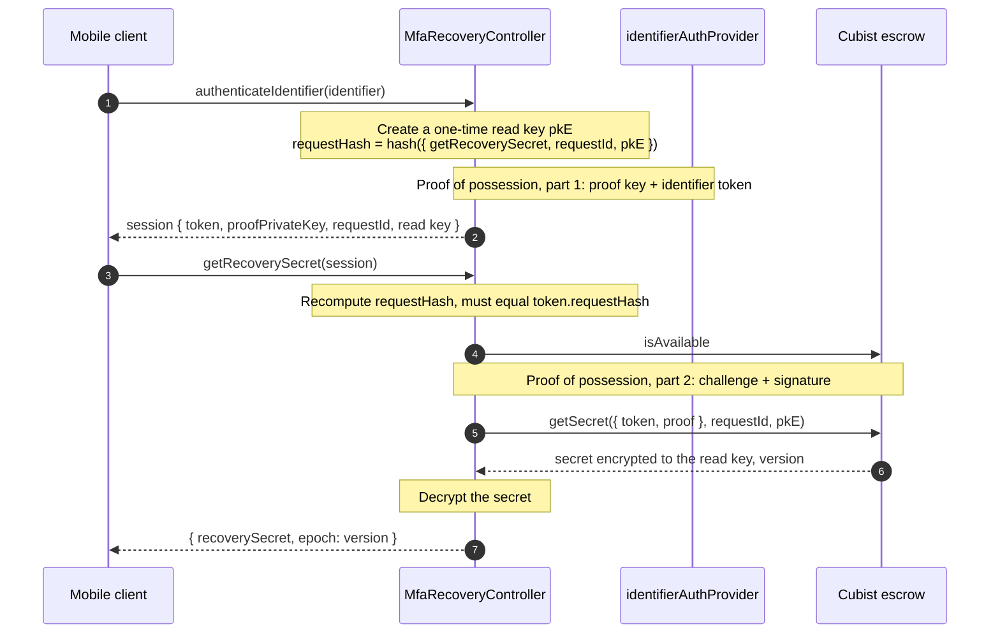

# Cubist MFA recovery sequence

How the mobile developer test (`runMfaRecoveryCubistTest` in
`metamask-mobile`) drives one `MfaRecoveryController` against a single Cubist
escrow (`id: cubist`). It runs three mutations and reads the secret back after
each one. Error branches, pending-state repair, and multi-escrow behavior are
in [ARCHITECTURE.md](./ARCHITECTURE.md); treat the TypeScript in `src/` as the
source of truth if a diagram drifts.

| Step | Client call                                                  | Version |
| ---- | ------------------------------------------------------------ | ------- |
| 1    | `register(secret, [siwe, passkey])`                          | `0 → 1` |
| 2    | `updateRecoverySecret(passkey, newSecret, epoch)`            | `1 → 2` |
| 3    | `updateIdentifiers(siwe, [siwe, replacementPasskey], epoch)` | `2 → 3` |

Each update passes the `epoch` returned by the previous read.

## Overview

## Setup

The mobile client does this before it creates the controller. The controller
never calls these services itself.

- `authProvider` (`StubAuthProvider` in mobile) takes the profile ID from the
  access token and mints request-bound JWTs from the MPC service's
  development-only `POST /token` endpoint. That route is not mounted in
  production builds.
- `identifierAuthProvider` (`TestIdentifierAuthProvider` in mobile) signs SIWE
  proofs with the primary account and passkey proofs with a software passkey.

## Write: `register`, `updateRecoverySecret`, `updateIdentifiers`

All three mutations share one path.

| Operation              | Identifier proof        | JWT requires     | Payload              |
| ---------------------- | ----------------------- | ---------------- | -------------------- |
| `register`             | none                    | identifiers      | identifiers + secret |
| `updateRecoverySecret` | the identifier argument | 2FA              | secret               |
| `updateIdentifiers`    | the identifier argument | 2FA, identifiers | identifiers          |

If `applyMutation` fails, the controller keeps the pending mutation and throws
`incomplete_mutation`; call `resume()` to finish it.

## Proof of possession

Updates and reads prove control of a registered identifier in two parts. The
identifier provider signs a token that names a fresh proof key and the
`requestHash`. Then the controller signs a Cubist challenge with that proof
key. Code: `requestKeyBoundIdentifierToken` and `authorizeEscrowsWithToken` in
`src/identifier-auth.ts`.

- The identifier provider signs once, over the proof key and `requestHash`.
  The proof key then signs each escrow challenge, so the token works only for
  this request.
- The proof private key is never sent to the identifier provider or Cubist.
  For reads it lives only in the session returned by `authenticateIdentifier`.
- The Cubist-side checks happen in the escrow C2F (`cubist_secret_escrow`),
  not in this package.
- `register` sends no identifier proof (`null`); the JWT from `authProvider`
  is the only authorization.

## Read: `authenticateIdentifier`, `getRecoverySecret`

With one escrow, any failure during the read (challenge, `getSecret`, wrong
wrap key, or decrypt) surfaces as `read_failed`.
