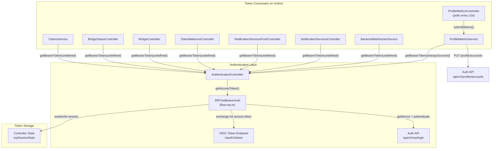
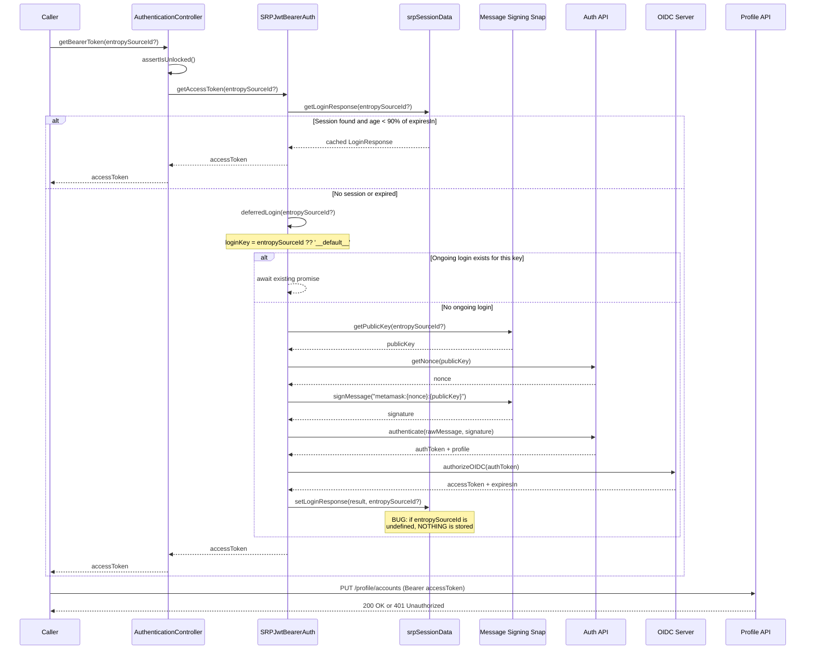
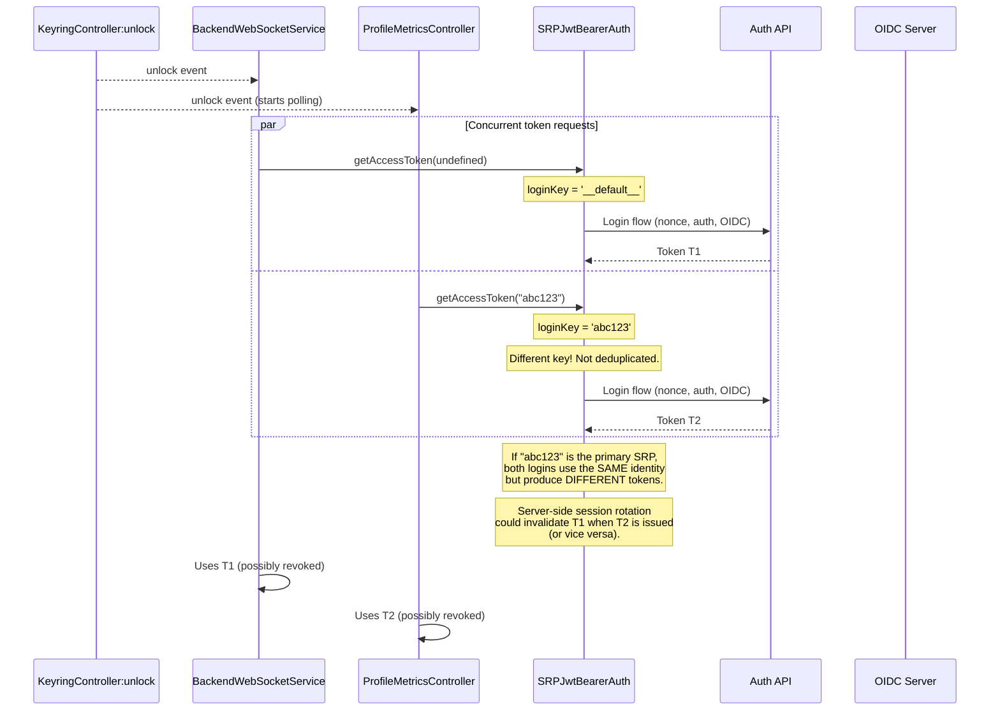
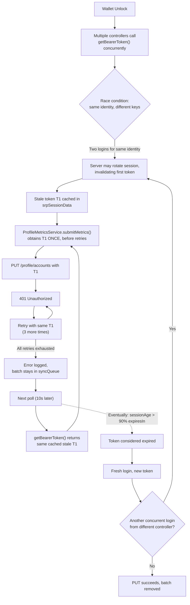

# ProfileMetricsController 401 Investigation Report

## Table of Contents

- [Executive Summary](#executive-summary)
- [Architecture Overview](#architecture-overview)
- [Authentication Flow](#authentication-flow)
- [Why Are We Getting 401s?](#why-are-we-getting-401s)
- [Root Causes (Detailed)](#root-causes-detailed)
  - [1. Token Silently Discarded for Undefined entropySourceId](#1-token-silently-discarded-for-undefined-entropysourceid)
  - [2. Bearer Token Obtained Outside the Retry Loop](#2-bearer-token-obtained-outside-the-retry-loop)
  - [3. No Token Invalidation on Downstream 401](#3-no-token-invalidation-on-downstream-401)
  - [4. Login Deduplication by entropySourceId Not by Identity](#4-login-deduplication-by-entropysourceid-not-by-identity)
  - [5. 401s Are Retried But Never Succeed](#5-401s-are-retried-but-never-succeed)
- [How the Issues Compound](#how-the-issues-compound)
- [Can a 401 Lock the User?](#can-a-401-lock-the-user)
- [Suggested Fixes](#suggested-fixes)

---

## Executive Summary

`ProfileMetricsController` polls on a 10-second interval and calls `PUT /api/v2/profile/accounts` with a bearer token obtained from `AuthenticationController`. Approximately 60% of users are receiving HTTP 401 responses on this endpoint.

Five compounding issues were identified in the client-side authentication and retry infrastructure. Together, they create a scenario where:

1. An invalid/stale token can enter the system (via race conditions or expiry-edge timing).
2. That token is retried 4 times with no chance of success (token captured outside retry loop).
3. The invalid token is never evicted from cache (no invalidation on 401).
4. The polling loop keeps hitting the same stale token every 10 seconds.
5. This continues for up to 90% of the token's `expiresIn` lifetime before a refresh occurs.

The user is **temporarily locked** (minutes to potentially hours, depending on token TTL) but **not permanently locked** -- tokens eventually expire and are refreshed.

---

## Architecture Overview



Key observation: **~8 controllers** call `getBearerToken(undefined)` (no `entropySourceId`), while `ProfileMetricsService` calls `getBearerToken(entropySourceId)` with a **specific** entropy source ID. Both paths go through the same `SRPJwtBearerAuth` instance, but they are deduplicated independently.

---

## Authentication Flow

When `getBearerToken(entropySourceId?)` is called, this is the full chain of events:



---

## Why Are We Getting 401s?

The short answer has two parts:

1. **What triggers the 401?** Likely one of two things (possibly both): the same user identity authenticates twice concurrently through different code paths and the server invalidates the earlier token (see below), or the token simply expires naturally and the client is caught in the edge of the 90% TTL window.

2. **Why can't we recover?** This is the real problem. **It does not matter what causes the 401.** Whether the token was invalidated by a concurrent login, expired naturally, or was revoked server-side for any reason -- the outcome is identical. The client has no mechanism to respond to a 401 by re-authenticating. A well-behaved OAuth2 client would detect the 401, invalidate the cached token, re-authenticate, and retry with a fresh token. The current implementation does none of that. It retries with the same dead token, never tells `AuthenticationController` the token was rejected, and keeps serving the dead token from cache for up to 90% of its TTL. **The client is fundamentally unable to recover from any 401, regardless of cause.**

Below is the most likely sequence that produces the initial 401, step by step. But keep in mind: even if the trigger is something else entirely (e.g., normal token expiry, server-side revocation), the persistence and amplification mechanisms described in Steps 4-5 apply identically.

### Step 1 -- Wallet unlocks, multiple controllers wake up at once

When the wallet unlocks, `KeyringController:unlock` fires. Several controllers react simultaneously:

- **BackendWebSocketService**, **NotificationServicesPushController**, **TokenBalancesController**, and others all call `getBearerToken()` with **no** `entropySourceId` (i.e. `undefined`).
- **ProfileMetricsController** starts polling and eventually calls `getBearerToken("abc-entropy-id")` with the **specific** entropy source ID of each account batch.

Both calls go through the same `SRPJwtBearerAuth` instance.

### Step 2 -- Two independent logins fire for the same identity

`SRPJwtBearerAuth.#deferredLogin` is supposed to prevent concurrent logins, but it deduplicates by `entropySourceId`, not by the actual identity (public key):

```typescript
const loginKey = entropySourceId ?? '__default__';
//                ^^^^^^^^^^^^^^^^^^^^^^^^^^^^^^^^^^^
//  getBearerToken(undefined)     → loginKey = '__default__'
//  getBearerToken("abc-entropy") → loginKey = 'abc-entropy'
//
//  Different keys → NOT deduplicated → two full login flows proceed.
```

Critically, when `"abc-entropy"` is the **primary SRP** (which it almost always is), both `getIdentifier(undefined)` and `getIdentifier("abc-entropy")` resolve to the **same public key**. Two independent login flows run against the auth server for the exact same identity:

| Login flow | `entropySourceId` | `loginKey` | Identity (public key) |
|---|---|---|---|
| Flow A (8+ controllers) | `undefined` | `'__default__'` | Primary SRP key |
| Flow B (ProfileMetricsService) | `"abc-entropy"` | `'abc-entropy'` | Primary SRP key (same!) |

Each flow independently calls `getNonce` -> `authenticate` -> `authorizeOIDC`, producing two distinct OIDC access tokens for the same identity.

### Step 3 -- The auth server invalidates the earlier token

The OIDC/auth server issues token **T1** (for flow A) and then token **T2** (for flow B) -- or vice versa depending on timing. When the server performs session rotation (standard practice for security), it invalidates the previously issued token for that identity. The token that happened to be issued first is now dead.

> **This is the moment the 401 is born.** One of the two tokens is now server-side invalid, but the client has no idea.

### Step 4 -- The dead token gets cached, the valid one gets discarded

Here is where the `#setLoginResponseToState` bug makes everything worse:

- **Flow B** (`entropySourceId = "abc-entropy"`): Token T2 is **stored** in `srpSessionData["abc-entropy"]`. This is the token ProfileMetricsController will use.
- **Flow A** (`entropySourceId = undefined`): Token T1 should be stored too, but `#setLoginResponseToState` has an `if (entropySourceId)` guard that **silently discards it** when `entropySourceId` is falsy. T1 vanishes.

If T2 was issued first and T1 invalidated it, ProfileMetricsController is fine (it uses T2). But if T1 was issued **second** and invalidated T2, ProfileMetricsController is stuck with a dead T2 in its cache.

Because the `undefined` path never caches its token, **every subsequent call** to `getBearerToken(undefined)` triggers a fresh login for the same identity -- continuously creating new tokens that can keep invalidating whatever ProfileMetricsController has cached. The race condition isn't a one-time event; it recurs on every poll cycle where another controller also needs a token.

### Step 5 -- No recovery, no circuit breaker, no escape

Once ProfileMetricsController has a dead token cached:

1. `submitMetrics` obtains the dead token **once**, before the retry loop.
2. All 4 retry attempts use the same dead token. All return 401.
3. The `AuthenticationController` is never told the token was rejected. The dead token stays in `srpSessionData`.
4. The circuit breaker only trips on 5xx errors. 401 is invisible to it.
5. 10 seconds later, the next poll cycle starts. `getBearerToken("abc-entropy")` reads the same dead token from cache (still within the 90% TTL window). Same 401s.
6. This repeats every 10 seconds, wasting 4 requests per cycle, **for up to 90% of the token's lifetime** (potentially ~49 minutes for a 1-hour token).
7. When the token finally expires by age, a fresh login happens. If another controller races it again, the cycle restarts.

### Visual summary

```mermaid
flowchart LR
    subgraph trigger ["THE TRIGGER"]
        A["Wallet unlocks"] --> B["~8 controllers call<br/>getBearerToken(undefined)"]
        A --> C["ProfileMetricsService calls<br/>getBearerToken('abc-entropy')"]
        B --> D["Login flow A<br/>key: '__default__'"]
        C --> E["Login flow B<br/>key: 'abc-entropy'"]
        D --> F["Same public key!"]
        E --> F
        F --> G["Two OIDC tokens issued<br/>for same identity"]
        G --> H["Server invalidates<br/>the earlier token"]
    end

    subgraph persist ["THE PERSISTENCE"]
        H --> I["Dead token cached in<br/>srpSessionData"]
        I --> J["No invalidation<br/>on 401"]
        J --> K["Retries use<br/>same dead token"]
        K --> L["Circuit breaker<br/>ignores 401"]
        L --> M["Locked for up to<br/>90% of token TTL"]
    end

    subgraph recur ["THE RECURRENCE"]
        M --> N["Token expires by age"]
        N --> O{"Another concurrent<br/>login from undefined path?"}
        O -->|"Yes (likely)"| H
        O -->|"No"| P["Success"]
    end
```



### Why ~60% of users?

The 60% failure rate aligns with users who have **at least one mnemonic-based account** (the vast majority). For these users, `ProfileMetricsService` calls `getBearerToken` with a specific `entropySourceId`, while other controllers call it with `undefined`. Since `undefined` maps to the same primary SRP identity, the race condition fires. Users who only have imported/hardware accounts (no mnemonic entropy source) would use the `undefined` path exclusively -- no conflicting login keys, no race condition. But because the `undefined` path never caches its token, these users still suffer from repeated unnecessary logins (issue #1), which can cause rate limiting and transient failures, though not the persistent 401 lock.

---

## Root Causes (Detailed)

### 1. Token Silently Discarded for Undefined `entropySourceId`

**Severity: High** | **File:** `AuthenticationController.ts` lines 286-306

When `#setLoginResponseToState` is called with `entropySourceId = undefined`, the entire storage operation is silently skipped:

```typescript
async #setLoginResponseToState(
    loginResponse: LoginResponse,
    entropySourceId?: string,
) {
    const metaMetricsId = await this.#metametrics.getMetaMetricsId();
    this.update((state) => {
      if (entropySourceId) {        // <-- undefined is falsy, entire block skipped
        state.isSignedIn = true;
        if (!state.srpSessionData) {
          state.srpSessionData = {};
        }
        state.srpSessionData[entropySourceId] = {
          ...loginResponse,
          profile: { ...loginResponse.profile, metaMetricsId },
        };
      }
      // When entropySourceId is undefined: NOTHING happens.
      // The token is silently discarded. isSignedIn is not set.
    });
}
```

**How does `undefined` get there?**

In `ProfileMetricsController._executePoll` (line 291-292), accounts without a mnemonic entropy source are grouped under the key `'null'`:

```typescript
entropySourceId: entropySourceId === 'null' ? null : entropySourceId,
```

Then in `ProfileMetricsService.submitMetrics` (line 203):

```typescript
data.entropySourceId ?? undefined   // null ?? undefined → undefined
```

So `getBearerToken(undefined)` is called. This also happens for the ~8 other controllers that never pass an `entropySourceId` at all (BackendWebSocketService, NotificationServicesController, TokenBalancesController, BridgeController, etc.).

**Impact:**

- Every `getBearerToken(undefined)` call that needs a fresh login produces a valid token, but **never caches it**.
- The companion read path (`#getLoginResponseFromState(undefined)`) tries `Object.values(srpSessionData)[0]`, which returns the first stored session (typically from `performSignIn`). If `performSignIn` hasn't been called yet, or all stored sessions have expired, there is no fallback -- a fresh login is triggered every single time.
- This causes excessive authentication traffic to the auth API, increasing the probability of hitting rate limits (429) and amplifying the race condition described in issue #4.

---

### 2. Bearer Token Obtained Outside the Retry Loop

**Severity: Critical** | **File:** `ProfileMetricsService.ts` lines 200-226

The bearer token is obtained **once**, before the retry policy executes, and is captured in the closure:

```typescript
async submitMetrics(data: ProfileMetricsSubmitMetricsRequest): Promise<void> {
    // Token obtained HERE, ONCE, before retries
    const authToken = await this.#messenger.call(
      'AuthenticationController:getBearerToken',
      data.entropySourceId ?? undefined,
    );
    await this.#policy.execute(async () => {
      // All retry attempts use the SAME authToken from the closure
      const url = new URL(`${this.#baseURL}/profile/accounts`);
      const localResponse = await this.#fetch(url, {
        method: 'PUT',
        headers: {
          Authorization: `Bearer ${authToken}`,  // same stale token on every retry
          // ...
        },
        // ...
      });
      if (!localResponse.ok) {
        throw new HttpError(localResponse.status, /* ... */);
      }
    });
}
```

**Impact:**

If the token is invalid at the time of the first request, all 4 attempts (1 initial + 3 retries from the default `maxRetries = 3`) fail with 401. There is no mechanism to refresh the token between retries.

---

### 3. No Token Invalidation on Downstream 401

**Severity: Critical** | **Files:** `flow-srp.ts` lines 174-191, `AuthenticationController.ts` lines 265-284

When `/api/v2/profile/accounts` returns HTTP 401, the `AuthenticationController` is **never notified**. The stale token remains in `srpSessionData` and keeps being served to callers.

The token validity check in `#getAuthSession` is purely time-based:

```typescript
async #getAuthSession(entropySourceId?: string): Promise<LoginResponse | null> {
    const auth = await this.#options.storage.getLoginResponse(entropySourceId);
    if (!validateLoginResponse(auth)) {
      return null;
    }
    const currentTime = Date.now();
    const sessionAge = currentTime - auth.token.obtainedAt;
    const refreshThreshold = auth.token.expiresIn * 1000 * 0.9;

    if (sessionAge < refreshThreshold) {
      return auth;   // Returns the token even if the server already rejects it
    }
    return null;
}
```

There is no event, callback, or messenger action that allows a consumer to signal "this token was rejected, please invalidate it."

**Impact:**

Once a token becomes invalid server-side (for any reason), it remains cached and returned to all callers for up to **90% of `expiresIn`**. For a 1-hour token, that is ~54 minutes of persistent 401 failures.

---

### 4. Login Deduplication by `entropySourceId`, Not by Identity

**Severity: High** | **File:** `flow-srp.ts` lines 236-260

The `#deferredLogin` mechanism correctly prevents concurrent logins for the **same `entropySourceId`**, but different `entropySourceId` values that resolve to the **same identity** (same public key) are treated as independent:

```typescript
async #deferredLogin(entropySourceId?: string): Promise<LoginResponse> {
    const loginKey = entropySourceId ?? '__default__';

    const existingLogin = this.#ongoingLogins.get(loginKey);
    if (existingLogin) {
      return existingLogin;  // Deduplicates same key
    }

    const loginPromise = this.#loginWithRetry(entropySourceId);
    this.#ongoingLogins.set(loginKey, loginPromise);
    // ...
}
```

**The race condition:**

On wallet unlock, multiple controllers subscribe to `KeyringController:unlock` and begin making requests:



When `undefined` and a specific `entropySourceId` both map to the same underlying public key (which happens when that `entropySourceId` is the primary SRP), two independent login flows execute for the **same identity**. Depending on the OIDC server's behavior:

- **If stateless JWTs**: both tokens are valid independently. No immediate issue, but unnecessary load.
- **If reference tokens with session rotation**: the second token issuance may invalidate the first, causing 401s for any consumer still using the first token.

**Impact:**

This race condition is the most likely **trigger** for the initial 401. The other issues (no invalidation, stale retries) then **amplify** the failure and **extend its duration**.

---

### 5. 401s Are Retried But Never Succeed

**Severity: Medium** | **File:** `create-service-policy.ts` lines 192-205, 276-286

The default service policy uses `retryFilterPolicy = handleAll`, which means **all errors** (including 401) trigger retries. However, the circuit breaker only considers errors with `httpStatus >= 500` as service failures:

```typescript
const isServiceFailure = (error: unknown): boolean => {
  if (typeof error === 'object' && error !== null &&
      'httpStatus' in error && typeof error.httpStatus === 'number') {
    return error.httpStatus >= 500;   // 401 is NOT a service failure
  }
  return true;
};
```

`ProfileMetricsService` uses default policy options (`policyOptions = {}`), so:

- **Retry policy**: `handleAll` with `maxRetries = 3` -- 401s ARE retried (4 total attempts), all with the same stale token.
- **Circuit breaker**: `handleWhen(isServiceFailure)` with `maxConsecutiveFailures = 12` -- 401s do NOT count toward the circuit breaker. The breaker **never opens** for 401s.

**Impact:**

Each 10-second poll cycle that encounters a 401 wastes 4 HTTP requests (with exponential backoff delays), and the circuit breaker never intervenes. This continues indefinitely until the token expires naturally.

---

## How the Issues Compound

The five issues create a cascading failure loop:



**Timeline of a typical failure cycle:**

1. **T=0s**: Wallet unlocks. BackendWebSocketService calls `getBearerToken(undefined)`, ProfileMetricsController starts polling.
2. **T=0-2s**: Two concurrent logins for the same identity (keys `'__default__'` and `"primary-srp-id"`). Server issues T1 and T2. T1 may be invalidated.
3. **T=10s**: First poll. `submitMetrics` obtains T1 (still cached, age < 90% threshold). PUT fails with 401. Retried 3 more times. All fail.
4. **T=20s, 30s, ...**: Same cycle repeats every 10 seconds. 4 wasted requests per cycle.
5. **T = 90% of expiresIn**: Token T1 finally expires in cache. Fresh login produces T3.
6. **T = 90% + 10s**: If no concurrent login interferes, PUT succeeds. If another controller triggers a concurrent login, the cycle may restart.

---

## Can a 401 Lock the User?

### Temporary Lock: YES

A 401-producing token remains cached in `srpSessionData` until the time-based expiry threshold is reached (`sessionAge > expiresIn * 1000 * 0.9`). During this window:

- Every call to `getBearerToken(entropySourceId)` returns the same stale token.
- Every `submitMetrics` call fails with 401 (4 attempts each).
- Failed batches remain in `syncQueue` and are retried on the next poll cycle.

**Lock duration** = remaining time until 90% of `expiresIn` from `obtainedAt`.

For example, if the OIDC token has `expiresIn = 3600` (1 hour) and is invalidated at T=5 minutes:
- Remaining lock = `(3600 * 0.9) - 300` = **2940 seconds (~49 minutes)** of continuous 401 failures.

### Permanent Lock: NO

There is no persistent error state that prevents future authentication:

- `syncQueue` retains failed batches -- they are always retried.
- Tokens eventually expire and trigger fresh logins.
- `performSignOut()` clears `srpSessionData`, and new logins start fresh.
- No error counter or flag gates future `getBearerToken` calls.

### Repeating Lock: POSSIBLE

If the conditions that caused the initial 401 (concurrent logins for the same identity) recur on each token refresh, the user can enter a repeating cycle:

1. Token refreshed -> concurrent login invalidates it -> 401 for ~90% of TTL
2. Token refreshed again -> same thing happens -> another ~90% TTL lock
3. Repeat

This would make `ProfileMetricsController` **effectively non-functional** for the affected user, even though there is no formal "lock" state.

---

## Suggested Fixes

### Implemented: Resolve `undefined` `entropySourceId` at the `AuthenticationController` boundary

**Priority: Critical** | **Files:** `AuthenticationController.ts`, `flow-srp.ts`, `authentication.ts`, `flow-siwe.ts`

**Status: Implemented** -- This single fix addresses root causes #1 (token silently discarded) and #4 (dedup race condition) with **zero consumer code changes**.

#### The approach

Instead of fixing the storage bug and deduplication race separately, we resolve `undefined` `entropySourceId` to the actual primary SRP entropy source ID at the earliest possible point -- inside `AuthenticationController`, before it reaches `SRPJwtBearerAuth`.

A new private method `#getPrimaryEntropySourceId()` resolves the primary entropy source ID by calling the message-signing snap's `getAllPublicKeys` method (which always returns the primary SRP as the first entry). The result is cached in memory for the lifetime of the controller instance.

```typescript
#cachedPrimaryEntropySourceId?: string;

async #getPrimaryEntropySourceId(): Promise<string> {
  if (this.#cachedPrimaryEntropySourceId) {
    return this.#cachedPrimaryEntropySourceId;
  }
  const allPublicKeys = await this.#snapGetAllPublicKeys();
  this.#cachedPrimaryEntropySourceId = allPublicKeys[0][0];
  return this.#cachedPrimaryEntropySourceId;
}
```

`getBearerToken`, `getSessionProfile`, and `getUserProfileLineage` all resolve `undefined` before delegating:

```typescript
public async getBearerToken(entropySourceId?: string): Promise<string> {
  this.#assertIsUnlocked('getBearerToken');
  const resolvedId =
    entropySourceId ?? (await this.#getPrimaryEntropySourceId());
  return await this.#auth.getAccessToken(resolvedId);
}
```

#### Why this works

This single change implicitly fixes the two root causes that **trigger** the 401s:

1. **Storage bug (root cause #1) eliminated**: `#setLoginResponseToState` always receives a defined `entropySourceId` now, so the `if (entropySourceId)` guard always passes. Tokens are always stored. `isSignedIn` is always set.

2. **Dedup race (root cause #4) eliminated**: `getBearerToken(undefined)` and `getBearerToken("primary-srp-id")` now resolve to the same concrete ID before reaching `SRPJwtBearerAuth`. The `#deferredLogin` deduplication key is the same for both, so only one login fires. No more two-token race against the OIDC server.

3. **Zero consumer changes**: All callers (`ProfileMetricsService`, `BackendWebSocketService`, `NotificationServicesController`, etc.) continue passing `undefined` or specific IDs as before. The resolution is entirely internal to `AuthenticationController`.

#### Design note: why not use `srpSessionData` as a fast path?

An earlier version tried to use `Object.keys(srpSessionData)[0]` as a fast path before falling back to the snap. This was rejected because if a secondary SRP authenticates first (e.g., `ProfileMetricsController` processes secondary SRP accounts before the primary), the first key in `srpSessionData` would be the secondary SRP -- not the primary. The snap's `getAllPublicKeys` is the only authoritative source for which SRP is primary.

### Fix 2: Client-side JWT `exp` claim validation

**Files changed**: `flow-srp.ts`, `flow-siwe.ts`, `validate-login-response.ts`

Backend analysis confirmed that the 401s are caused by **expired tokens** -- some as old as 6 months -- being sent from recent extension versions. The client-side TTL check (`obtainedAt`/`expiresIn`) should prevent this, but can be bypassed if the persisted `expiresIn` value is corrupted to an astronomically large number. There is no runtime validation at any stage of the `srpSessionData` hydration chain (OIDC response → state storage → restoration from `chrome.storage.local`).

As a robust defensive measure, `#getAuthSession` in both `SRPJwtBearerAuth` and `SIWEJwtBearerAuth` now decodes the JWT's `exp` claim and rejects tokens that have actually expired, regardless of what `obtainedAt`/`expiresIn` say:

```typescript
// In validate-login-response.ts
export function isAccessTokenExpired(accessToken: string): boolean {
  try {
    const parts = accessToken.split('.');
    if (parts.length !== 3) {
      return true;
    }
    const base64 = (parts[1] as string)
      .replace(/-/gu, '+')
      .replace(/_/gu, '/');
    const { exp } = JSON.parse(atob(base64));
    return typeof exp !== 'number' || exp * 1000 <= Date.now();
  } catch {
    return true;
  }
}
```

Used in `#getAuthSession` after the existing TTL check passes:

```typescript
if (sessionAge < refreshThreshold) {
  if (isAccessTokenExpired(auth.token.accessToken)) {
    return null; // JWT actually expired — force fresh login
  }
  return auth;
}
```

#### Why this works

- Acts as a "belt-and-suspenders" guard: even if `expiresIn` is corrupted and the TTL check passes, the JWT's own `exp` claim (set by the OIDC server) provides ground truth.
- No changes to persistence behavior (`srpSessionData` remains persisted).
- No consumer code changes required.
- Gracefully handles malformed tokens (missing `exp`, bad base64, wrong structure) by treating them as expired.

### Remaining: Consumer-side hardening (future work)

The remaining root causes (#2, #3, #5) relate to how consumers handle 401s **after** they occur. With the fixes above, the primary triggers for 401s are eliminated, but these consumer-side improvements would provide defense-in-depth against any future source of token invalidation (server-side revocation, natural expiry edge cases, etc.):

- **Root cause #2** (token outside retry loop): Move token acquisition inside `policy.execute()` in `ProfileMetricsService.submitMetrics` so each retry gets a fresh token.
- **Root cause #3** (no invalidation on 401): Add an `invalidateToken` messenger action to `AuthenticationController` that consumers can call when they receive a 401, forcing a fresh login on the next `getBearerToken` call.
- **Root cause #5** (401 retried with same token): Either exclude 401 from retries (if token stays outside the loop) or let retries naturally succeed (if token moves inside the loop per fix #2).

These are lower priority now that the triggers are eliminated, but should be addressed for robustness.

---

## Summary Table

| Issue | Type | Severity | Causes 401? | Extends 401? | Status |
|-------|------|----------|-------------|--------------|--------|
| Token discarded for `undefined` entropySourceId | Bug | High | Indirectly (excess logins) | No | **Fixed** -- resolve `undefined` to primary ID |
| Dedup by entropySourceId not identity | Race condition | High | Yes (trigger) | No | **Fixed** -- same resolution eliminates the race |
| Stale cached tokens bypass TTL check | Bug | Critical | Yes (direct cause) | Yes | **Fixed** -- JWT `exp` claim validation |
| Token outside retry loop | Design flaw | Critical | No | Yes (4x amplification) | Future work |
| No invalidation on 401 | Design flaw | Critical | No | Yes (lock for 90% TTL) | Future work |
| 401 retried with same token | Design flaw | Medium | No | Yes (wastes requests) | Future work |
