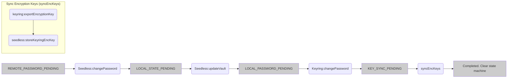

# Seedless Onboarding Password Change Flow


### Background and Context

- Seedless Onboarding (Social Login) has multiple moving parts and each flow success outcome depends on the chains of successful sequential moving parts.
- In its nature, each of the moving parts involves cryptographic operations or pseudo random computations. 
- Due to pseudo randomness, any mistakes in sequences can cause incorrect computations. The involvement of cryptographic computations makes the slow operations.
- With these two, each flow is fragile and possible to expose the failure windows between the moving parts. Improper retries or resumes can cause the data (including passwords or secrets) out of sync,
and potentially impact the users loss of wallet access, even permanent lost. 
- Hence, the idempotency of each flow is very crucial to the users and in this doc, we are proposing to make `Password Change` flow resilient.
- Password change operation is one of the operations which includes moving parts such as -
   - Remote server password change
   - Local wallet state commitment (vault encryptions)
   - Local keyring password change
   - Key sync between Seedless and Keyring vaults

### Solution proposal
Introducing the state machines, checkpoints to resume.
Commit or save the checkpoint before proceeding to the moving parts; remote commitment calls, un-deterministic functions, heavy computations such as encryption, decryption.

In this document, we are focusing on the `Password Change` implementation only.
For more info such as generic state machine, researches and decisions, please refer to the following docs.
- Status: Implementation companion
- Scope: `@metamask/seedless-onboarding-controller`
- State-machine contract: [ADR 0002](https://github.com/MetaMask/decisions/pull/280)
- Password-change architecture: [ADR 0003](https://github.com/MetaMask/decisions/pull/281)
- Client guide: [Password-change recovery](./0002-seedless-password-change-recovery-client-guide.md)

## Proposed implementation

Before each any operation in the password change flow, we will commit the checkpoints to the state machine.
Checkpoints required for the password change ~
- `REMOTE_PASSWORD_PENDING` - commit before we call to the remote server password change.
- `LOCAL_STATE_PENDING` - commit after successful remote server password change and before updating the local vault with new encryption keys.
- `LOCAL_PASSWORD_PENDING` - commit after seedless vault is updated, before the `Keyring:changePassword` call.
- `KEY_SYNC_PENDING` - commit after Keyring vault is updated and before we sync Keyring encryption key to Seedless vault.

> Upon completion, the checkpoint value should be cleared from the state machine.



For the fail path and recovery flow, please refer to the [Password Sync Flow](./0002-seedless-password-sync-flow.md)

## Package changes

- Added new persisted state to the `SeedlessOnboardingController`.
```ts
export type SeedlessOperationLifecycle = {
  /** Name of the flow. */
  operation: SeedlessOnboardingOperation;
  /** Last known check point */
  checkpoint: SeedlessOnboardingCheckpoint;
};
```
- Added new public methods to commit checkpoints from the client.
   - `completePasswordChange`: complete the password change flow. Clear the last known checkpoint.
   - `markPasswordChangeKeySyncPending`: commit `KEY_SYNC_PENDING` checkpoint before syncing Keyring encryption key to Seedless.

### Client call order
`Seedless:changePassword` → `Keyring:changePassword` →
`Keyring:exportEncryptionKey` → `Seedless:storeKeyringEncryptionKey` →
`Seedless:markPasswordChangeKeySyncPending` → remote key sync →
`Seedless:completePasswordChange`.
