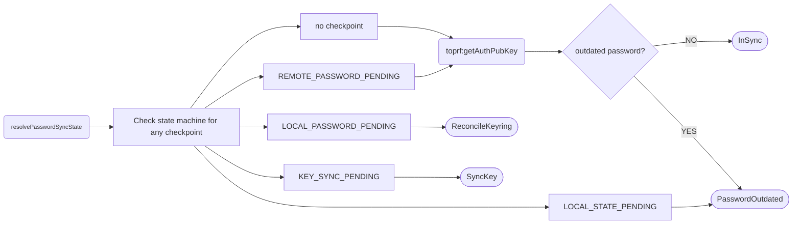
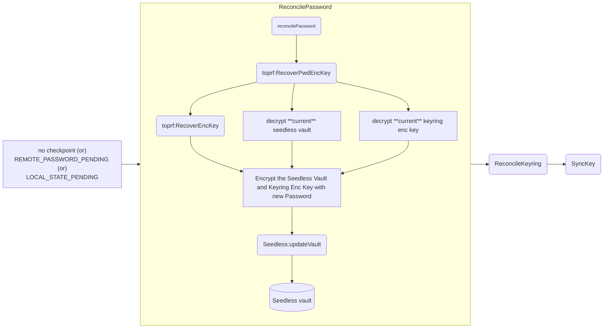
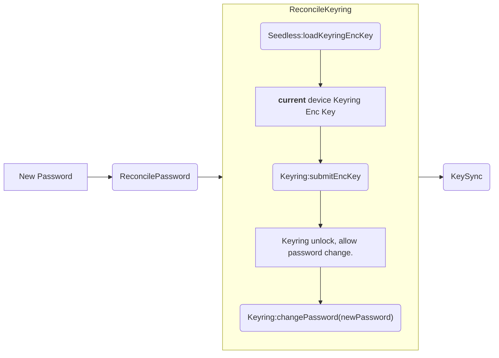
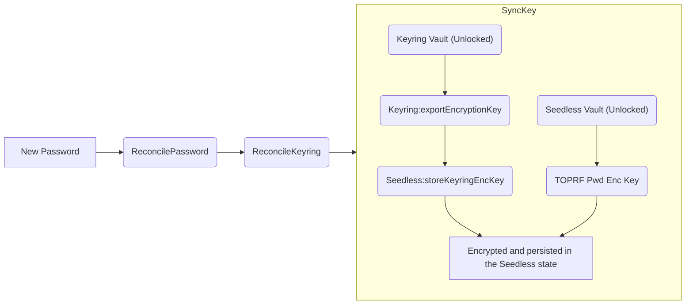
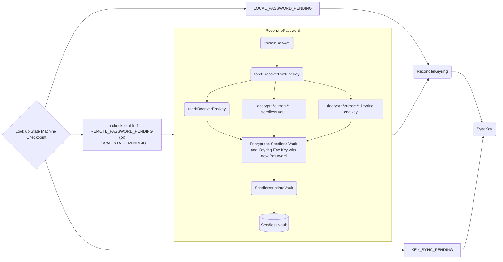

# Seedless Onboarding Password Sync flow

## Background and Context

For seedless onboarding (social login), users can only have one password globally across different devices.
When user change new password in the extension, the same session in the mobile has to sync with the latest password.
So that the encryption keys are in sync globally and encrypted secret metadata can be updated from any devices.

We call this, `Password Sync` flow. Currently, `Password Sync` flow can only sync the remote password updates.
Integrating with the password change state machine checkpoints, we can use this existing flow as for the recovery too.

For the more information about the architecture decisions and researches, please refer to [the original document for Password Sync flow](https://docs.google.com/document/d/1tyVz7QPlaB7o5KLcNwwJKlywOakEJUrcw5AtOddNpUM/edit?tab=t.0#heading=h.fcfnz78jlyyl).

In this document, we are focusing on updating the `Password Sync` flow to use for `Password Change Recovery`.

## Goal

- Update `Password Sync` flow to **aware of state machine checkpoints.**
- Use `Password Sync` flow for the Password change failure recovery.

## Proposed Design

The existing **Password Sync** flow includes two top level steps;

- verify the current device is sync with the latest global password from remote server
- if not in sync, perform sync for local Seedless and Keyring vault in the current device

### Password sync check

The existing public method for this is, `checkIsPasswordOutdated`.
We will rename this method to `resolvePasswordState` to facilitate the both `Remote Password Check` and `Local Password Recovery`.

Previously, the method returns `boolean` value to indicate if the device is out of sync.
In the new design, the method, `resolvePasswordState` will no longer return `boolean`.
It will return the UX aware instructions to do in the client side.

The updated method signature:

```ts
resolvePasswordState(): Promise<PasswordSyncInstruction>
```

`PasswordSyncInstruction` is an enum, clients can use this instruction take relevant actions in the UX.

```ts
export enum PasswordSyncInstruction {
  /**
   * No password change activities on other devices.
   * Even if the last password change has failed, no commitment has done on the remote server.
   * The check point is either empty or `REMOTE_PASSWORD_PENDING`.
   * The local and remote passwords are synchronized; no recovery action is needed. Unlock normally.
   */
  InSync = 'in-sync',
  /**
   * The remote password changed due to
   *    - another device changed it.
   *    - the last password change has failed, but commitment has done in the server
   * The check point can be empty, `REMOTE_PASSWORD_PENDING` or `LOCAL_STATE_PENDING`.
   * Prompt for the new password, then call `reconcilePassword`.
   */
  PasswordOutdated = 'password-outdated',
  /**
   * Prompt for the new password.
   * The Seedless vault is reconciled (checkpoint is `LOCAL_PASSWORD_PENDING`).
   * The client needs to unlock Seedless vault with new password.
   * Recover current keyring and call the Keyring:changePassword.
   */
  ReconcileKeyring = 'reconcile-keyring',
  /**
   * Prompt for the new password.
   * Checkpoint is `KEY_SYNC_PENDING`.
   * The client must enter new password to unlock both Keyring and Seedless vault.
   * After that, must sync Keyring Encryption Key to seedless vault.
   */
  SyncKey = 'sync-key',
}
```

The following is the execution flow for the `resolvePasswordState`.



### Execute password sync

The password sync execution has three sub steps

#### Sync local seedless vault with the remote server. (`ReconcilePassword`)

This method first recovers the encryption key belongs to the current device, so that we can unlock the current Seedless and Keyring vault which allows us to change their respective password (and encryption key).
Then it syncs the latest password from the server, update the Seedless vault with new encryption keys.



#### Recover the current Keyring vault and sync with the latest password. (`ReconcileKeyring`)

This step is responsible for recovering the **current** device Keyring vault, using the **current** Keyring encryption key, stored in the seedless vault.
After the Keyring vault recovery and has unlocked, we can change the password of the Keyring vault.



#### Sync the new Keyring encryption to the Seedless vault. (`SyncKey`)

After both Keyring and Seedless vault has updated, export the new keyring encryption.
The exported key will be stored inside the seedless state, encrypted with the TROPF password enc key.
This encrypted key will be used again on the next password sync, to unlock the current Keyring.



### Usage with the password change failure recovery

Refer the below diagram, based on the last checkpoint on the password change failure, we can go to different branches.
The diagram assumes that user's device is already out of sync.

At this point, the possible checkpoints user can have are ~

- **REMOTE_PASSWORD_PENDING**: remote commitment has done in the last password change failure, but no attempt has started for local yet.
- **LOCAL_STATE_PENDING**: remote commitment has done, but local state write has failed.
- **LOCAL_PASSWORD_PENDING**: Seedless vault is already updated/synced, but the `Keyring:changePassword` has failed.
- **KEY_SYNC_PENDING**: Both keyring and seedless vault were updated, but sync key steps has not finished yet.
- **no checkpoint**: No failure. Another device updated the password.



#### REMOTE_PASSWORD_PENDING (or no checkpoint)

In this case, the remote server already has the encrypted shares associated to the new password.
The client must go through the `reconcilePassword` method to recover the **current device Seedless vault** and sync the last to the device. Please refer to the [`ReconcilePassword` flow above](#sync-local-seedless-vault-with-the-remote-server-reconcilepassword).

#### LOCAL_STATE_PENDING

This checkpoint means that the client has acknowledged the remote commitment. But the process failed before updating the Seedless vault with new password (and encryption keys).
Both vaults are (**must be**) still locked.
The client will have to start from [`ReconcilePassword` flow](#sync-local-seedless-vault-with-the-remote-server-reconcilepassword) again.

#### LOCAL_PASSWORD_PENDING

From the password change checkpoint, it means Seedless vault is updated and synced.
The next step would be to recover and update Keyring vault, following this [`ReconcileKeyring` path](#recover-the-current-keyring-vault-and-sync-with-the-latest-password-reconcilekeyring).

#### KEY_SYNC_PENDING

Both Seedless and Keyring were synced.
At this point, user can technically unlock the wallet session with new password.
The last step of both `Password Change` and `Password Sync` flow.
The client has just to do the [`SyncKey`](#sync-the-new-keyring-encryption-to-the-seedless-vault-synckey)
