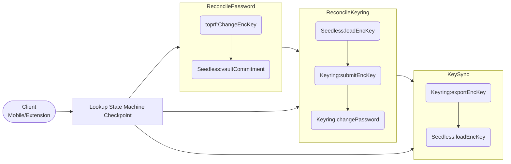
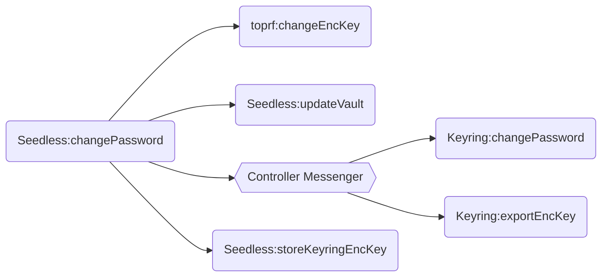
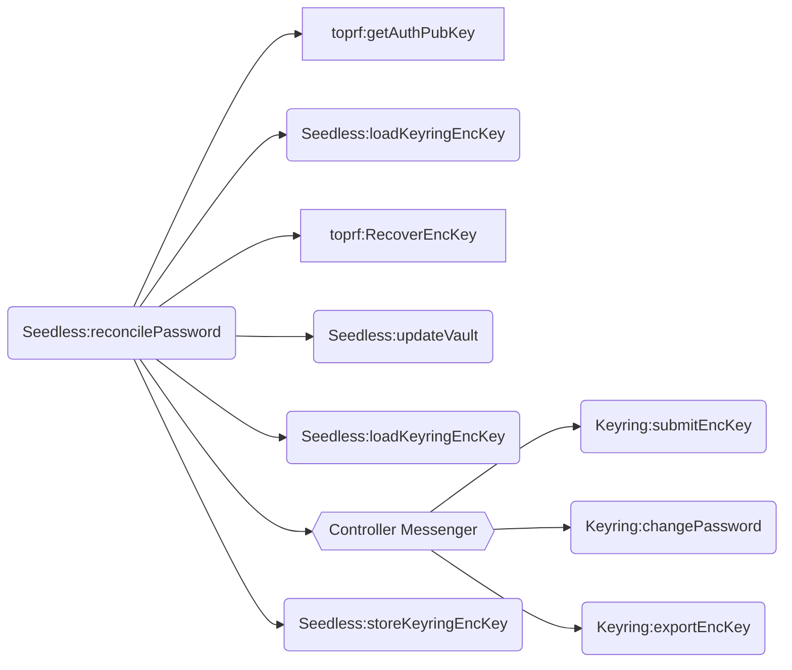

# Plan 0003: Controller-owned Password Change and Sync flow

- Status: Proposed
- Related: [Password-change flow 0001](./0001-seedless-password-change-flow.md), [client guide 0002](./0002-seedless-password-change-recovery-client-guide.md)

## Context

Seedless onboarding controller features consist of multiple operations across the `SeedlessOnboardingController`, `KeyringController` and `OAuthService`.
Currently for the password change/sync operation, **client** is responsible for orchestrating the right pieces in the right places. 
The whole operations outcome depends on **the client side orchestration**.
This exposes mistakes and repetitive codes in the client side. Harder to manage for both platforms.

## Current flow

Take the password sync flow as an example, in below diagram.

- The whole password sync flow depends on the local State Machine checkpoint or the remote server pub key status.
- Based on the checkpoint/status, the client will have to call the relevant methods from the different controllers.

## Goal

Move the complete transactions into `SeedlessOnboardingController`.
`SeedlessOnboardingController` will manage the transactions/methods calls with `KeyringController` via the central controller messenger.

### Password change flow

### Password Sync flow

