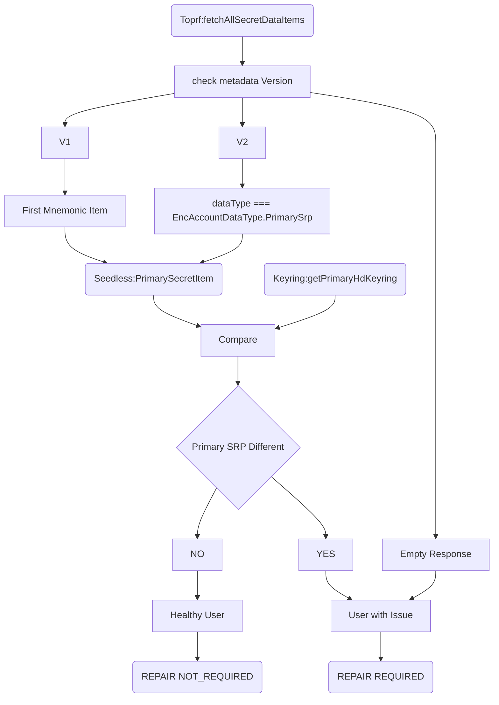
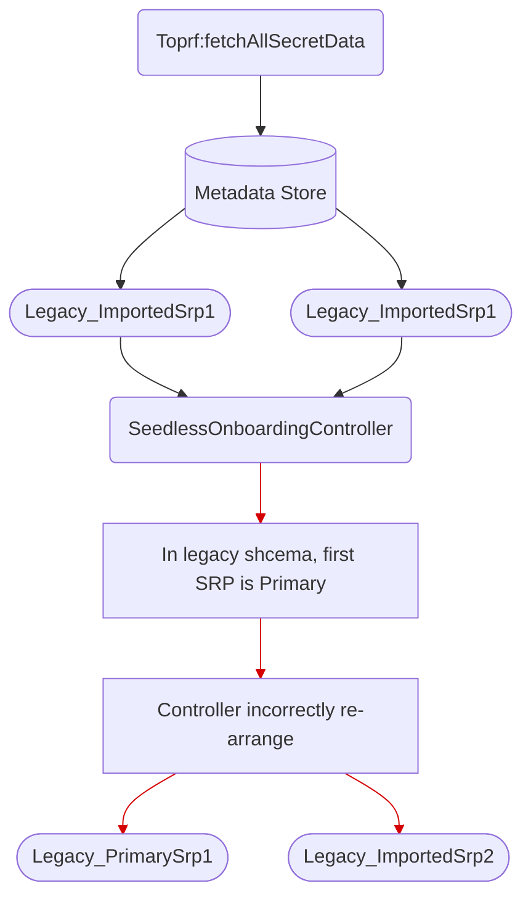
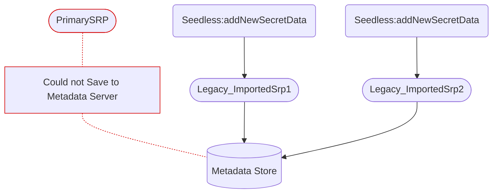
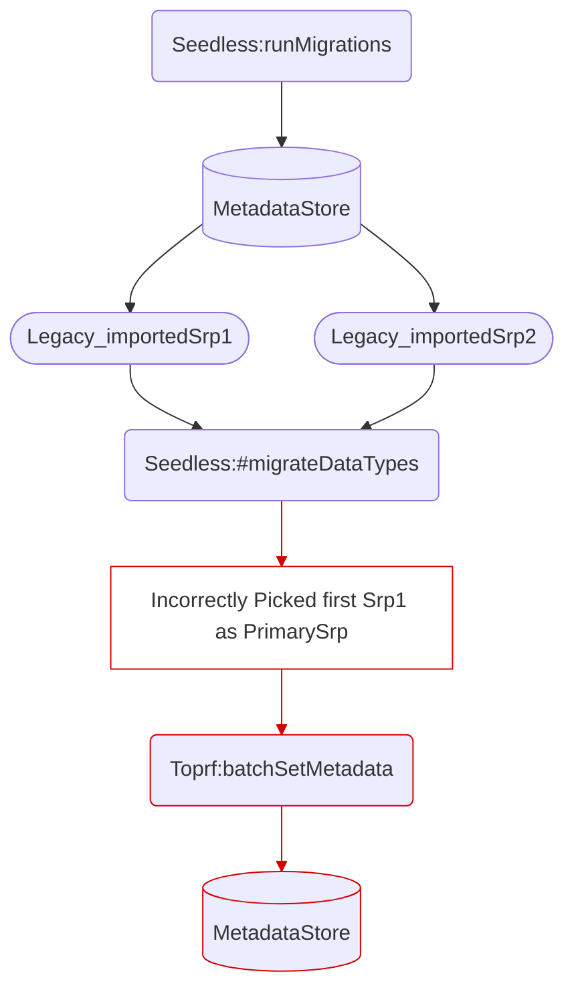

# Identify Social Login Users with incomplete/incorrect Metadata backup

## Background Context

We have found a production bug where new social login users can ran into the TOPRF init failure **silently** and it leaves the users with incomplete remote backup metadata.
In short, the `Primary SRP` was left out in the remote backup and it is only present in that device.
If users never export that SRP from the wallet, they have the risk of **the permanent wallet loss**, especially when users lost access to the device.

For more information, please check [this document]((https://docs.google.com/document/d/1Z2-hBnrYC4Q5d35_maG3uUyn297ODgmrikZDJljRqBE/edit?tab=t.0#heading=h.ic7lth3mlv9b)).

As the follow up remediation, we have two steps plan for the existing users in the production ~
1. Identify the users affected by this issue
2. Fix the incomplete remote metadata backup (Will be worked on [#10219](https://github.com/MetaMask/core/pull/10219))

This document defines the plan to identify the users affected by the Social Login users' TOPRF init failure bug.

## Goal

The goal of this document is to guide the development plan to correctly identify the affected users in the production.

## Identification Flow

We will do the identification at the users next unlock. Check the flow diagram below.

1. Fetch remote secret metadata from the metadata server via `Toprf:fetchAllSecretDataItems`.
2. Inspect the fetched remote metadata, we have three possible scenarios;
   A. No Primary SRP available
   B. Primary SRP available with V1 schema
   C. Primary SRP available with V2 schema
3. We will compare the Primary SRP data (if any) with the local keyring state.
4. If remote Primary SRP is missing or not match with the local keyring state, we can confirm that user's remote metadata needs the repair.

> We cannot assume that the V2 migrations has already run for all the users in the product.. Migrations won't be ran if `Primary SRP` isn't available in the remote backup.
E.g. Step 2.B above. The migrations were designed to run asynchronously and errors aren't visible to the users either.

### Different Remote Metadata Scenarios

We can't automatically assume that users don't have the metadata issue just because the `Primary SRP` is available. 
We have to inspect it manually and compare it with local keyring.

#### Missing Primary SRP
Simplest among three, users do not have any other SRP metadata in the remote backup.
Private Keys might be available but they aren't qualify for the Primary SRP selections.

We can simply conclude this case as `METADATA REPAIR REQUIRED`.

#### V1 Primary SRP
For the legacy V1 schema type, `Primary SRP` is determined based on the backup creation timestamp in the client side.
The earliest SRP (Mnemonic) item is classified as `Primary SRP`.

Take this as a sample case;
- User created a Social Login wallet with Torpf init failure. The Primary SRP was not backup to remote.
- User imported new SRPs and they were added to the remote backup.

- When we fetch the remote backup metadata for issue identification, it returns that these imported SRPs in the response.
- Client **incorrectly** labels the earliest SRP as the `Primary SRP`.

If the user restores the social login wallet in another device, the user gets the incorrect/incomplete wallet.
In this case; `Legacy_PrimarySrp1` become `PrimarySrp`, which is not correct.

#### V2 Primary SRP
For the latest V2 schema, `PrimarySrp` type is attached explicitly to the backup item during the account creation time.
V2 schema is used by default for the new users. For the existing users, the schema migration runs when user adds new Secret Metadata Item (SRP or PrivateKey).

Take the similar case as V1 Primary SRP,

- users created an account with the same issue

- after we introduced Schema Migration, let's assume it runs in the user's device.

Migration could **incorrectly** labels the **imported SRP** as `PrimarySrp` as above and stored it in the remote metadata server.
Same as the v1 case, the user will rehydrate with the incorrect/incomplete wallet.

## Accepted Behavior

- The `Identification flow` must run asynchronously and should not block **wallet operations**
- Network failures and cryptographic failures are not classified as affected accounts.
- Any errors during the identification steps, must not surface to the UI.
- Relevant logs and metrics should be collected for all events (both success and failures).
- The next repair step should be perform correctly based on the outcome of this flow.
- The flow **must not** include any writes, modifications to both local and remote server.
