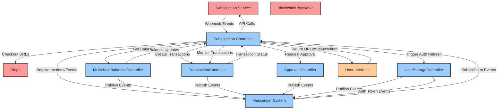

# Subscription Controller Architecture

## Overview

The Subscription Controller is responsible for managing user subscription lifecycle within MetaMask, including subscription creation, management, and payment processing. It handles both traditional card-based payments and cryptocurrency payments, while maintaining subscription state and coordinating with external services and other MetaMask controllers.

## Core Responsibilities

### 1. Subscription Service Communication

- **Read User Subscription**: Fetch current user subscription data from the subscription service
- **Remove User Subscription**: Cancel user subscriptions via the subscription service
- **Update User Subscription**: Modify subscription details (renew, plan changes, billing updates)
- **Authentication Token Management**: Trigger auth token refresh and validation through user storage controller

### 2. Event-Driven Subscription Management

- **Subscription Change Events**: Listen for user subscription events (subscribe/cancel)
- **Auth Token Refresh**: Trigger auth token refresh through user storage controller when subscription status changes
- **Status Synchronization**: Update local subscription status based on service events
- **Event Broadcasting**: Emit events when subscription status changes and auth token refresh is triggered

### 3. Card-Based Subscription Creation

- **Existing Subscription Check**: Verify if user already has an active subscription
- **Stripe Integration**: Request hosted checkout URLs from subscription service
- **Checkout Flow**: Return checkout URLs to UI for user completion
- **Success Handling**: Update subscription status when payment succeeds

### 4. Cryptocurrency-Based Subscription Creation

- **Balance Verification**: Check user's available crypto balance on supported chains
- **Transaction Creation**: Generate approval transactions for user signature
- **Multi-chain Support**: Handle payments across different blockchain networks
- **Transaction Monitoring**: Track transaction status and update subscription on completion

### 5. Payment Options Management

- **Available Methods**: Determine user's available payment options
- **Card Support**: Always include card payment as an option
- **Crypto Support**: Include supported cryptocurrencies based on user's chain balances
- **Dynamic Options**: Update available options based on user's current state

### 6. Billing Management

- **Billing Portal Access**: Request Stripe billing portal URLs from subscription service
- **Subscription Verification**: Ensure user has active subscription before billing access
- **Portal Integration**: Return billing URLs to UI for user management

## Architecture Components

### State Management

```typescript
interface SubscriptionControllerState {
  // User subscription information
  subscription: Subscription;

  // Authentication token reference (managed by user storage controller)
  authTokenRef: {
    lastRefreshTriggered: string;
    refreshStatus: 'pending' | 'completed' | 'failed';
  };

  // Payment options cache
  availablePaymentOptions: {
    cards: boolean;
    crypto: {
      [chainId: string]: {
        [tokenAddress: string]: {
          symbol: string;
          balance: string;
          decimals: number;
        };
      };
    };
  };

  // Transaction tracking
  pendingTransactions: {
    [transactionId: string]: {
      type: 'subscription_approval' | 'subscription_payment';
      status: 'pending' | 'confirmed' | 'failed';
      chainId: string;
      hash?: string;
    };
  };
}
```

### Controller Dependencies

#### External Services

- **Subscription Service**: Primary API for subscription management

#### Internal Controllers

- **MultichainBalancesController**: Check user's crypto balances across chains
- **TransactionController**: Create and manage crypto payment transactions
- **ApprovalController**: Handle user approval for transactions
- **NetworkController**: Get current network information
- **AccountsController**: Access user account information
- **UserStorageController**: Manage authentication tokens and user data

### Messenger System Integration

The Subscription Controller uses MetaMask's messenger system for inter-controller communication:

```typescript
type SubscriptionControllerMessenger = RestrictedMessenger<
  'SubscriptionController',
  | SubscriptionControllerActions
  | MultichainBalancesControllerGetStateAction
  | TransactionControllerGetStateAction
  | ApprovalControllerGetStateAction
  | NetworkControllerGetStateAction
  | AccountsControllerGetStateAction
  | UserStorageControllerGetStateAction,
  | SubscriptionControllerEvents
  | MultichainBalancesControllerAccountBalancesUpdatesEvent
  | TransactionControllerTransactionStatusChangeEvent
  | ApprovalControllerApprovalStateChangeEvent
  | NetworkControllerStateChangeEvent
  | AccountsControllerStateChangeEvent
  | UserStorageControllerAuthTokenRefreshedEvent,
  | 'SubscriptionController'
  | 'MultichainBalancesController'
  | 'TransactionController'
  | 'ApprovalController'
  | 'NetworkController'
  | 'AccountsController'
  | 'UserStorageController',
  'SubscriptionController'
>;
```

## Key Methods

### Public API

- `getSubscription()`: Retrieve current subscription status
- `createSubscriptionViaCard()`: Initiate card-based subscription
- `createSubscriptionViaCrypto()`: Initiate crypto-based subscription
- `getAvailablePaymentOptions()`: Get user's available payment methods
- `manageBilling()`: Access billing management portal
- `cancelSubscription()`: Cancel active subscription
- `triggerAuthTokenRefresh()`: Trigger auth token refresh through user storage controller

### Internal Methods

- `#checkExistingSubscription()`: Verify if user has active subscription
- `#requestStripeCheckoutUrl()`: Get Stripe hosted checkout URL
- `#checkCryptoBalance()`: Verify user's crypto balance for payment
- `#createApprovalTransaction()`: Generate crypto payment transaction
- `#monitorTransaction()`: Track transaction status
- `#updateSubscriptionStatus()`: Update local subscription state
- `#handleSubscriptionEvent()`: Process subscription change events
- `#triggerAuthTokenRefresh()`: Trigger auth token refresh via user storage controller

## Event Flow

### Card Payment Flow

1. User initiates card subscription
2. Controller checks for existing subscription
3. Controller requests Stripe checkout URL from subscription service
4. Controller returns checkout URL to UI
5. User completes payment on Stripe
6. Subscription service notifies controller of success
7. Controller updates subscription status and emits events

### Crypto Payment Flow

1. User initiates crypto subscription
2. Controller checks for existing subscription
3. Controller verifies user's crypto balance via MultichainBalancesController
4. Controller creates approval transaction via TransactionController
5. User approves transaction via ApprovalController
6. Controller monitors transaction status
7. On confirmation, controller updates subscription status and emits events

### Subscription Event Handling

1. Subscription service emits subscription change event
2. Controller receives event and triggers auth token refresh via user storage controller
3. Controller updates local subscription status
4. Controller emits `subscriptionStatusChanged` event
5. User storage controller handles auth token refresh and emits `authTokenRefreshed` event
6. Other controllers can listen for auth token updates

## Architecture Diagram


